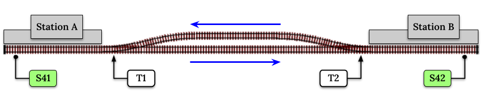

***********************
EX-RAIL Automation
***********************

Introduction
==============

EX-RAIL is an **EX**\panded **R**\ailroad **A**\utomation **I**\nstruction **L**\anguage
that can be easily used to describe sequential actions to automatically take place on your model layout.

Things You Can Do With EX-RAIL
====================================

- Create "Routes" which set multiple turnouts and signals at the press of a button in Engine Driver (other WiThrottle-compatible throttles are available)
- Intercept turnout changes to automatically adjust signals or other turnouts
- Animate accessories such as lights, crossings, or cranes
- Automatically drive multiple trains simultaneously, and manage complex interactions such as single line working and crossovers
- Drive trains manually, and hand a train over to an automation

What You Don't Need:
====================

- You DON'T need JMRI or any additional utilities, other than the Arduino IDE.
- You DON'T need knowledge of C++ or Python/Jython programming.

.. sidebar:: A note from the Author

   My original aim was to see if I could create an automated layout with lots going
   on, that didn’t just run around in circles. Having looked at JMRI
   (briefly, I must say) and DCC++, I began to wonder whether I could
   actually make a simpler automation system, and run it entirely on the
   Arduino used for DCC++.

   Some of the automation techniques I read about, using jython scripts in
   JRMI, seem to require extensive programming skills and complex table configurations 
   which appeared awkward to me, despite my years of programming in dozens of languages.

   It seemed to me that basing an automation on block occupancy detection leaves a 
   lot of complex technical problems to be solved… and wanting to be cheap,
   I didn’t want to invest in a range of block occupancy detectors,
   or ABC braking modules, which are all very well on
   circular layouts, but not good at complex crossings 
   or single line operations with passing places. 
   Also, I didn’t want the automation to be an obvious cycle of movements… 
   some random timings and decisions need to be introduced so
   that two trains don’t always arrive at the same place in the same order, 
   nor go on the same journey in a predictable cycle.

   By reversing the usual assumptions, I think I have a workable, extensible and cheap solution.
   
   Because the original DCC++ used a software design inappropriate for internal automation, I had to start by 
   rewriting the entire Command Station code and this became DCC-EX, so 
   automation has been in the plan from the start.

   - Chris Harlow

How It Works
=============

A small amount of code in the CS (The EX-RAIL executor), lets you write an automation script in the form of simple, easy to use text commands that it interprets and runs on your layout. You don't have to be a programmer and you don't have to learn code. You simply add your own Automation.h file in the same program you use to upload the Command Station Software to your Arduino (the Arduino IDE, PlatformIO, etc). This means that you already have all the tools you will need, and there is nothing else to download or install. The method of creating your script file is described in the next section.

The EX-RAIL code is surprisingly small and requires very little PROGMEM (memory that holds the program code) or SRAM (the runtime workspace that stores variables and things the program needs) to operate. You will need a Mega for your CS, the UNO and Nano are simply too small to include EX-RAIL with the rest of the Command Station code.

.. NOTE: The EX-RAIL code is only included in the compilation of the Command Station if the compiler detects a “myAutomation.h” file. If you don't create that file, no extra space is wasted for something you don't use.

EX-RAIL automation is *much* (perhaps 2 orders of magnitude) more time efficient than the code required to process incoming requests from an external automation processor, or the contunuous polling of every sensor.

The Automation Process
******************************************

All routes, automations, etc step through a list of simple keywords until they reach a ``DONE`` keyword. 

For a full list of keywords, see :ref:`EX-RAIL – Reference`

Automation scripts are added to your Command Station by creating a file called "myAutomation.h"
in the same folder as CommandStation-EX.ino, and adding in the scripts as follows:

.. code-block:: cpp

   EXRAIL
     ... your scripts
     ENDEXRAIL

Connecting your Arduino and pressing the Upload button in the usual way will save the file and upload your script into the Command Station.

To create the myAutomation.h file in the Arduino IDE, use the pulldown button and select New Tab (or simply press Ctrl+Shift+N

.. image:: ../_static/images/ex-rail/Setup1.jpg
   :alt:  Setup pulldown button
   :align: center
   :scale: 100%

.. image:: ../_static/images/ex-rail/Setup2.jpg
   :alt:  Setup pulldown menu
   :align: center
   :scale: 100%

Enter the file name "myAutomation.h" (This is case sensitive)

.. image:: ../_static/images/ex-rail/Setup3.jpg
   :alt:  Setup myAutomation.h
   :align: center
   :scale: 100%

And type your script in, starting with EXRAIL and ending with ENDEXRAIL. 

.. image:: ../_static/images/ex-rail/Setup4.jpg
   :alt:  Setup Example file
   :align: center
   :scale: 100%

Some Simple Examples  
**********************************

Example 1: Creating Routes for Engine Driver
==============================================

A typical Route might be used to set a sequence of turnouts in response to a single button in Engine Driver.
The EX-RAIL instructions to do this might look like

.. code-block:: cpp

   ROUTE(1,"Coal Yard exit")
     THROW(1)
     CLOSE(7)
     DONE

Or you can write it like this

.. code-block:: cpp

   ROUTE(1,"Coal Yard exit")  THROW(1)  CLOSE(7)  DONE

or add comments

.. code-block:: cpp

 // This is my coal yard to engine shed route
   ROUTE(1,"Coal Yard exit")     // appears in Engine Driver
     THROW(1)   // throw turnout onto coal yard siding
     CLOSE(7)   // close turnout for engine shed
     DONE    // that's all folks!

Of course, you may want to add signals, and time delays

.. code-block:: cpp

   SIGNAL(77,78,79)  // see later for details
   SIGNAL(92,0,93)   //   on signal definitions
   
   ROUTE(1,"Coal Yard exit")
      RED(77)
      THROW(1)
      CLOSE(7)
      DELAY(5000)  // this is a 5 second wait
      GREEN(92)
      DONE

Example 2: Automating Signals with Turnouts
===========================================
By intercepting a turnout change command, it's easy to automatically adjust signals or 
automatically switch an adjacent facing turnout. Use an ``ONTHROW`` or ``ONCLOSE`` keyword to detect a particular turnout change:

.. code-block:: cpp

   ONTHROW(8)  // When turnout 8 is thrown,
      THROW(9)  // must also throw the facing turnout
      RED(24)
      DELAY(2000)
      GREEN(27)
      DONE

   ONCLOSE(8)  // When turnout 8 is closed
     CLOSE(9)
     RED(27)
     DELAY(2000)
     GREEN(24)
     DONE

@Chris - I think the definition info might be best after the examples?

Defining Turnouts
*****************

DCC-EX supports a number of different 
turnout hardware configurations, but your automation treats them all
as simple ID numbers. Turnouts may be defined using ``<T>`` commands from JMRI,
or in ``SETUP("<T ...>")`` commands or C++ code in mySetup.h, just like earlier versions.

You may, however, find it more convenient to define turnouts using EX-RAIL
commands, which may appear anywhere in the 'myAutomation.h' file, even after they are
referenced in an ``ONTHROW``, ``ONCLOSE``, ``THROW`` or ``CLOSE`` command.
(EXRAIL extracts the turnout definitions just once from your script at Command Station startup.)

Turnouts defined in 'myAutomation.h' will still be visible to WiThrottle and JMRI in the normal way.

..
  (@KEBBIN.. feature TODO  However it is possible with EX-RAIL to hide a turnout from WiThrottle which is useful if it is a facing turnout that will be automatically adjusted by your script to match its partner.)

See the Reference section for TURNOUT definitions. 

Defining Signals
=================

Signals are now simply a decoration to be switched by the route process;
they don’t control anything.

``GREEN(55)`` would turn signal 55 green, and ``RED(55)`` would turn it red.
Somewhere in the script there must be a SIGNAL command like this: 
``SIGNAL(55,56,57)``.  This defines a singal with ID 55, where the red/Stop lamp is connected to 
pin 55, the amber/Caution lamp to pin 56, and the green/Proceed lamp to pin 57.
The pin allocations do not need to be contiguous, and the red pin is also used as the signal ID. Thus  
you can change the signal by ``RED(55)``, ``AMBER(55)``, or ``GREEN(55)``.
This means you don't have to manually turn off the other lamps. 
A RED/GREEN only signal may be created with a zero amber pin.

Example 3: Automating various non-track items 
==============================================

This normally takes place in a timed loop, for example alternate flashing of a fire engine's lights. To do this use a SEQUENCE.

.. code-block:: cpp

   SEQUENCE(66)  
     SET(101)   // sets output 101 HIGH
     RESET(102) // sets output 102 LOW
     DELAY(500)   // wait 0.5 seconds
     SET(102)   // swap the lights   
     RESET(101) 
     DELAY(500)   // wait 0.5 seconds
     FOLLOW(66)  // follow sequence 66 continuously
     
Note, however, that this sequence will not start automatically: it must be started
during the startup process (see later) using ``START(66)``.

Example 4: Automating a train (simple loop)
===========================================

Start with something as simple as a single loop of track with a station and a 
sensor (connected to pin 40 for this example) at the 
point where you want the train to stop.

.. image:: ../_static/images/ex-rail/Example_4_diagram.png
   :alt:  Simple example 4
   :align: center
   :scale: 100%

Using an ``AUTOMATION`` keyword means that this automation will appear in Engine Driver so
you can drive the train manually, and then hand it over to the automation at the press of a button.

\* Technically, an automation can independently run multiple locos along the same path through the layout, but this is discussed later...

.. code-block:: cpp

   AUTOMATION(4,"Round in circles")
      FWD(50)   // move forward at DCC speed 50 (out of 127)
      AT(40)     // when you get to sensor on pin (40)
      STOP      // stop the train 
      DELAYRANDOM(5000,20000) // delay somewhere between 5 and 20 seconds
      FWD(30)   // start a bit slower
      AFTER(40)  // until sensor on pin 40 has been passed
      FOLLOW(4) // and continue to follow the automation

The instructions are followed in sequence by the loco given to it;
the ``AT`` command just leaves the loco running until that sensor is
detected.

Notice that this automation does not specify the loco address. If you drive a loco with Engine Driver 
and then hand it over to this automation, then the automation will run with the loco you last drove.

Example 5: Signals in a train script
====================================

Adding a station signal to the loop script is extremely simple, but it does require a mind-shift
for some modellers who like to think in terms of signals being in 
control of trains! 
EX-RAIL takes a different approach, by animating the signals as part of
the driving script. Thus set a signal GREEN before moving off (and allow a little delay for the driver to react)
and RED after you have passed it.

.. code-block:: cpp

   SIGNAL(77,78,79)  // see later for details
   AUTOMATION(4,"Round in circles")
      FWD(50)   // move forward at DCC speed 50 (out of 127)
      AT(40)     // when you get to sensor on pin (40)
      STOP      // Stop the train 
      DELAYRANDOM(5000,20000) // delay somewhere between 5 and 20 seconds
      GREEN(77)
      DEALY(25)  // This is not Formula1!
      FWD(30)   // start a bit slower
      AFTER(40)  // until sensor on pin 40 has been passed
      RED(77)
      FOLLOW(4) // and continue to follow the automation

Example 6: Single line shuttle
======================================

Consider a single line, shuttling between stations A and B.

.. image:: ../_static/images/ex-rail/Example_6_diagram.png
   :alt:  Simple example 4
   :align: center
   :scale: 100%

Starting from Station A, the steps may be something like:

-  Wait between 10 and 20 seconds for the guard to stop chatting up the
   girl in the ticket office.
-  Move forward at speed 30
-  When I get to B, stop.
-  Wait 15 seconds for the tea trolley to be restocked
-  Move backwards at speed 20
-  When I get to A, stop.

Notice that the sensors at A and B are near the ends of the track (allowing for braking
distance, but don’t care about train length or whether the engine is at the front or back.)
We have wired sensor A on pin 41, and sensor B on pin 42 for this example.

.. code-block:: cpp

    SEQUENCE(13)
      DELAYRANDOM(10000,20000) // random wait between 10 and 20 seconds
      FWD(50)
      AT(42) // sensor 42 is at the far end of platform B
      STOP
      DELAY(15000)
      REV(20) // Reverse at DCC speed 20 (out of 127)
      AT(41) // far end of platform A
      STOP
      FOLLOW(13) // follows sequence 13 again… forever

Note a SEQUENCE is exactly the same as an ANIMATION except that it does NOT appear
in Engine Driver.

When the Command Station is powered up or reset, EX-RAIL starts operating at
the beginning of the file.  For this sequence we need to set a loco address
and start the sequence:

.. code-block:: cpp

   SETLOCO(3)
   START(13) 
   DONE        // This marks the end of the startup process

The sequence can also be started from a serial monitor with the command ``</ START 3 13>``.

If you have multiple separate sections of track which do not require inter-train
cooperation, you may add many more separate sequences and they will operate independently.

Although the above is trivial, the routes are designed to be
independent of the loco address so that we can have several locos
following the same route at the same time (not in the end to end example
above!), perhaps passing each other or crossing over with trains on other
routes.

The example above assumes that loco 3 is sitting on the track and pointing in
the right direction. A bit later you will see how to script an automatic
process to take whatever loco is placed on the programming track, and
send it on its way to join in the fun!

Example 7: Running multiple inter-connected trains
==================================================
So what about routes that cross or share single lines (passing places etc)?
Let's add a passing place between A and B. S= Sensors, T=Turnout
number. So now our route looks like this:

Assuming that you have defined your turnouts with TURNOUT commands.

.. code-block:: cpp

   SEQUENCE(11)
      DELAYRANDOM(10000,20000) // random wait between 10 and 20 seconds
      THROW(1)
      CLOSE(2)
      FWD(30)
      AT(42) // sensor 42 is at the far end of platform B
      STOP
      DELAY(15000)
      THROW(2)
      CLOSE(1)
      REV(20)
      AT(41)
      STOP
      FOLLOW(11) // follows sequence 11 again… forever

 
All well and good for one loco, but with 2 (or even 3) on this track we
need some rules. The principle behind this is

-  To enter a section of track that may be shared, you must RESERVE it.
   If you cant reserve it because another loco already has, then you
   will be stopped and the script will wait until such time as you can
   reserve it. When you leave a shared section you must free it.

-  Each “section” is merely a logical concept, there are no electronic
   section breaks in the track. You may have up to 255 sections (More can be supported by a code mod if required)

So we will need some extra sensors (hardware required) and some logical
blocks (all in the mind!):

We can use this map to plan routes, when we do so, it will be easier to
imagine 4 separate routes, each passing from one block to the next. Then
we can chain them together but also start from any block.

So… lets take a look at the routes now. For convenience I have used
route numbers that help remind us what the route is for.

..
  @KEBBIN **the sensor numbers in the code below are all a mess. Because the sensor numbers are now direct pin references, we need to avoid pin numbers that may clash with motor shield, I2C or similar pins that have special meanings.**

.. code-block:: cpp

   SEQUENCE(12) // From block 1 to block 2
      DELAYRANDOM(10000,20000) // random wait between 10 and 20 seconds
      RESERVE(2) // we wish to enter block 2… so wait for it
      THROW(1) // Now we “own” the block, set the turnout
      FWD(30) // and proceed forward
      AFTER(71) // Once we have reached AND passed sensor 71
      FREE(1) // we no longer occupy block 1
      AT(72) // When we get to sensor 72
      FOLLOW(23) // follow route from block 2 to block 3
   
   SEQUENCE(23) // Travel from block 2 to block 3
      RESERVE(3) // will STOP if block 3 occupied
      CLOSE(2) // Now we have the block, we can set turnouts
      FWD(20) // we may or may not have stopped at the RESERVE
      AT(2) // sensor 2 is at the far end of platform B
      STOP
      FREE(2)
      DELAY(15000)
      FOLLOW(34)
   
   SEQUENCE(34) // you get the idea
      RESERVE(4)
      THROW(2)
      REV(20)
      AFTER(13)
      FREE(3)
      AT(14)
      FOLLOW(41)
   
   SEQUENCE(41)
      RESERVE(1)
      CLOSE(1)
      REV(20)
      AT(1)
      STOP
      FREE(4)
      FOLLOW(12) // follows Route 12 again… forever

Does that look long? Worried about memory on your Arduino…. Well the
script above takes about 100 BYTES of program memory and no dynamic.

If you follow this carefully, it allows for up to 3 trains at a time
because one of them will always have somewhere to go. Notice that there
is common theme to this…

-  RESERVE where you want to go, if you are moving and the reserve
   fails, your loco will STOP and the reserve waits for the block to
   become available. (these waits and the manual WAITS do not block the
   Arduino process… DCC and the other locos continue to follow their
   routes)

-  Set the points to enter the reserved area.. do that ASAP as you may
   be still moving towards them. 
   
-  Set any signals 

-  Move into the reserved area

-  Reset your signals

-  Free off your previous reserve as soon as you have fully left the
   block

In addition, it is possible to take decisions based on blocks reserved by other trains.
The IFRESERVE(block) can be used to reserve a block if it not already reserved by some other train,
or skip to the matching ENDIF. For example, this allows a train to choose which platform to stop at
based on prior occupancy. It is features like this that allow for more interesting and unpredictable
automations.       

Starting the system
===================

Starting the system is tricky because we need to place the trains in a
suitable position and set them off. We need to have a starting position
for each loco and reserve the block(s) it needs to keep other trains
from crashing into it.

For a known set of locos, the easy way is to define the startup process
at the beginning of ROUTES , e.g. for two engines, one at each station

.. code-block:: cpp

 // ensure all blocks are reserved as if the locos had arrived there
 RESERVE(1) // start with a loco in block 1
 RESERVE(3) // and another in block 3
 SENDLOCO(3,12) // send Loco DCC addr 3 on to route 12
 SENDLOCO(17,34) // send loco DCC addr 17 to route 34
 DONE // don’t drop through to the first route

CAUTION: this isn’t ready to handle locos randomly placed on the layout after a power down.

Some interesting points about the startup… You don’t need to set
turnouts because each route is setting them as required. Signals default
to RED on powerup and get turned green when a route decides.

Drive Away feature
==================

EX-RAIL can switch a track section between programming and mainline
automatically.

Here for example is a startup route that has no predefined locos but
allows locos to be added at station 1 while the system is in motion.
Let’s assume that the track section at Station1 is isolated and
connected to the programming track power supply. Also that we have a
“launch” button connected where sensor 17 would be and an optional
signal (ie 3 leds) on the control panel connected where signal 27 would
be .

.. code-block:: cpp

 SEQUENCE(99)
   SIGNAL(27,28,29)
   RED(27)   // indicate launch not ready
   AFTER(17) // user presses and releases launch button
   UNJOIN // separate the programming track from main
   DELAY(2000)
   AMBER(27) // Show amber, user may place loco
   // user places loco on track and presses “launch” again
   AFTER(17)
   READ_LOCO // identify the loco
   GREEN(27) // show green light to user
   JOIN // connect prog track to main
   START(12) // send loco off along route 12
   FOLLOW(99) // keep doing this for another launch

The READ_LOCO reads the loco address from the PROG track and the current route takes on that
loco. By altering the script slightly and adding another sensor, it’s
possible to detect which way the loco sets off and switch the code logic
to send it in the correct direction by using the INVERT_DIRECTION instruction so that
this locos FWD and REV commands are reversed. (easily done with diesels!)

Sounds
======
You can use ``FON(n)`` and ``FOFF(n``) to switch loco functions… eg sound horn

Sensors
========

-  DCC++EX allows for sensors that are LOW-on or HIGH-on, this is
   particularly important for IR sensors that have been converted to
   detect by broken beam, rather than reflection. By making the sensor
   number negative, the sensor state is inverted. e.g. AT(-5)

-  Magnetic/Hall sensors work for some layouts but beware of how you detect
   the back end of a train approching the buffers in a siding,
   or knowing when the last car has cleared a crossing.

-  Handling sensors in the automation is made easy because EX-RAIL throws
   away the concept of interrupts (“oh… sensor 5 has been detected…
   which loco was that and what the hell do I do now?”) and instead has
   the route scripts work on the basis of “do nothing, maintain speed
   until sensor 5 triggers and then carry on in the script”

- Sensor numbers are direct references to virtual pin numbers in the Hardware Adapter Layer. 
   For a Mega onboard GPIO pin, this is the same as the digital pin number. Other pin ranges refer to 
   pin expanders etc. 

- Sensors with id's 0 to 255 may be LATCHED/UNLATCHED in your script.
   If a sensor is latched on
   by the script, it can only be set off by the script… so AT(5) LATCH(5) for
   example effectively latches the sensor 5 on when detected once.

- Sensor polling by JMRI is independent of this and may continue if <S> commands are used.

Outputs
========

- Generic Outputs are mapped to VPINs on the HAL (as for sensors)
- SIGNAL definitions are just groups of 3 Outputs that can be more easily managed.

Sequence Numbers
================

- All ROUTE / AUTOMATION / SEQUENCE  ids are limited to 1- 32767 
- 0 is reserved for the startup sequence appearing as the first entry in  the EXRAIL script. 

Various techniques
===================

- Defining names for some or all of the numbers, use the ALIAS command. (this must come BEFORE the EXRAIL command)

   For example:

.. code-block:: cpp

   ALIAS(COAL_YARD_TURNOUT,19) 
   ALIAS(COAL_YARD_SIGNAL,27) 
      EXRAIL
         ROUTE(1,"Coal yard exit") 
            THROW(COAL_YARD_TURNOUT)
            GREEN(COAL_YARD_SIGNAL)

- Including sub-files
   For example:
   
.. code-block:: cpp

   EXRAIL
      ROUTE(1,"Coal yard exit") 
         THROW(19)
         GREEN(27)
         DONE
      #include "myFireEngineLights.h"
      #include "myShuttle.h"

