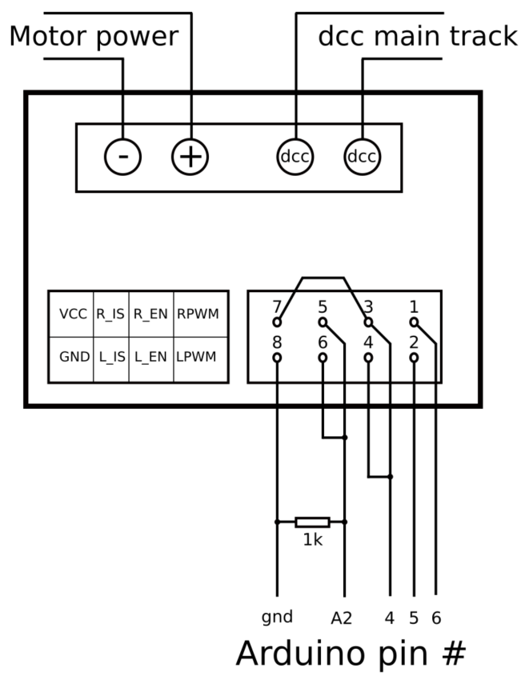
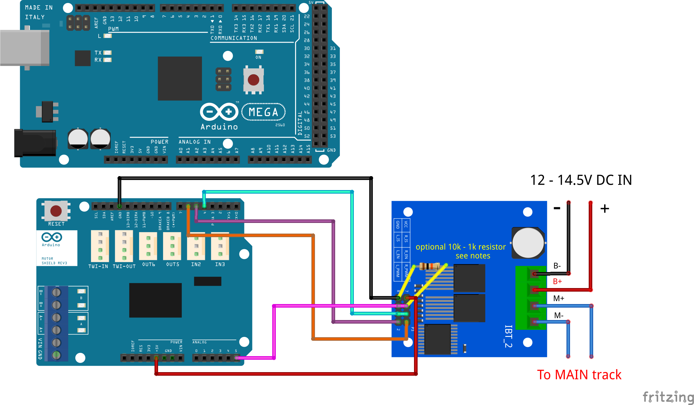
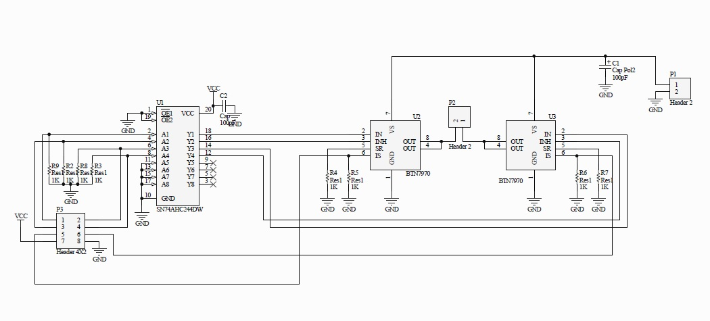

#########################
IB_2 BTS7960 Motor Board
#########################

*******************************
What You Will Need (for IBT_2)
*******************************

* An Arduino Mega or clone (or an Uno if you don't need WiFi or Ethernet)
* An Arduino Motor Shield
* An IBT_2 Motor Board
* Version 3.1.0 or later of the DCC++ EX Command Station Software
* 1k Resitor (Optional)
* Some Jumper Wires

We assume that many of you may have started off with the Arduino Mega with Arduino Motor Shield (or clones) and are here because you are making the step up to something that can handle more current, and therefore more locos. We will cover how to "upgrade" with just one IBT_2 board to run your MAIN track and relegate your Arduino Motor Shield to the PROG track as well as explain other options.

.. Note:: We can't say it enough, this board can pump out some Amps. Be careful! Put fuses on the connection to each rail and limit the current to a safe level in your config.h file. We have a saying at DCC-EX, if you need more than 5 Amps to run locos, then you need to add power districts, not more Amps.

Upgrading and Using the Arduino Motor Shield
=============================================

For this installation we are going to assume you already have a working CS or at least have a the parts you need as listed above.

If you need instructions on how to install the Arduino Motor Shield, see `Arduino Motor Shield Assembly <../get-started/assembly.html>`_

What We Are Going To Do
==========================

* Use just 1 output of your existing Arduino Motor Shield for your program track with no hardware changes
* Add an IBT_2 (BTS7960) Motor Board to replace the "A" output of the motor shield to power your MAIN track
* Move a few wires and connect a few jumpers to your IBT_2
* Optionally add a current sense resistor to the IBT_2
* Change your motor board type in your config.h file

.. WARNING:: Instead of bending out the current sense pin of the Arduino Motor Shield and using the same A0 pin for the IBT_2 current sense, we are using pin A5. Both outputs of the motor shield are still connected, we just don't enable it. DO NOT try to use the A output of the motor shield! You will have no current sense and no short circuit protection.

Steps 
======

1. Make sure all power supplies are disconnected from your Arduino, The Motor Shield, and the IBT_2

2. Disconect the wires coming out of output A of the Arduino Motor Shield that normally connect to your MAIN track.

3. Move the two wires we just disconnected from the motor shield and connected them to the B+ and B- Screw terminals of the IBT_2. If you will be using power districts or wanting to connect the main and prog tracks together when prog is not in use, keep the polarity of the rails the same with reference to each other. In other words, if you connect + to the left rail, then always keep + on the rail to the left as viewd from a train sitting on the track. We need to keep the phase of the DCC signal in sync between power districts.

4. Option = You may need to connect or solder a 1k resistor between pin 5 or 6 and ground on the IBT_2 (see alternate method using a current sense board below). There is already a 1k resistor on both boards, but if there isn't we will need to install our own. Below we will cover how to know.

5. Select your IBT_2 board in the config.h file

6. Upload the new sketch to your Arduino Mega

Use the following diagrams to connect pins from the Arduino Mega to the IBT_2:

+--------------+-----------------------------+
|  Arduino     |           IBT_2             |
+==============+=============================+
| 4 (enable)   | 3,4,7  (R_EN, L_EN, VCC)    |
+--------------+-----------------------------+
| 5 (signal 1) | 2 (LPWM)                    |
+--------------+-----------------------------+
| 6 (signal 2) | 1 (RPWM)                    |
+--------------+-----------------------------+
| A5 (CS MAIN) | 5,6, R1a  (R_IS, L_IS, R1a) |
+--------------+-----------------------------+
|     GND      |        GND, R1b             |
+--------------+-----------------------------+

Here is a visual diagram, click to enlarge:

It shoud look like following. Note we have included the Arduino Mega and have the Arduino Motor shield off to the side for reference. The motor shield would obviously normally be stacked on top of the Arduino. However, some people might not use the motor shield and instead will have another board to use for their programming track. In this case, they would connect the IBT_2 to the same pins on the Arduino microcontroller. Also note the jumper wiring that shows pin 4 or the Arduino connecting to pins 3,4, and 7 on the IBT_2 and A5 connected to pins 5 and 6. As with most of our diagrams, you can click on them to enlarge them.

.. Note:: We are going to edit your config.h file. If this is your first time using the Command Station software and do not have a config.h file, rename your config.example.h file to config.hardware

Launch the Arduino IDE (or whatever editor you use) and open the CommandStation-EX project. Find the config.h file. look for the following lines of code:

.. code-block:: C++

   // DEFINE MOTOR_SHIELD_TYPE BELOW ACCORDING TO THE FOLLOWING TABLE:
   //
   //  STANDARD_MOTOR_SHIELD : Arduino Motor shield Rev3 based on the L298 with 18V 2A per channel
   //  POLOLU_MOTOR_SHIELD   : Pololu MC33926 Motor Driver (not recommended for prog track)
   //  FUNDUMOTO_SHIELD      : Fundumoto Shield, no current sensing (not recommended, no short protection)
   //  IBT_2_WITH_ARDUINO    : IBT_2 Motor Board on MAIN and Arduino Motor Shield on PROG
   //  FIREBOX_MK1           : The Firebox MK1                    
   //  FIREBOX_MK1S          : The Firebox MK1S   
   //   |
   //   +-----------------------
   //
   #define MOTOR_SHIELD_TYPE STANDARD_MOTOR_SHIELD

Change the last line to look like this. To be sure of your spelling, you can copy and paste IBT_2_WITH_ARDUINO and replace STANDARD_MOTOR_SHIELD

``#define MOTOR_SHIELD_TYPE IBT_2_WITH_ARDUINO``

Upload the sketch to your arduino. If you need help on how to upload a sketch, see `Getting Started <../get-started/index.html>_`

Using One IBT_2 for MAIN and another for PROG
==============================================

This section will cover how to use 2 IBT_2 boards, one for MAIN and one for PROG if you do not already have an Arduino Motor Shield or clone. Be careful as the IBT_2 can deliver much more current than you need for a proramming track. If you install 1 Amp fuses in between the IBT_2 outputs and both rails of your programming that, that and the lower trip current we set in the CS for the programming track should protect your layout.

Using External Curent Sense
============================

Using an external current sense board instead of the onboard current sense included with the IBT_2 can give us a little more control over the sensitivity of our circuit (ability to read low currents such as one N scale loco sitting still on the main track). 

***TODO: Insert help for using or pointing to a section for external CS boards***

***********
Tech Notes
***********

add notes here showing what pins are in the motordrivers section and what the pins are on the motor boards. Also show the motor board section. Show how they can chage the pins if there is a problem by creating a new motor board type.

Below is a link to the IBT_2 schematic. Click to enlarge.

