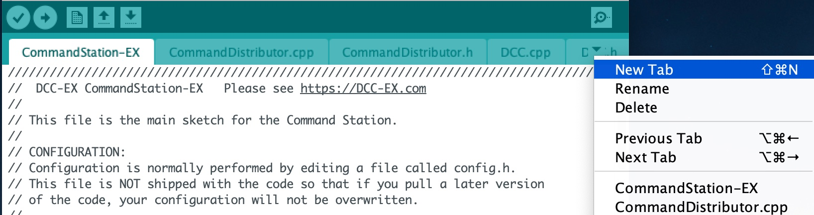

**************************
Hardware I/O Configuration
**************************

The DCC++ EX controller has always had built-in support for turnout control, output control and input sensors attached to the Arduino pins.  However, you may 
outgrow the built-in capabilities and want to access more output pins than the arduino has available.  Or you may wish to attach servos to the controller
for turnout control or for animating a layout component, such as the doors to an engine shed.  

DCC++ EX, as of version 3.2.0, provides support for a wider set of input and output devices than previous versions.  This is thanks to a 
piece of software called the **HAL** or **H**\ardware **A**\bstraction **L**\ayer.  
The HAL provides support for a range of different input and output modules through drivers that are supplied with DCC++ EX.
In addition, its simple interface allows engineers and tinkerers to add new plug-in device support to DCC++ EX 
without having to change a line of the core application code.  

The HAL exposes a standard set of functions which the rest of DCC++ EX code is able to call upon, and the HAL directs the 
calls to the appropriate device driver.
The specific device end-points are given by a kind of pin number, called a **V**\irtual **pin** or VPIN.
Any module has one or more VPINs associated with it.

When DCC++ EX code needs to write to an Arduino digital output pin, the output is uniquely identified by a pin number.  
The Arduino Mega has digital I/O pin numbers ranging up to 69.  A call to ``IODevice::write(50,1)`` will set pin 50 HIGH.

The HAL extends this model to other devices.  If you want to write to a digital output pin on an external GPIO Extender Module, 
then the same function is called, but the pin number identifies a virtual pin number associated with an extender module.  The call is passed to
the driver software for that module, and a command is sent to the module to modify its pin state.
DCC++ EX does not need to know what type of device it is, or what low-level commands are necessary to operate it.  
It just sends an instruction for the pin to be set on or off.
If you want to reposition a servo, the same function is called, but with a VPIN number that identifies a pin
on a servo controller module; consequently, a command is sent to the servo control module to move the servo to the appropriate position.

So how are these 'VPINs' configured?  

The standard DCC++ EX build for an Arduino Mega already contains support for four external modules, two GPIO Extender modules
and two servo modules.  The GPIO Extender modules are MCP23017 modules which each have 16 pins that can be configured as inputs or outputs.  The Servo modules are
PCA9685 modules which each have 16 pins that each provide a pulse-width-modulated signal that may be used to control a servo.  That's sixteen independently controlled
servos on each module.

If you need more modules, then they can be added from a user-specific configuration file, as described further on.

**IMPORTANT NOTE**  The Arduino Nano and Arduino Uno both have very limited FLASH program space and RAM memory, compared to the Arduino Mega.
The rest of the DCC++ EX code takes up most of the FLASH program space, and so there is very little spare for any HAL code.  Consequently, when 
DCC++ EX is compiled for a Nano or Uno, a *reduced HAL* is included in place of the full HAL.  This provides limited functionality and supports 
only for the Arduino digital input and output functions and analogue input functions.  No advanced drivers (Servos, external GPIO etc.) can be installed.
It is theoretically possible to create an 'on-line only' version of DCC++ EX which excludes the loco programming functions and 
therefore frees up FLASH on the Uno and Nano to allow the full HAL to operate, but this is not currently supported.

Catching the I2C Bus
====================

Many of the external modules are connected to the Arduino via the I2C (Inter Integrated Circuit) interface.  
This has four connections, usually labelled SDA (data), SCL (clock), VSS (+5V power usually) and GND (ground, or zero volts).  
Your motor shield may have convenient connectors for I2C devices; for example, the DeekRobot shield has two sets of
four I2C pins on the top.  If not, then check the Arduino's data sheet to find the applicable I2C and power connections.  
For an Arduino Mega, SCL and SDA are the two connectors nearest the reset button, in the connector block running along the edge of the Arduino.

**WARNING**  *There is no standard pin order for the I2C bus connectors, so be careful that you identify which pin is
which, and always connect SDA to SDA, SCL to SCL, GND to GND and VSS/+5V to VSS/+5V.*

All I2C devices are connected in parallel to this bus, and when the Arduino sends commands, all attached devices receive them.
However, only a device with a matching address will respond.  Each device attached to the bus should have a unique address.

Pull-Ups
--------
The I2C bus requires pull-up resistors in order for it to operate.  However, many I2C modules contain
pull-up resistors already, and the Arduino also has built-in pull-up resistors which are sufficient for
installations with short bus cables, so you don't have to be concerned about this unless you're
really *pushing the envelope*\!

Identifying What Devices Are Connected
--------------------------------------

During the startup phase of DCC++ EX, the I2C bus is queried to identify what (if any) devices are connected.
The list of active I2C addresses is shown on the serial output during startup.  An example is shown below, with annotations.
Note that the address does not necessarily tell you what the device is, since different modules may have the same default
address.

.. code-block::

  <* License GPLv3 fsf.org (c) dcc-ex.com *>
  <* I2C Device found at x20 *>    -- GPIO Extender device
  <* I2C Device found at x3C *>    -- OLED display
  <* I2C Device found at x40 *>    -- PWM (Servo) Control Module
  <* I2C Device found at x48 *>    -- 4-pin Analogue Input Module

MCP23017 Modules
================

The MCP23017 GPIO Extender module has 16 input/output pins.  Like the Arduino input/output pins, you can access any of these in input mode (as a sensor input)
or output mode (driving a digital output and illuminating an LED or switching some external hardware).  Each module has an address associated with it, which 
is generally either 0x20, 0x21, 0x22 or 0x23.  By default, the module is usually 0x20.  The address will only need to be changed if you have more
than one module, in which case the second one will have to be set to address 0x21, usually by moving jumpers on the module or by soldering across pads on 
the circuit board.  Refer to the documentation for your own board for details.

When used for inputs (sensors or switches), the sensor/switch is usually connected between the nominated pin and the GND (ground) signal.  
When the sensor/switch activates, it usually connects the pin to GND, and the device detects a small current flow.  When the sensor/switch deactivates,
the current stops flowing.  This is just the same as the Arduino digital GPIO pins.

Two MCP23017 modules are pre-configured, one is address 0x20 and uses VPINs 164-179.  The second is address 0x21 and uses VPINs 180-195.

An input pin may be configured using the DCC++ EX Sensor commands, as follows:

.. code-block::

	<S 201 164 1>  

This command associates sensor ID 201 with VPIN 164 (MCP23017 first pin) and enables pullup.

When the sensor activates and deactivates, the following messages are sent by DCC++ EX over the serial output:

.. code-block::

	<Q 201>         -- Activation
	<q 201>         -- Deactivation

PCA9685 Modules
===============

The PCA9685 PWM (servo) controller module has 16 input/output pins.  In addition, next to each PWM pin is a +5V and a GND pin, so that a servo connector may
be directly plugged onto the group of three pins.  Even better, the pins are usually colour-coded to match the colours of the servo cables!

Like the MCP23017 module, each PCA9685 has an address.  The default address is 0x40, and may be changed to 0x41, 0x42 or 0x43 for the second, third and fourth module 
on the bus.

Servos contain motors, and so may draw more power than the Arduino can support.  Therefore, the PCA9685 module usually has a block connector allowing connection
of an external 5V power supply, to power the servo motors.  If this power isn't connected and on, then the servos won't move.

Two PCA9685 modules are pre-configured, one is address 0x40 and uses VPINs 100-115.  The second is address 0x41 and uses VPINs 116-131.

A servo turnout may be configured using the DCC++ EX Turnout commands, as follows:

.. code-block::

	<T 301 SERVO 100 410 205 2>		
  
This command associates turnout ID 301 with VPIN 100 (PCA9685 first pin).
When the turnout is 'thrown', the PWM position is set to 410.
When the turnout is 'closed', the PWM position is set to 205.
The movement of the turnout is Medium speed (2).  The movement profile may be 0 (Immediate), 1 (Fast=0.5 sec), 
2 (Medium=1 sec), 3 (Slow=2 sec), or 4 (Bounce profile for semaphore signals).

Many references quote a PWM pulse length of 1ms to 2ms, which corresponds to PWM values of 205 to 410.  
However, I've found, with SG90 servos, that 102 to 490 gives a full servo sweep of nearly 180 degrees.
*But use with care, as an attempt to position a servo outside of its range may 
cause damage to the servo gearing, or to any layout components you have connected to the servo!*

.. code-block::

	<T 301 1>  -- Instructs the turnout to move to the 'thrown' position.
	<T 301 0>  -- Instructs the turnout to move the the 'closed' position.

In EX-RAIL, the servo can be controlled directly via the **SERVO(pin,position,profile)** or **SERVO2(pin,position,duration)** commands.
	
**Good to know:** The PCA9685 is not only used for servos.  It generates pulses of variable mark-to-space
ratio, with a value of 0 being full off, and 4095 being full on.  So it can be used to control an LED
to different brightness levels.  the EX-RAIL automation has a command **FADE(pin,value,ms)** which operates the 
PCA9685 to do exactly this.

Adding A New Device Configuration File
======================================

This will need to be done in the `Arduino-IDE <../get-started/arduino-ide.html>`_, so first make sure you have followed these steps to load up the Arduino IDE.

Create a new tab
----------------

First you will need to add a new file, just like the `config.h file <../get-started/arduino-ide.html#copy-the-config-example-h-file-or-rename-it>`_. 
Create a new tab using the following menu option.

**Figure 1** - Creating a new tab in the Arduino IDE

Creating the mySetup.cpp file
-----------------------------

At the bottom of the IDE window, a yellow bar will appear asking for a `Name for new file`, here make sure to enter ``mySetup.cpp`` (case sensitive, 
so upper case S in setup) and click ``OK`` to create the new file. [The screen shot shows mySetup.h, so be sure to enter ``mySetup.cpp``.]

.. image:: ../../_static/images/arduino-ide/arduino_ide_mysetup.jpg
   :alt: Arduino IDE New Tab
   :scale: 40%

**Figure 2** - Choosing a file name for the new file

Adding in the configuration commands
------------------------------------

Within the new file that has been created, you can add in the definitions of new devices.  But first you need to add the following lines:

.. code-block:: cpp

	#include "IODevice.h"
	
	void mySetup() {
	  // Insert your commands here...
		
	}

Then you would need to enter into the `mySetup` function:

.. code-block:: cpp

   MCP23017::create(196, 16, 0x22);

This instructs the HAL to create a driver for the MCP23017 module configured for I2C address 0x22, and associates its 16 pins with VPIN numbers 196-211.

Upload the new version of the software
--------------------------------------

Finally, upload the code to the Arduino as you would do during the standard `Arduino IDE Setup <../get-started/arduino-ide.html#upload-the-software>`_. 
Restart the Command Station and the new device will be configured at startup.  

Checking the Driver
-------------------

If you look at the output from the 
Arduino IDE's serial monitor with the module disconnected, you should see the following message:

.. code-block::

  <* MCP23017 I2C:x22 Error:2 No response from device (address NAK) *>

If you connect the device, and then reset the Arduino, this message should no longer be output.  If you enter the following command:

.. code-block::

  <D HAL SHOW>

You will see a list of the configured devices, and among them should be the new device, as follows:

.. code-block::

  <* Arduino Vpins:2-69 *>
  <* PCA9685 I2C:x40 Configured on Vpins:100-115 *>
  <* PCA9685 I2C:x41 Configured on Vpins:116-131 *>
  <* MCP23017 I2C:x20 Configured on Vpins:164-179 *>
  <* MCP23017 I2C:x21 Configured on Vpins:180-195 *>
  <* MCP23017 I2C:x22 Configured on Vpins:196-211 *>     <<== New device

