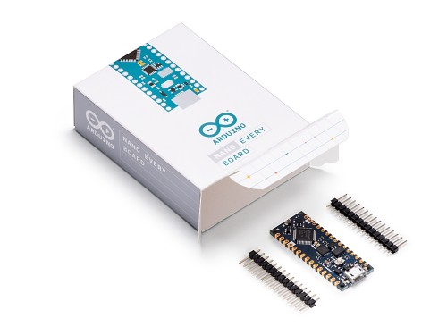
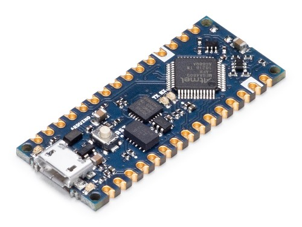
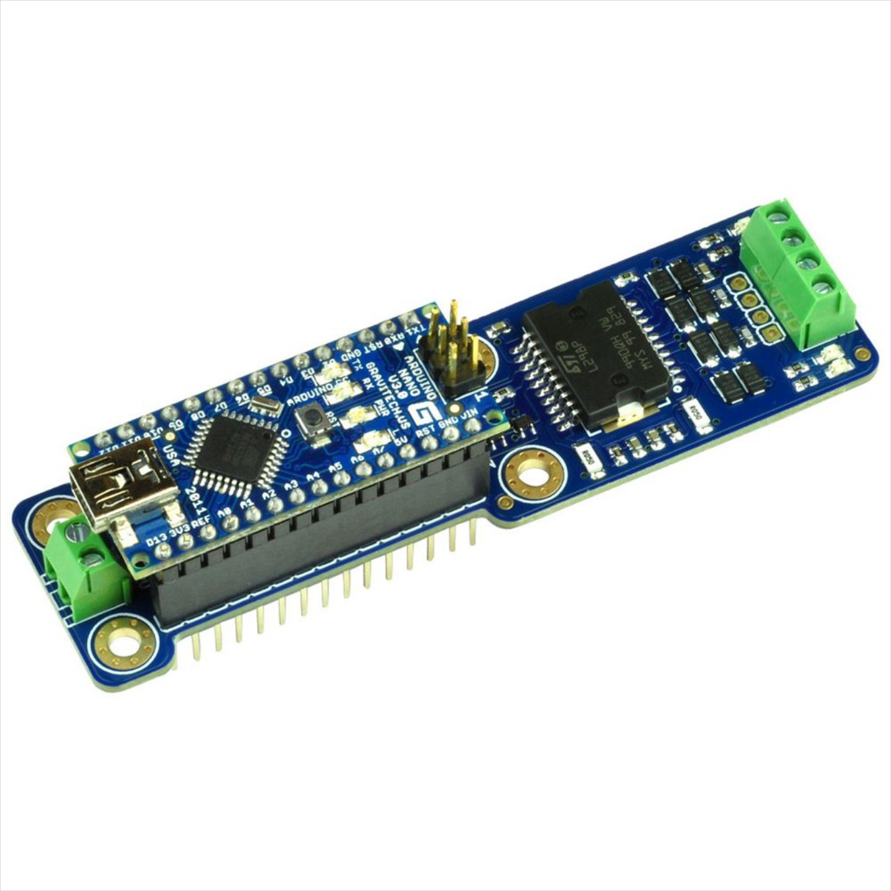

***********************
Arduino Nano Setup
***********************

.. image:: ../_static/images/conductor.png
   :alt: Tinkerer Icon
   :scale: 50%

Conductor Level

That Arduino Nano is an Uno in disguise. It has the same processor, the same speed, the same (small) amount of memory. It's just small. The disadvantage is that you can't plug shields on top of it, but the benefit is that it can fit in a small box. You can always use all the same Uno shields, like the full-sized motor shield, you just have to solder or use wire jumpers to make the connections.

.. NOTE:: Be sure to compare the Mega before using the Nano ***TODO: add link to the comparison page***

**Figure 1** - Arduino Nano

**Figure 2** - Arduino Nano

***TODO: make a note about some boards having to be soldered***

.. image:: ../_static/images/motorboards/nano_cheap.jpg
   :alt: Nano Motor Shield Clone
   :scale: 50%

.. image:: ../_static/images/tinkerer.png
   :alt: Tinkerer Icon
   :scale: 50%

Tinkerer Level