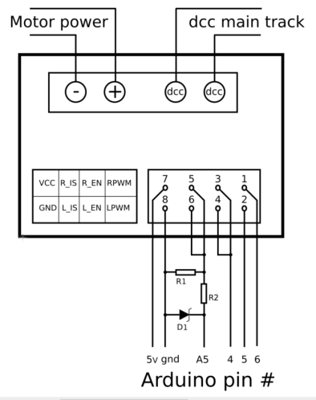

**************************
IRF3205 Motor Board Setup
**************************

.. image:: ../../_static/images/tinkerer.png
   :alt: Engineer Icon
   :scale: 50%
   :align: left

Tinkerer Level

|

- :ref:`What You Will Need (for the IRF3205)`
- :ref:`Use Arduino Motor Shield for PROG and IRF3205 for MAIN`
- :ref:`Use IRF3205 alone for both PROG and MAIN`
- :ref:``
- :ref:``
- :ref:``
- :ref:`Parts List`

What You Will Need (for the IRF3205)
=====================================

* An Arduino Mega or clone (or an Uno if you don't need WiFi or Ethernet)
* An Arduino Motor Shield (If you are upgrading and already have an Arduino Motor Shield)
* An IRF3205 15A motor board
* Version 3.1.0 or later of the DCC++ EX Command Station Software
* A 7-9V DC Power supply for the Mega
* A 12-18V DC (depending on train scale) power supply rated for the current you need (we recommend 5A)
* 2 5A fuses and fuse holders
* A separate current sense board like one based on the ACS724 chip (or just depend on the 5A fuses)
* Some Jumper Wires

TODO: xxx fnd See the parts list below

We assume that many of you may have started off with the Arduino Mega with Arduino Motor Shield (or clones) and are here because you are making the step up to something that can handle more current, and therefore more locos. We will cover two option for how to use your IRF3205 motor board:

1 "Upgrade" by using 1 output of your Arduino Motor Shield to control your PROG track and one output of your IRF3205 board to run your MAIN track.
1. Use both outputs of the IRF3205 board to handle both the MAIN and PROG tracks. You won't need a second motor controller. This is a Tinkerer or perhaps an Engineer option since it requires a little more knowledge.

.. Note:: We can't say it enough, this board can pump out some Amps. Be careful! Put fuses on the connection to each rail and limit the current to a safe level in your config.h file. We have a saying at DCC-EX, if you need more than 5 Amps to run locos, then you need to add power districts, not more Amps.

.. image:: ../../_static/images/motor-boards/15A_Dual_HBridge3.jpg
   :alt: 15A Dual H-Bridge
   :scale: 50%
   :align: center

The IRF3205 is actually the part number of the transistors on the board, N-Channel Power MOSFETS specifically. It takes 4 of them to make one full H-Bridge circuit to control one track. This board has 2 sets of 4 for 2 H-Bridges. You may find other boards that use this transistor, but this guide only covers the 15A Dual H-Bridge pictured above.

Upgrading and Using the Arduino Motor Shield
----------------------------------------------

For this installation we are going to assume you already have a working CS or at least have all the parts you need as listed above.

If you need instructions on how to install the Arduino Motor Shield, see `Arduino Motor Shield Assembly <../../get-started/assembly.html>`_

Tinkerers will use their existing motor shield for PROG and replace the MAIN output with one of the outputs of this board. Engineers can skip to TODO: XXX to see how to modify the board so that just the IRF3205 can manage both tracks.

What Tinkerers Are Going To Do
-------------------------------

* Use just 1 output of your existing Arduino Motor Shield for your program track with no hardware changes
* Add an IRF3205 Motor Board to replace the "A" output of the motor shield to power your MAIN track
* Connect a few jumpers (wires) to your IRF3205 board
* Add a current sense board and fuses (or just fuses for Engineers)
* Change your motor board type in your config.h file

.. WARNING:: Instead of bending out the current sense pin of the Arduino Motor Shield and using the same A0 pin for the IBT_2 current sense, we are using pin A5. Both outputs of the motor shield are still connected, we just don't enable the A or main side of the Arduino Motor Shield. DO NOT try to use the A output of the motor shield! You will have no current sense and no short circuit protection.

Steps 
------

1. Make sure all power supplies are disconnected from your Arduino, The Motor Shield, and the IRF3205 motor board.

2. Disconnect the wires coming out of output A of the Arduino Motor Shield that normally connect to your MAIN track.

3. Move the two wires we just disconnected from the motor shield and connect one to each of the "Motor1" screw terminals of the IRF3205 board. TODO: XXX fnd see if this is where we need to also warn about polarity for <1 JOIN>

4. Option - TODO: fnd curent sense / fuses! See the notes below for more detail about current sense and a suggestion for using an external current sense board.

5. Select your IRF3205 board in the config.h file. TODO: fnd XXX need to add this type

6. Upload the new sketch to your Arduino Mega

Use the following diagrams to connect pins from the Arduino Mega to the IRF3205:

+--------------+-----------------------------+
|  Arduino     |           IBT_2             |
+==============+=============================+
| 4 (enable)   | 3,4  (R_EN, L_EN)           |
+--------------+-----------------------------+
| 5 (signal 1) | 2 (LPWM)                    |
+--------------+-----------------------------+
| 6 (signal 2) | 1 (RPWM)                    |
+--------------+-----------------------------+
| A5 (CS MAIN) | 5,6, R1a  (R_IS, L_IS, R1a) |
+--------------+-----------------------------+
|     5V       |        7 (Vcc)              |
+--------------+-----------------------------+
|     GND      |        GND, R1b             |
+--------------+-----------------------------+

Here is a visual diagram. R1, R2 and D1 are optional. See current sense notes below. Click to enlarge:

It should look like following. Note we have included the Arduino Mega and have the Arduino Motor shield off to the side for reference. The motor shield would obviously normally be stacked on top of the Arduino. However, some people might not use the motor shield and instead will have another board to use for their programming track. In this case, they would connect the IBT_2 to the same pins on the Arduino microcontroller. Also note the jumper wiring that shows pin 4 or the Arduino connecting to pins 3 and 4 on the IBT_2 and A5 connected to pins 5 and 6. As with most of our diagrams, you can click on them to enlarge them.

.. image:: ../../_static/images/motorboards/ibt_2_wiring_fritz.png
   :alt: IBT_2 Wiring 2
   :scale: 25%

.. Note:: We are going to edit your config.h file. If this is your first time using the Command Station software and you do not have a config.h file, rename your config.example.h file to config.h.

Launch the Arduino IDE (or whatever editor you use) and open the CommandStation-EX project. Find the config.h file. look for the following lines of code:

.. code-block:: cpp

   // DEFINE MOTOR_SHIELD_TYPE BELOW ACCORDING TO THE FOLLOWING TABLE:
   //
   //  STANDARD_MOTOR_SHIELD : Arduino Motor shield Rev3 based on the L298 with 18V 2A per channel
   //  POLOLU_MOTOR_SHIELD   : Pololu MC33926 Motor Driver (not recommended for prog track)
   //  FUNDUMOTO_SHIELD      : Fundumoto Shield, no current sensing (not recommended, no short protection)
   //  IBT_2_WITH_ARDUINO    : IBT_2 Motor Board on MAIN and Arduino Motor Shield on PROG
   //  FIREBOX_MK1           : The Firebox MK1                    
   //  FIREBOX_MK1S          : The Firebox MK1S   
   //   |
   //   +-----------------------
   //
   #define MOTOR_SHIELD_TYPE STANDARD_MOTOR_SHIELD

Change the last line to look like this. To be sure of your spelling, you can copy and paste IBT_2_WITH_ARDUINO to replace STANDARD_MOTOR_SHIELD

``#define MOTOR_SHIELD_TYPE IBT_2_WITH_ARDUINO``

Upload the sketch to your arduino. If you need help on how to upload a sketch, see `Getting Started <../../get-started/index.html>`_

Important Notes about Current Sensing Resistors
------------------------------------------------

.. WARNING:: Make sure your board has the expected current sensing resistors and that their value is correct for the maximum current you expect to use. Also, make sure you don't apply more than 5V to the Arduino Analog pin. Our calculations use NOMINAL values, but these chips can vary widely in how much voltage they report per Amp of current at the output. The value of your resistor will also affect this.

Please do the following to ensure you won't damage the Arduino, your layout, or yourself:

* Test your board to see what voltage it reports for 2 or 3 different currents and extrapolate to make sure that at your required current, example 5A, to CS output does not produce more than 5V.
* Use a 5V zener diode and current limiting resistor. This would normally be a 270 Ohm resistor.
* Check your board for at least 2 resistors that are labeled "103", you will need a magnifier or to take a picture with your phone and zoom in. 103 = 10k (10 followed by 3 zeros). When we tie the two CS outputs together, that gives us 5k of resistance from which to measure a voltage drop and convert that to current.
* Put a 5A fuse on each output leg going to your track.

The spec sheet of the BTS7960B states that the "expected" (aka nominal) value for the ratio of output current to the current reported at the current sense pin is 8500 to 1. That means if you have 1 Amp of output current you will get .176 mA of current at the CS pin. If we apply that through our 5k of resistance (V = I*R) we would see .588 Volts at the output connected to our Arduino analog pin. Since the response is linear, we get .588 Amps per Volt. If we have 3A of current to the track, we would have 1.75V. And for 5 Amps, the voltage would be 2.94V. So far, so good, BUT, the tolerance and difference between what is "expected" and what will pass as "acceptable" is huge. The 8500 ratio we expect can be as low as 3000 and has high as 14,000! This means that a 3A current can be reported as anything from 1V to 5V on the CS pin. But what happens at 5A on one of these boards? The answer is that you could have as much as 8.33V connected to your Arduino! In other words, **You could destroy the analog input pin on your Arduino**.

***TODO: organize the above and add pictures***

.. WARNING:: If you are going to use more than 3 Amps, you should add a 10k or less current sense resistor and a 5V Zener diode and series resistor protection circuit. An additional 10k resistor would give you .392 Volts per Amp and will require a small change to your sketch to adjust your current conversion factor. A 2.2k resistor would allow you to measure up to 10A, but the larger the current range the less sensitivity and accuracy you can get. Besides, we should use boosters and power districts if we need more than 5 Amps, right? ;)

Using One IBT_2 for MAIN and another for PROG
----------------------------------------------

This section will cover how to use 2 IBT_2 boards, one for MAIN and one for PROG if you do not already have an Arduino Motor Shield or clone. Be careful as the IBT_2 can deliver much more current than you need for a programming track. If you install 1 Amp fuses in between the IBT_2 outputs and both rails of your programming track, that and the lower trip current we set in the CS for the programming track should protect your layout.

***TODO: Finish this section***

Using External Current Sense
------------------------------

Using an external current sense board instead of the onboard current sense included with the IBT_2 can give us a little more control over the sensitivity of our circuit (ability to read low currents such as one N scale loco sitting still on the track. Circuits and boards we tested are the MAX471 (up to 3A), the Pololu ACS724 (10A+), and a 5A current sense transformer for use with one output wire wrapped through it going directly to the track.

***TODO: Add help or point to a section for external CS boards***

Tech Notes
===========

Motor Board Definitions
------------------------

The choice of motor driver is set in the config.h file. It is set in the following line:

``#define MOTOR_SHIELD_TYPE [Motor Board Type]``

The default is "STANDARD_MOTOR_SHIELD" For Arduino and clone shields.

If you want to change your motor shield or create a definition for one that does not yet have built-in support, you can follow the simple instructions in the `Motor Board Config Section <../motor-board-config.html>`_

For the Engineers, the defintions and implementation for motor board control are in the following files:

  **MotorDrivers.h**  - Contains the definitions for all the currently supported motor boards
  **MotorDriver.h** - Creates the "MotorDriver" C++ class that defines the data type for a motor controller
  **MotorDriver.cpp** - The routines that control the operation of a motor controller (Power, Current Sense, etc.)

Normally you would never need to get into these files, we just mention them because it can be helpful to see the examples in the code if you want to learn more about how to customize your motor board definition or see how things work.

IBT_2 schematic
---------------

Below is a link to the IBT_2 schematic. Click to enlarge.

.. image:: ../../_static/images/schematics/IBT_2_schematic.jpg
   :scale: 50

Below is the Handson Technology datasheet, recommended reading for Tinkerers and Engineers

`Handson Technology BTS7960 High Current 43A H-Bridge Motor Driver <../../_static/documents/bts7960-motor-driver.pdf>`_

TODO: xxx fnd 
-----------------

If you are an Engineer will be using the <1 JOIN> command to connect the main and prog tracks together when prog is not in use, keep the polarity of the rails the same with reference to each other. In other words, if you connect + to the left rail, then always keep + on the rail to the left as viewed from a train sitting on the track. We need to keep the phase of the DCC signal in sync between power districts.

Parts list:
Mean Well LRS-150-15
Enclosed Switchable Power Supply 1U Profile, 150W 15V 10A
http://amazon.com/gp/product/B019GYOPSS/
$23.38 +tax; prime shipping

ELEGOO MEGA 2560 R3 Board ATmega2560 ATMEGA16U2 + USB Cable
https://www.amazon.com/gp/product/B01H4ZLZLQ
$16.99 +tax; prime shipping

ACS724 Current Sensor Carrier 0 to 10A (this one has 400mv/A sensitivity)
https://www.pololu.com/product/4042
$9.95 + $3.95 shipping

DuPont pin M/F jumper wires 20cm – an assortment is fine
https://www.amazon.com/dp/B07GD2BWPY
$5.79 +tax; prime shipping

Dual Motor Driver Board H-Bridge IRF3205, 3-36V, 10A, Peak 30A
various sellers, prices and delivery methods. $16 and higher.
https://www.amazon.com/gp/product/B087PF8CZM
$24.40 +tax; prime shipping

See the PDF file IRF3205_mega_ACS724 in my trains folder

.. WARNING:: If you intend to use more than 5A of current though this board, we recommend using heat sinks.

.. WARNING:: Heat sinks must be insulated! The metal tabs on the transistors are connected to their drain (the middle pin). If you touched the metal of heat sink that was not insulated, or an uninsulated heat sink connected to one transistor touched the heatsink connected to another transistor, the results could be bad. You can used one big heat sink to connect the transistors, but you would have to use proper mounting hardware and thermal compound. Ideas below

XXX put images of thermal double sides tape or the mica and screw solution

1. Current sense on the input of the board for both tracks
2. Curent sense at the motor board outputs (to the tracks) for separate measurement
3. Cut the thick trace on the board and have separate current sense to each H-Bridge