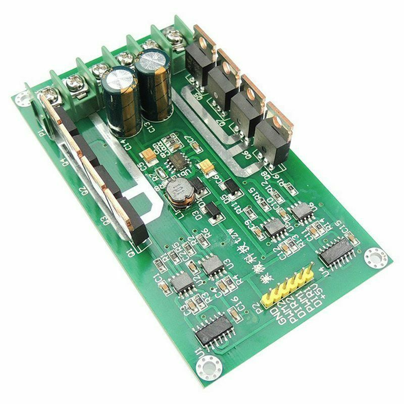
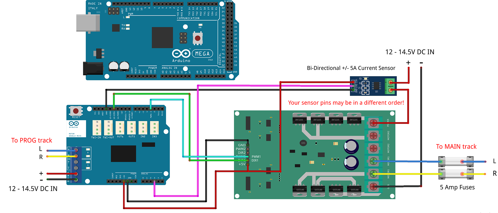
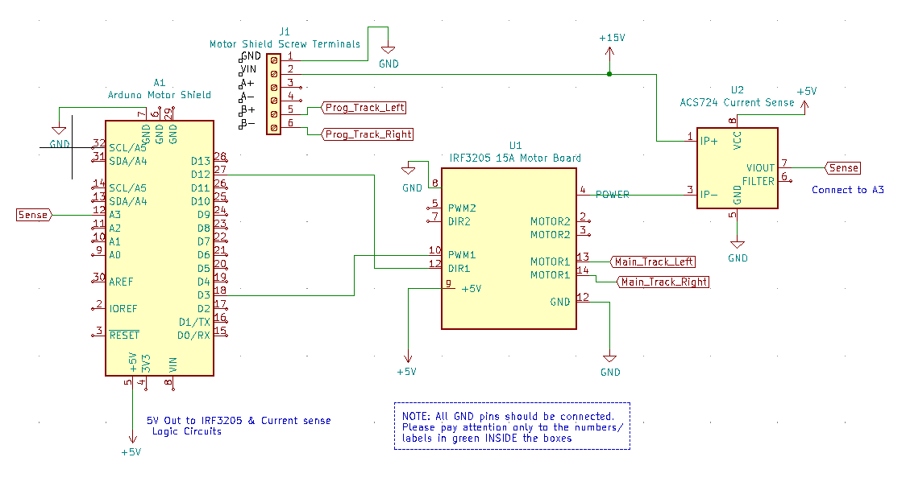

**************************
IRF3205 Motor Board Setup
**************************

.. image:: ../../_static/images/tinkerer.png
   :alt: Engineer Icon
   :scale: 50%
   :align: left

Tinkerer Level

|

- :ref:`What You Will Need (IRF3205)`
- :ref:`Which option should you choose? (IRF3205)`
- :ref:`Upgrading (Use the Arduino Motor Shield AND the IRF3205)`
- :ref:`Replacing (Use both IRF3205 outputs to control MAIN and PROG)`
- :ref:`Important Notes on Current Sensing`
- :ref:`Parts list (IRF3205)`

What You Will Need (IRF3205)
=============================

* An Arduino Mega or clone (or an Uno if you don't need WiFi or Ethernet)
* An Arduino Motor Shield (If you are upgrading or already have an Arduino Motor Shield)
* An IRF3205 15A motor board
* Version 3.1.2 or later of the DCC++ EX Command Station Software
* A 7-9V DC Power supply for the Mega
* A 12-18V DC (depending on train scale) power supply rated for the current you need (we recommend 5A)
* 2 5A fuses and fuse holders
* A separate current sense board like one based on the ACS724 chip (or just depend on the 5A fuses)
* Some Jumper Wires

See the :ref:`Parts list (IRF3205)`

We assume that many of you may have started off with the Arduino Mega with Arduino Motor Shield (or clones) and are here because you are making the step up to something that can handle more current, and therefore more locos. We will cover two options for how to use your IRF3205 motor board:

1. **"Upgrade"** - Using ONE output of your Arduino Motor Shield to control your PROG track and ONE output of your IRF3205 board to run your MAIN track.
2. **"Replace"** - Using BOTH outputs of the IRF3205 board to handle BOTH the MAIN and PROG tracks. You won't need a second motor controller. This is a Tinkerer or perhaps an Engineer option since it requires a little more knowledge and abilities.

.. Note:: We can't say it enough, this board can pump out some Amps. Be careful! Put fuses on the connection to each rail and limit the trip (short circuit) current to a safe level in your config.h file. We have a saying at DCC-EX, if you need more than 5 Amps to run locos, then you need to add power districts, not more Amps.

The IRF3205 is actually the part number of the transistors on the board, N-Channel Power MOSFETS specifically. It takes 4 of them to make one full H-Bridge circuit to control one track. This board has 2 sets of 4 for 2 H-Bridges. You may find other boards that use this transistor, but this guide only covers the 15A Dual H-Bridge pictured above. Anything with MOSFETS in them is more efficient than something with Bipolar Junction Transistors (BJTs) like the L298 on the Arduino and Deek Robot Motor Shields. That means **there is no voltage drop to the tracks** like there is for those boards. Keep that in mind because that means **there can be an extra 2 to 3 volts to your track**. Your trains will run faster than they did before and things could overheat if they were able to handle the 12V reaching the track from a 14.5V power supply, but don't like the full 14+ volts.

Which Option Should You Choose? (IRF3205)
===========================================

.. NOTE:: This board can use the "High Accuracy Waveform" option since it uses just one direction pin per H-Bridge. As long as you use one of our motor board definitions for MOTOR_BOARD_TYPE in your config.h file that uses a Timer1 pin, this will all be automatic. See `High Accuracy Waveform <../high-accuracy.html>`_

Upgrade (IRF3205)
------------------

The main benefit of using the upgrade option, keeping the Arduino Motor Shield for programming and adding the IRF3205 for providing more current for your MAIN track, is that you already have a working system for programming, and therefore need to make fewer changes. The other reason is that current sensing for programming requires more sensitivity that simply being able to detect a short condition, which is all you need on MAIN. 

The circuitry on the Arduino Motor Shield is designed to measure current from just 0 to 2 Amps in the 1023 steps of the analog input pin of an Arduino Mega (it has a 10 bit analog-to-digital converter (ADC)), and 10 bits can hold an integer from 0 to 1023). Measuring 5 or 10 amps in the same number of steps obviously means a loss of resolution. This is not necessarily a bad thing, but is worth noting.

It would be possible to just use fuses to both rails of your MAIN track to protect for shorts on the track and not have to have an external current sense board as long at you also had protection in your power supply to protect against a short in the board itself. Just note that without a current sense board, the Command Station would not be able to automatically turn off power to the board in the event of a short and current monitoring, like in the JMRI DCC++ monitor, will not report main track current.

Replace (IRF3205)
-----------------

The main benefit of the replace option, using only the IRF3205 board, is that you only need one board. If you are building a new CS and don't already have an Arduino Motor Shield, you can save money and space by not having to buy another board.

To use this option *and* be able to program locos, you **must** have an external current sense board so you can detect the acknowledgement (ACK) pulses from a loco on your programming track. The current sensor also allows the CS to monitor for a short and automatically cut the power to the tracks if there is an overload condition (a short).

There are two ways to monitor motor board current, one is at the input of the board and the other is at the output. We will cover both of these methods in the :ref:`Important Notes on Current Sensing` section.

Upgrading (Use the Arduino Motor Shield AND the IRF3205)
===========================================================

For this installation we are going to assume you already have a working CS or at least have all the parts you need as listed above.

If you need instructions on how to install the Arduino Motor Shield, see `Arduino Motor Shield Assembly <../../get-started/assembly.html>`_

Tinkerers will use their existing motor shield for PROG and replace the MAIN output with one of the outputs of this board. Engineers can skip to :ref:`Replacing (Use both IRF3205 outputs to control MAIN and PROG)` to see how to modify the board so that just the IRF3205 can manage both tracks.

What Tinkerers Are Going to Do (Upgrade)
-----------------------------------------

* Use just ONE output (the "B" Output) of your existing Arduino Motor Shield for your program track with no hardware changes
* Add an IRF3205 Motor Board to replace the "A" output of the motor shield to power your MAIN track
* Connect a few jumpers (wires) to your IRF3205 board
* Add a current sense board and fuses (or just fuses for Engineers)
* Change your motor board type in your config.h file

.. WARNING:: Instead of bending out the current sense pin of the Arduino Motor Shield and using the same A0 pin for the IBT_2 current sense, we are using pin A3. Both outputs of the motor shield are still connected, we just don't enable the A, or main, side of the Arduino Motor Shield. DO NOT try to use the A output of the motor shield! You will have no current sense and no short circuit protection.

Steps (Upgrade IRF3205)
--------------------------

1. Make sure all power supplies are disconnected from your Arduino, The Motor Shield, and the IRF3205 motor board.

2. Disconnect the wires coming out of output A of the Arduino Motor Shield that normally connects to your MAIN track.

3. Move the two wires we just disconnected from the motor shield and connect one to each of the "Motor1" screw terminals of the IRF3205 board. TODO: Add image.

4. NOTE: It is important that the phase of the signal to your PROG and MAIN tracks are the same if you are ever going to use the ``<1 JOIN>`` command to make both tracks a MAIN when the PROG track is not in use, or if you are going to use the "Driveaway" feature. For more detail, see :ref:`Keeping your tracks in phase` below.

5. Use the following diagrams to connect pins from the Arduino Mega to the IRF3205. "CS" in the table means "Current Sense":

+--------------+----------------------+
|  Arduino     |       IRF3205        |
+==============+======================+
| 2 (enable)   |        PWM1          |
+--------------+----------------------+
| 12 (signal)  |        DIR1          |
+--------------+----------------------+
| A3 (CS MAIN) |   CS Board Sense     |
+--------------+----------------------+
|     5V       |        +5V           |
+--------------+----------------------+
|     GND      |        GND           |
+--------------+----------------------+

Here is a visual diagram. See :ref:`Important Notes on Current Sensing`. Click to enlarge:

It should look like following. Note we have included the Arduino Mega and have the Arduino Motor shield off to the side for reference. The motor shield would obviously normally be stacked on top of the Arduino. However, some people might not use the motor shield and instead will have another board to use for their programming track. In this case, they would connect the IRF3205 (TODO: What does this mean? Did I mean to connect this other board to those pins or the IRF3205?? Fix this in the IBT_2 board page also) to the same pins on the Arduino microcontroller. As with most of our diagrams, you can click on them to enlarge them. )TODO: Mention fuses here? Another diagram?)

6. Select your IRF3205 board type in the config.h file. TODO: fnd XXX need to add this type in EX
   
.. Note:: We are going to edit your config.h file. If this is your first time using the Command Station software and you do not have a config.h file, rename your config.example.h file to config.h.

Launch the Arduino IDE (or whatever editor you use) and open the CommandStation-EX project. Find the config.h file. look for the following lines of code:

.. code-block:: cpp

   // DEFINE MOTOR_SHIELD_TYPE BELOW ACCORDING TO THE FOLLOWING TABLE:
   //
   //  STANDARD_MOTOR_SHIELD : Arduino Motor shield Rev3 based on the L298 with 18V 2A per channel
   //  POLOLU_MOTOR_SHIELD   : Pololu MC33926 Motor Driver (not recommended for prog track)
   //  FUNDUMOTO_SHIELD      : Fundumoto Shield, no current sensing (not recommended, no short protection)
   //  IBT_2_WITH_ARDUINO    : IBT_2 Motor Board on MAIN and Arduino Motor Shield on PROG
   //  FIREBOX_MK1           : The Firebox MK1                    
   //  FIREBOX_MK1S          : The Firebox MK1S   
   //   |
   //   +-----------------------
   //
   #define MOTOR_SHIELD_TYPE STANDARD_MOTOR_SHIELD

Remove the last line and replace it with this. To be sure of your spelling, you can copy and paste everything:

.. code-block:: c

   #define MOTOR_SHIELD_TYPE IRF3205_ARDUINO_ACS724

   #define IRF3205_ARDUINO_ACS724 F("IRF3205_ARDUINO_ACS724"), \
     new MotorDriver(3, 12, UNUSED_PIN, UNUSED_PIN, A3, 12.2, 6000, UNUSED_PIN), \
     new MotorDriver(11, 13, UNUSED_PIN, UNUSED_PIN, A1, 2.99, 2000, UNUSED_PIN)

This will use pin 3 for Enable and 12 for signal, which will use the "High Accuracy" waveform. You could use other pins that line up together if you like and use "Standard" accuracy (TODO: Link to not explaining high accuracy).

7. Upload the new sketch to your Arduino. If you need help on how to upload a sketch, see `Getting Started <../../get-started/index.html>`_

8. If you intend to use your Command station for programming on a separate programming track, or you will want to monitor current on your main track, you will connect an external current sense board. See the notes below for more detail about current sense and a suggestion for using an external current sense board.

See :ref:`Important Notes on Current Sensing`

Replacing (Use both IRF3205 outputs to control MAIN and PROG)
==============================================================

.. NOTE:: This option requires a small external current sense board wired in series with the DC power into the board. This monitors the total current the board uses, so cannot measure the MAIN and PROG tracks separately. You will need to turn off power to MAIN ``<0 MAIN>`` when programming. There is an option to use 2 current sense boards at the output to each track (requires bi-directional current sense boards) or to create a break in the power trace on the board to one of the H-Bridge circuits to monitor DC input current separately. Those options are covered in the :ref:`Tech Notes (IRF3205)` section.

This section will cover how to the MOTOR1 output to control MAIN and MOTOR2 to control PROG if you do not already have an Arduino Motor Shield or clone. Be careful as the IRF3205 can deliver much more current than you need for a programming track. If you install 1 Amp fuses in between the IRF3205 Motor2 outputs and both rails of your programming track, that and the lower trip current we set in the Command Station for the programming track should protect your layout and your locos.

What Tinkerers Are Going to Do (Replace IRF3205)
-------------------------------------------------

* Use both outputs of your IRF3205 15A board (MOTOR1 and MOTOR2) to control your MAIN and PROG track
* Connect a few jumpers (wires) to your IRF3205 board
* Add a current sense board and fuses (you MUST have current sense to program locos)
* Change your motor board type in your config.h file

Steps (Replace IRF3205) 
-------------------------

1. Make sure all power supplies are disconnected from your Arduino and the IRF3205 motor board.
2. Option - TODO: fnd curent sense / fuses! See the notes below for more detail about current sense and a suggestion for using an external current sense board.
3. Select your IRF3205 board in the config.h file. ***TODO: fnd need to add this type***
4. Upload the new sketch to your Arduino Mega

Connect wires of the proper gauge (TODO: see gauge) from the "MOTOR1" screw terminals of the IRF3205 board to your MAIN track and connect 2 more wires from the "MOTOR2" terminals to your PROG track. 

.. NOTE:: It is important that the phase of the signal to your PROG and MAIN tracks are the same if you are ever going to use <1 JOIN> to make both tracks a MAIN when the PROG track is not in use, or if you are going to use the "Driveaway" feature. TODO: fnd finish this. How do know phase?

Use the following diagrams to connect pins from the Arduino Mega to the IRF3205. "CS" in the table means "Current Sense":

+--------------+----------------------+
|  Arduino     |       IRF3205        |
+==============+======================+
| 3 (enable)   |        PWM1          |
+--------------+----------------------+
| 12 (signal)  |        DIR1          |
+--------------+----------------------+
| A0 (CS MAIN) |   CS Board Sense     |
+--------------+----------------------+
| 11 (enable)  |        PWM2          |
+--------------+----------------------+
| 13 (signal)  |        DIR2          |
+--------------+----------------------+
| A1 (CS PROG) |   CS Board Sense     |
+--------------+----------------------+
|     5V       |        +5V           |
+--------------+----------------------+
|     GND      |        GND           |
+--------------+----------------------+

It should look like following graphical image. Note we have included the Arduino Mega and have the Arduino Motor shield off to the side for reference. The motor shield would obviously normally be stacked on top of the Arduino. However, some people might not use the motor shield and instead will have another board to use for their programming track. In this case, they would connect the IRF3205 directly to the same pins on the Arduino microcontroller. Please use fuses on BOTH wires of the output to your MAIN track. As with most of our diagrams, you can click on them to enlarge them.

Here is a wiring diagram. See :ref:`Important Notes on Current Sensing` below. Click on images to enlarge them:

Pay attention to board labels, not their position on this drawing. Your current sensor may have its connections wired differently! Here is a schematic image to help clarify the wiring.

If you want to use more than 5A (but we recommend not to), there are changes you need to make to the hardware AND to the config.h settings. See TODO: link to section below.

.. Note:: We are going to edit your config.h file. If this is your first time using the Command Station software and you do not have a config.h file, rename your config.example.h file to config.h.

Launch the Arduino IDE (or whatever editor you use) and open the CommandStation-EX project. Find the config.h file. look for the following lines of code:

.. code-block:: cpp

   // DEFINE MOTOR_SHIELD_TYPE BELOW ACCORDING TO THE FOLLOWING TABLE:
   //
   //  STANDARD_MOTOR_SHIELD : Arduino Motor shield Rev3 based on the L298 with 18V 2A per channel
   //  POLOLU_MOTOR_SHIELD   : Pololu MC33926 Motor Driver (not recommended for prog track)
   //  FUNDUMOTO_SHIELD      : Fundumoto Shield, no current sensing (not recommended, no short protection)
   //  IBT_2_WITH_ARDUINO    : IBT_2 Motor Board on MAIN and Arduino Motor Shield on PROG
   //  FIREBOX_MK1           : The Firebox MK1                    
   //  FIREBOX_MK1S          : The Firebox MK1S   
   //   |
   //   +-----------------------
   //
   #define MOTOR_SHIELD_TYPE STANDARD_MOTOR_SHIELD

Remove the last line and replace it with this. To be sure of your spelling, you can copy and paste everything:

.. code-block:: c

   #define MOTOR_SHIELD_TYPE IRF3205_ACS724

   #define IRF3205_ACS724 F("IRF3205_ACS724"), \
     new MotorDriver(3, 12, UNUSED_PIN, UNUSED_PIN, A0, 12.2, 6000, UNUSED_PIN), \
     new MotorDriver(11, 13, UNUSED_PIN, UNUSED_PIN, A1, 2.99, 2000, UNUSED_PIN)

This will us pin 3 for Enable and 12 for signal, which will use the "High Accuracy" waveform. You could use other pins that line up together if you like and use "Standard" accuracy (TODO: Link to note explaining high accuracy).
Upload the sketch to your arduino. If you need help on how to upload a sketch, see `Getting Started <../../get-started/index.html>`_

***TODO: organize the above and add pictures***

***TODO: Finish this section***

Important Notes on Current Sensing
===================================

.. WARNING:: You MUST have current sensing if you want to read or write settings to locos on a programming track (PROG). You also must have current sensing in order to have the Command Station software detect an overload and cut power to the MAIN track. Alternately, you can use fuses for MAIN. If the fuses blow, the Command Station will still think there is power to the track, and you will recieve no notification in the log. Also, make sure you don't apply more than 5V to the Arduino Analog pin. Ensure that your calculation for what voltage the current sense board will report at the maximum current will not be more than 5V for a 5V Arduino or 3.3V for a Command Station using a 3.3V board (like a Teensy or Feather).

Please do the following to verify you won't damage the Arduino, your layout, or yourself:

* Test your current sense board to see what voltage it reports for 2 or 3 different currents and extrapolate to make sure that at your required current, example 5A, the output going to pin A3 of the CS does not produce more than 5V.
* Consider using a 5V zener diode and current limiting resistor to clamp the voltage on the analog pin. This would normally be a 270 Ohm resistor.
* Put a 5A fuse on each output leg going to your track.

Using Other External Current Sense Boards
------------------------------------------

TODO: finish this. Circuits and boards we tested are the MAX471 (up to 3A), the Pololu ACS724 (10A+), and a 5A current sense transformer for use with one output wire wrapped through it going directly to the track.

***TODO: Add help or point to a section for external CS boards***

Sense Current at the Tracks instead of the motor board input
--------------------------------------------------------------

TODO: Finish this.

Tech Notes (IRF3205)
=====================

Motor Board Definition for IRF3205
------------------------------------

The choice of motor driver is set in the config.h file. It is set in the following line:

``#define MOTOR_SHIELD_TYPE [Motor Board Type]``

The default is "STANDARD_MOTOR_SHIELD" For Arduino and clone shields.

If you want to change your motor shield or create a definition for one that does not yet have built-in support, you can follow the simple instructions in the `Motor Board Config Section <../motor-board-config.html>`_

For the Engineers, the defintions and implementation for motor board control are in the following files:

  **MotorDrivers.h**  - Contains the definitions for all the currently supported motor boards
  **MotorDriver.h** - Creates the "MotorDriver" C++ class that defines the data type for a motor controller
  **MotorDriver.cpp** - The routines that control the operation of a motor controller (Power, Current Sense, etc.)

Normally you would never need to get into these files, we just mention them because it can be helpful to see the examples in the code if you want to learn more about how to customize your motor board definition or see how things work.

IRF3205 15A Motor Board schematic
------------------------------------

Below is a link to the IBT_2 schematic. Click to enlarge. TODO: this is wrong

.. image:: ../../_static/images/schematics/IBT_2_schematic.jpg
   :scale: 50

Keeping Your tracks in Phase
------------------------------
   
If you are an Engineer will be using the <1 JOIN> command to connect the main and prog tracks together when prog is not in use, keep the polarity of the rails the same with reference to each other. In other words, if you connect + to the left rail, then always keep + on the rail to the left as viewed from a train sitting on the track. We need to keep the phase of the DCC signal in sync between power districts.

To check phase, Put an AC Voltmeter with one lead on the LEFT rail on PROG and the other lead on the left rail on MAIN. If the meter measures an AC voltage near track voltage (around 17-20 VAC normally) then reverse one of the power wires to one of the tracks at the track or at the motor board output. Test again.It should now read 0 Volts AC.

TODO: Finish this section

Parts List (IRF3205)
=====================

Mean Well LRS-150-15
Enclosed Switchable Power Supply 1U Profile, 150W 15V 10A
http://amazon.com/gp/product/B019GYOPSS/
$23.38 +tax; prime shipping

ELEGOO MEGA 2560 R3 Board ATmega2560 ATMEGA16U2 + USB Cable
https://www.amazon.com/gp/product/B01H4ZLZLQ
$16.99 +tax; prime shipping

ACS724 Current Sensor Carrier 0 to 10A (this one has 400mv/A sensitivity)
https://www.pololu.com/product/4042
$9.95 + $3.95 shipping

DuPont pin M/F jumper wires 20cm – an assortment is fine
https://www.amazon.com/dp/B07GD2BWPY
$5.79 +tax; prime shipping

Dual Motor Driver Board H-Bridge IRF3205, 3-36V, 10A, Peak 30A
various sellers, prices and delivery methods. $16 and higher.
https://www.amazon.com/gp/product/B087PF8CZM
$24.40 +tax; prime shipping

TODO: See the PDF file IRF3205_mega_ACS724 in trains folder to include here

.. WARNING:: If you intend to use more than 5A of current though this board, we recommend using heat sinks.

.. WARNING:: Heat sinks must be insulated! The metal tabs on the transistors are connected to their drain (the middle pin). If you touched the metal of heat sink that was not insulated, or an uninsulated heat sink connected to one transistor touched the heatsink connected to another transistor, the results could be bad. You can used one big heat sink to connect the transistors, but you would have to use proper mounting hardware and thermal compound. Ideas below

..
   TODO: finish and remove these comments
   XXX put images of thermal double sides tape or the mica and screw solution

..
   1. Current sense on the input of the board for both tracks
   2. Curent sense at the motor board outputs (to the tracks) for separate measurement
   3. Cut the thick trace on the board and have separate current sense to each H-Bridge
   
   from chris, re not using <1 JOIN> Alternatively you can connect the tracks through a dpdt relay and drive that with the feature that sets a gpio pin when joined... 

   Add to mySetup.h
   DCC::setJoinRelayPin(n)

   more TODO: What about the motor shield main output we aren't using? Any pins to bend out? Ground current sense? Don't think so on the latter.

   What does the ACS724 report for 6 or 7 amps? How to make sure it doesn't go over 5V to the Arduino analog pin.   

   put a note somewhere in the second install that measuring at the input means the current is for both tracks and that used by the board. We check for an offset, so the board current is cancelled out, but if either track has a short, both tracks cut out. Can't have locos anywhere when programming.Current sensing for IRF3205 motor board.

   To use the IRF3205 motor board with a common current sense module, turn off main when programming.

   Note that I was able to successfully read several decoders with 0-10A and +/-10A external current sensors, but not the recent model SD70Ace Genesis w/Tsunami2 OEM sound decoder.
   
   Locoduino site shows a method for separating the channels and adding a MAX471.
   https://forum-locoduino-org.translate.goog/index.php?PHPSESSID=7cbbfc3255ae799160a2b9a6aa42e375&topic=843.msg10416&_x_tr_sl=fr&_x_tr_tl=en&_x_tr_hl=en&_x_tr_pto=sc,elem#msg10416
   
   I wonder if the 1.5 ohm 3 watt resistor could be added to this setup instead of the MAX471.
   
   Perhaps the two channels of the IRF3205 motor board would be better utilized for two power districts.
   
   Perhaps anyone who is up to the challenges of the IRF3205 would also be able to add the 1.5 ohm resistor to the L298N motor board.
   
   But take a step back.  What to recommend?
   1.  Mega + motor shield
   2.  Add a motor board if more power is needed for main track
    a.  IBT_2
      or 
    b.  IRF3205 + external current sensor

   And consider adding the LEDs to confirm when tracks are powered.  I like using two LEDs per output instead of LED/diode -- if only one is lit, there is a problem...

   make a note about how current sense is affected by 3.3V boards
   
   -- instructions at:  https://www.locoduino.org/spip.php?article253
   where IRF3205 is incorrectly identified as L9110S.

