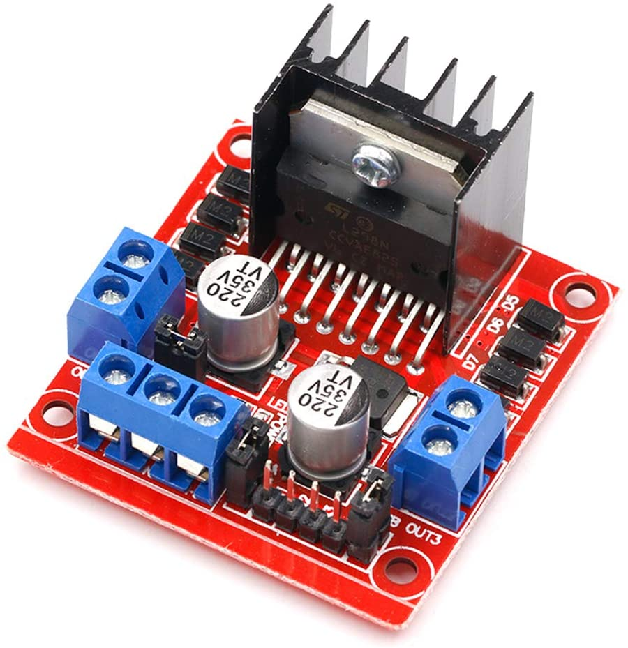
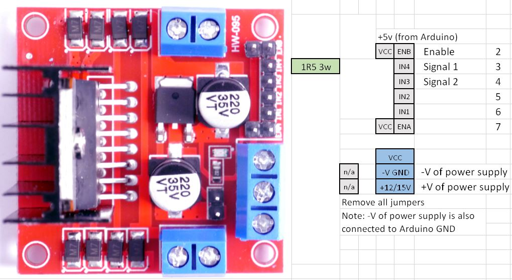

************************
L298N Motor Board Setup
************************

.. image:: ../../_static/images/tinkerer.png
   :alt: Tinkerer Icon
   :scale: 50%
   :align: left

Tinkerer Level

|

The L298N Motor board is the same H-Bridge on the Arduino Motor Shield. Here are the key differences:

* It is in a much smaller form factor
* It isn't a shield so you have to jumper wires to connect it to your CS
* It doesn't have current sense, so you are going to have to use one of the solutions below
* It stands vertically on the board with a big heat sink for better controlling

  L298N Motor Board

Handling Current sense
=======================

You will need to have currense sense in order to program locos on the programming (service) track. In addition, current sense is necessary to provide short-circuit detection for each track.

Adding Current Sense Resistors
-------------------------------

This is easier than it sounds. To do this yourself, you will need:

* 2 One Ohm, 1Watt Resistors
* small wire cutters
* soldering iron and soldering
* 18 Guage hookup wire

External Board
---------------

Add a Motor Board Definition
=============================

.. code:: none
   
   #define MY_L298N_BOARD F("MY_L298N_BOARD"),\
      new MotorDriver(2, 4, 6, UNUSED_PIN, A0, 4.88, 2000, UNUSED_PIN), \
      new MotorDriver(3, 5, 7, UNUSED_PIN, A1, 4.88, 2000, UNUSED_PIN)

      #define MOTOR_SHIELD_TYPE MY_L298N_BOARD

   