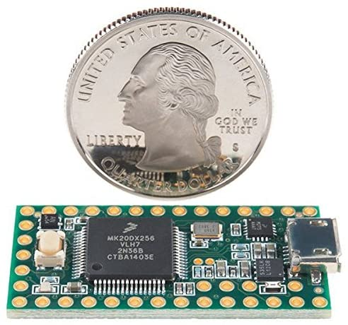
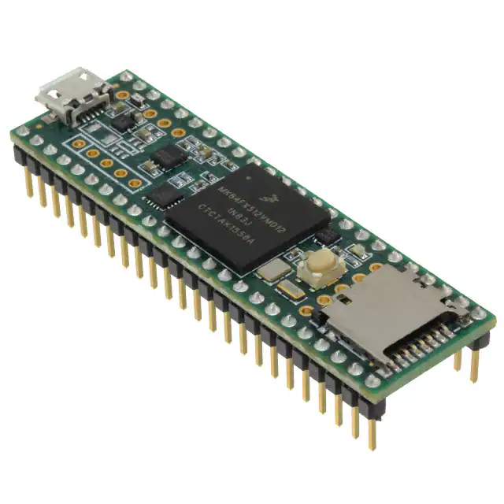

************
Teensy
************

.. image:: ../_static/images/tinkerer.png
   :alt: Tinkerer Icon
   :scale: 50%
   :align: left

Tinkerer Level

It's teensy because it is even smaller than a nano, but it is even more powerful than a Nano Every. This is not an Arduino, it is from a company called PJRC. Since it is a different processor, there are a lot of changes in the software that load onto the teensy when you select that as your processor.

There are several versions 3.2, 3.5, 3.6, 4.0, 4.1. DCC++ EX will run on all these boards. The biggest difference is size/number of pins. You can also purchase the boards with or without the headers soldered on.

There are even expansion boards to add WiFi and Ethernet. There is a Mega form factor board available to allow you to use 3.3V shields.

.. image:: ../_static/images/microcontrollers/teensy41_ethernet.jpg
   :alt: Teensy Ethernet
   :scale: 50%
   :align: left

Teesy Specifications
=======================

* 180 MHz ARM Cortex-M4 with Floating Point Unit
* 1M Flash, 256K RAM, 4K EEPROM
* Microcontroller Chip MK66FX1M0VMD18
* MK66FX1M0VMD18 USB High Speed (480 Mbit/sec) Port 
* 2 CAN Bus Ports 
* 32 General Purpose DMA Channels 
* 22 PWM Outputs 
* 4 I2C Ports 
* 11 Touch Sensing Inputs 
* 62 I/O Pins (42 breadboard friendly) 
* 25 Analog Inputs to 2 ADCs with 13 bits resolution 
* 2 Analog Outputs (DACs) with 12 bit resolution 
* 22 PWM Outputs USB Full Speed (12 Mbit/sec) 
* Port Ethernet mac, capable of full 100 Mbit/sec speed 
* Native (4 bit SDIO) 
* micro SD card port 
* I2S Audio Port 
* 4 Channel Digital Audio Input & Output 
* 14 Hardware Timers 
* Cryptographic Acceleration Unit 
* Random Number Generator 
* CRC Computation Unit 
* 6 Serial Ports (2 with FIFO & Fast Baud Rates) 
* 3 SPI Ports (1 with FIFO) 
* 4 I2C Ports Real Time Clock

The only downside is that PJRC is a very small company, it doesn't have the resources or the staff of Arduino or Expressif. The board is also 3.3V, so you have to be careful that anything connected to the GPIO porst is also 3.3V 