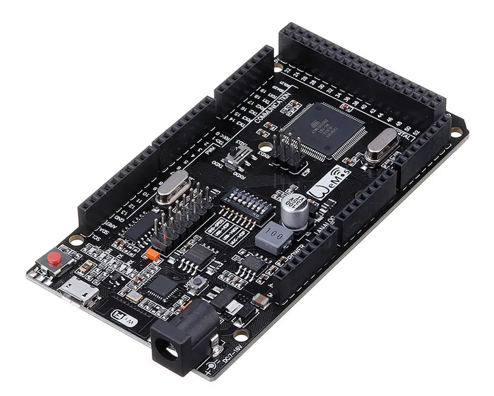

**************************
Mega+WiFi Configuration
**************************

A Operational Standalone WiFI DCC Command Station
==================================================

   figure 1 - Mega+WiFi Board

This is a combination of a Mega Clone and an ESP8266 WiFi chip on one board. Our guess is that like many boards made in China, this is only made by one or two factories, but sold under several names. Search for WiFi+Mega or ATmega2560+ESP8266. Here are some of the brands. Links to some supplers at at the bottom of this page:

* Wemos
* RobotDyn
* Geekcreit

What You Will Need
-------------------

This is our tested and proven configuration

* DCC++EX 3.0.5 or greater
* ATMega2560 + ESP8266 WiFI - Combo Board
* Deek Robot L298P Standard Motor Shield (or other `approved motor controllers <../reference/hardware/motor-boards.html>`_
* 12-16Vdc Laptop power supply to the Motor Shield (16V provides 14.5Vdc to the tracks for HO Gauge)
* 7-9Vdc power supply to the ATmega boards with a female 2.1mm power barrel
* Android Smartphone w Engine Driver v2.28.123 or iOS Smarphone with WiThrottle
* USB-A male to Micro USB-B cable

What You Will Do
------------------

1. Download the ESP Files
2. Flash the ESP8266 chip
3. Edit your config file and Load the DCC++EX v3.0.5 to the Mega2560 chip
4. Setup your Throttle

.. Note:: This board uses a Micro-USB connector instead of the USB-B printer type connector uses on regular Arduino Boards. It also uses the CH340G USB to Serial Driver chip instead of the FTDI on Arduino brands,so may require you to install a driver.

1. Plug in and test your Mega
------------------------------

Plug your board into your computer with a USB micro cable to see if it is recognized. These boards use a CH340 UART (The USB controller) instead of the ones on an Arduino brand Uno or Mega. If you have never plugged anything into your computer with this chip on it before, you are going to have to install a driver. On Windows, you can go to device manager and open the ports tree item. Look for "CH340" or "CH341".

.. figure:: ../_static/images/wifi/ch340_driver.png
   :alt: CH340 Recognized
   :scale: 100%
   :align: center

   figure 2 - CH340 Recognized 

If you don't see the CH340 with the Mega plugged into USB, download and install the drivers from here:

http://www.wch-ic.com/downloads/CH341SER_ZIP.html

Once you can see your computer recognizes your board, **remember the port**. For a PC running windows, it will be something like "COM24" as in the picture above. For a Mac, it will be something like "/dev/cu.wchusbserial*****", and for Linux it will look like "/dev/ttyUSBx". Write it down. 

**Unplug the Mega.**

For more detail on how to install the correct CH340 drivers for your OS, you can see this `Sparkfun Tutorial <https://learn.sparkfun.com/tutorials/how-to-install-ch340-drivers/all>`_

2. Download and install the flash download tool
------------------------------------------------

There are two tools you can use to flash the firmware, one is the **"Expressif Flash Download tool"** for Windows and the other is a Python script called **esptool** that will run on Windows, Mac, or Linux. Follow the path for the flash tool you choose.

Using the Flash Download Tool (Windows)
^^^^^^^^^^^^^^^^^^^^^^^^^^^^^^^^^^^^^^^^

Download the Flash Download Tool and the ESP8266_NONOS_AT_Bin_v1.7.4 firmware files by clicking on the buttons below. Unzip them wherever you like:

.. raw:: html

   
<a class="dcclink" href="../_static/files/esp8266/flash_download_tool_v3.8.5.zip">Flash Download tool</a>

  

.. raw:: html
  
   
<a class="dcclink" href="../_static/files/esp8266/mega_wifi_esp866_bin_files">ESP8266 Firmware Zipped</a>

Using esptool.py (Windows, Mac, Linux)
^^^^^^^^^^^^^^^^^^^^^^^^^^^^^^^^^^^^^^^

Download the ESP8266_NONOS_AT_BIN_v1.7.4 firmware files by clicking the button below:

.. raw:: html
   
   
<a class="dcclink" href="../_static/files/esp8266/mega_wifi_esp866_bin_files">ESP8266 Firmware Zipped</a>

Install python if you don't already have it installed. This quick quide shows you how to check if you already have Python and how to install it if you don't:

https://wiki.python.org/moin/BeginnersGuide/Download

Once you have Python installed, you will need to install etptool.py. Open a command prompt and use pip to find and install it from the web:

.. code-block::

   $ pip install esptool

NOTE:with some Python installations that command may not work and you’ll receive an error. If that’s the case, try to install esptool.py with one of the following:

| pip3 install esptool
| python -m pip install esptool
| pip2 install esptool

When that is installed, install setup tools:

.. code-block::

   $ pip install setuptools

3. Set the switches on your Mega for flashing
-----------------------------------------------

With the Mega UNPLUGGED (no power connected!), you will set some switches. Use the following diagram to see the locations on the board. You can click on any picture to enlarge it.

.. figure:: ../_static/images/wifi/mega_wifi1.png
   :alt: Mega WiFi Switch Locations
   :scale: 50%
   :align: center

   Figure 3 - Important Board Locations

Note that switch 8 is not connected to anything, you don't need to touch it. With a toothpick or jewelers screwdriver, very gently set your dip switches, it is easy to break them. Use this diagram to set your dip switches, ON is up in this picture. Switches 5,6, and 7 are on.

   Figure 4 - Switch Settings for Flashing

Configure the board as follows:

 -  set dip switches **5,6,7 ON** (1,2,3,4 OFF)
 -  set Serial Port (TX/RX) Slide Pin to **RxD3 & TxD3**
 -  Connect Mega+WiFI board to your computer with the USB cable
 -  press the **Mode button**

4. Flash the Firmware
------------------------

With the Flash Download Tool
^^^^^^^^^^^^^^^^^^^^^^^^^^^^^^
 
Run the Flasher Tool (it may take a few seconds to open while you see a black cmd window)

- press [Developer Mode] button
- Press [ESP8266 Download Tool] button

.. image:: ../_static/images/wifi/download_tool_dev_mode.jpg
   :alt: Flasher Tool Buttons
   :scale: 80%
   :align: left

.. figure:: ../_static/images/wifi/download_tool_esp8266.jpg
   :alt: Flasher Tool Buttons 2
   :scale: 80%
   :align: left

   Figure 5 - Flash Tool Button Selections

|
|
|
|
|
|
|
|
|
|
|
|
|
|
|
|
|
|
|
|
|
|

Setup the files and memory locations in the Flasher Tool

- Pay close attention setting up the Exact `*.bin` Files & locations 0xYYYYYYYY
- Make sure to check all the file checkboxes!
- Set the EXACT settings using the radio buttons & baud rate settings: (26M, 40MHz, DIO, 16Mbit-C1, Your COM port selected, and 460800 baud).

.. figure:: ../_static/images/wifi/flasher_1.png
   :alt: Flasher Settings Screen
   :scale: 80%
   :align: center

   Figure 6 - Flasher Settings Screen

.. NOTE:: These settings are for the ESP8266EX chip on the Mega+Wifi, you may need different settings to flash an ESP-01s, ESP12, etc.

- First press the **Erase button** and let the ESP erase the chip memory.   
- Then press the **Start button** and the bin files will flash load onto the ESP-WiFi chip

After flashing, the ESP8266 Log will show it uploaded them all successfully and it closes the port.

- Disconnect the USB cable.

Skip ahead to :ref:`3. Set the switches for run/sketch mode`

With esptool.py
^^^^^^^^^^^^^^^^

***TODO: Put instructions here***

3. Set the switches for run/sketch mode
==========================================

With the power disconnected from the Mega, set the switches back to the upload/run mode
- dip switches 5,6,7 OFF and 1,2,3,4 ON
- (Leave the TX/RX slide Pin on RxD3 TxD3)
- re-connect the USB cable

.. figure:: ../_static/images/wifi/mega_wifi_sw_run.png
   :alt: Switches in flash mode
   :scale: 30%
   :align: center

   Figure 7 - Switch Settings for sketch load/run

4. Install the DCC++EX Command Station Software
==================================================

Download and install DCC++EX from either the Automated exInstaller or the Latest DCC++ EX Release >= 3.0.5
- https://dcc-ex.com/download/index.html

***TODO: Link to the installer pages here***

Once you have DCC-EX installed on the Mega you need to Open the CommandStation-EX Folder make a Copy of the config.example.h file and rename the copy to config.h

Decide which Mode of WiFi Communication you wish to run, Either Access Point AP Mode, Or Station STA Mode.

AP mode is Local Intranet, No Internet access.  Station Mode is your local WiFi Router With Internet access.
**Note:**  See WiFi Configuration for more details.

Setting up in Access Point AP Mode
- No additional changes require, Leave SSID & Passwd alone
- Your ESP-Wifi chip will assign a SSID as DCCEX_xxxxxx and PASS_xxxxxx, Where xxxxxx is the ESP8266 MAC ID number.

Setting up WiFi in Station STA Mode with Router
- Open the CommandStation-EX.ino in the Arduino IDE Interactive Development Editor then
- Edited & change the new config.h file to your local or home Router's SSID & Password.
- #define WIFI_SSID "Your network name" to your "Local SSID"
- #define WIFI_PASSWORD "Your network passwd" to your "Local PW" 

Compile and Re-upload DCC-EX to the
- ATMega2560 board (com: xx, baud 115200),
- Verify your com port and baud rate in Windows device manager

After the Arduino IDE uploads DCC-EX 3.0.5 sketch
- Disconnect USB cable
- Reset dip switches 1,2,3,4 on .. 5,6,7,8 off
- (Leave the TX/RX slide Pin on RxD3 TxD3)

Power up the Arduino ATMega2560 + ESP8266 WiFi board by Either a USB cable, Or  
  **Note:** {For Standalone Operations (no USB) you can use a 7-12vdc power supply in the Arduino 2.1mm female barrel.}

- When powered on through a USB cable, check the Arduino IDE Tools > Serial Monitor.
- It should show the ATMega2560 & ESP8266 WiFI communicating and assigning a xxx.xxx.x.xxx IP Address and Port 2560 to the new DCC++EX Command Station.
- ++ Wifi Setup CONNECTED ++

**4)** Set your Smartphone WiFi to the same local SSID & PASSwd you entered into the DCC++EX config.h file
- Start your Smart Phone (Andriod) Engine Driver App Or (Apple iOs) WiTHrottlle App and enter the IP address XXX.XXX.X.XXX assigned in the Arduino Serial Monitor above and Port 2560.

If the Engine driver fails to connect the first time with the Command Station just press the Mega's red Reset button and try the IP/Port connection again.

You should have a direct Throttle connection to the DCC++EX 3.0.5+ Standalone WiFI Command Station Via your home router.

.. Note:: This is an Operations only config, the Engine Driver Power button only powers on the Main track, Not the Prog track. Function Keys are only local Default Function Settings, and are Not transferred from the JMRI Server Roster.

Going Further
==============

If you want to understand what is happening in more detail, such as what the different settings and firmware does, you may consult the following resources. 

Detailed tutorial and analysis by DCC-EX team member Neil McKechnie (NeilMc):
https://wakwak2popo.wordpress.com/2021/01/05/flashing-at-command-set-on-combined-mega-8266-board/

Fernando Koyanagi's excellent site including a video. Just be careful not to use his settings since he used an older version of the firmware: https://www.instructables.com/Arduino-MEGA-2560-With-WiFi-Built-in-ESP8266/

The Expressif ESP8266 page (The manufacturer of the chip): https://www.espressif.com/en/products/socs/esp8266/

Enjoy your New DCC++EX MEGA + WiFI On-Board Command Station!

Suppliers
==========

 https://robotdyn.com/mega-wifi-r3-atmega2560-esp8266-flash-32mb-usb-ttl-ch340g-micro-usb.html

 https://www.amazon.com/SongHe-Mega2560-ATmega2560-ESP8266-Compatible/dp/B07THDDFSJ

 https://usa.banggood.com/Geekcreit-Mega-+WiFi-R3-Module-ATmega2560+ESP8266-32Mb-Memory-USB-TTL-CH340G-p-1205437.html?utm_source=googleshopping&utm_medium=cpc_organic&gmcCountry=US&utm_content=minha&utm_campaign=minha-usg-pc&currency=USD&cur_warehouse=CN&createTmp=1&utm_source=googleshopping&utm_medium=cpc_bgcs&utm_content=frank&utm_campaign=frank-ssc-usg-all-21LP-0112-01sale&ad_id=490995939324&gclid=Cj0KCQjwl9GCBhDvARIsAFunhsmmtqTacFhEVspUMw3shUU51ed2Akuh65HHr6uYDtXNEvkIbV9LgrwaAuZEEALw_wcB

 ***TODO:*** show link for external antenna.

