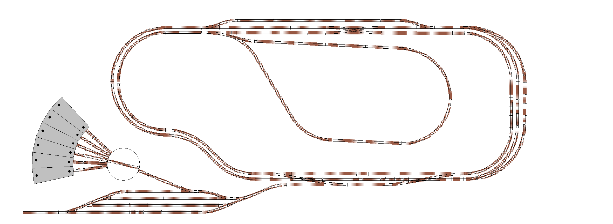

******************************************
Putting it all together - the Big Picture
******************************************

A common topic that arises in Discord conversations is the question "How does it all fit together?".

We have a great core product (CommandStation-EX) with great features such as built-in automation (EX-RAIL) along with many integration options (JMRI, WiThrottle, Engine Driver), support for various different integrated hardware devices (IO expanders, sensors, audio) and now even an integrated turntable controller (Turntable-EX). However, how does one take all these bits and pieces and use them together cohesively to control and/or automate an entire layout?

This brand new section of our website is aimed to answer just that!

Over the coming weeks and months we will build this section out with diagrams, information, and EX-RAIL examples to demonstrate how our fictional layout can be configured, controlled, and automated with CommandStation-EX and various other supported components and features.

We call our demonstration layout "Railway Modeller's Fictional Trains" (or RMFT for short) as it is completely fictional, and will only exist on this website for instructional purposes. The layout isn't designed to be an engaging, fun operations layout, rather to simply cram as many features in as possible to a relatively small layout to demonstrate the capabilities of DCC++ EX and how to make use of them in the context of a complete layout.

This is the complete layout we will build up to in stages:

These are the various concepts and components we will cover:

* Turnouts (including double turnouts)
* Sensors
* Signals
* Virtual blocks
* Reversing loops
* Double and single slips
* Turntables and traversers
* Automated continuous running
* Automated routing and switching

Recommended reading
====================

Throughout these pages we will be using EX-RAIL functionality extensively, not just for automation, but also to define the various objects in use, and therefore we highly recommend being familiar with at least the basics of EX-RAIL, so it would be best to read through the :doc:`/automation/EX-RAIL-intro` page prior to going any further.

We will also be outlining the equivalent DCC++ EX commands for items where relevant, so it can be handy to refer to the :doc:`/reference/software/command-reference` where necessary.

Building blocks and stages
===========================

We'll present this information by starting with a simple loop with a single siding and station, and then proceed to add extra features and complexity a step at a time until we reach the complete layout pictured above.

At each stage, we will outline how to implement each variation of the objects in use (eg. a servo based turnout, a pin based turnout, and a DCC controlled turnout) as well as outlining how the various objects can potentially interact with each other, and how to build an EX-RAIL automation sequence to take advantage of the features.

How to read the diagrams
=========================

Our diagrams will be created in such a way that you'll be able to click on the various items and be taken automatically to the correct page or section of the documentation that provides the software and hardware configuration of that element, along with various options depending on the supported hardware options available, and any EX-RAIL automation examples.

We will be using specific colour coded boxes and labels to identify track side buildings, sensors, signals, virtual blocks, and turnouts as outlined below:

.. raw:: html
  :file: ../_static/images/big-picture/rmft-legend.drawio.svg

Object ID ranges
=================

Throughout this exercise, we will be defining turnouts, sensors, and signals, and for consistency will be using IDs in these ranges for each type of object:

* Turnouts - 100 to 199
* Sensors - 200 to 299
* Signals - 300 to 399

This way, the various possible variations of each type of object will be defined with the same ID, meaning the same EX-RAIL sequences will apply, no matter how the objects are defined.

For further information on IDs used in EX-RAIL, refer to the :ref:`automation/ex-rail-reference:notes` section of the EX-RAIL reference page.

DCC addresses
______________

Further to the above, for DCC controlled turnouts, these will commence at the linear DCC address 101, which start at an address of 26, with a sub address of 0.

For help understanding linear vs. address/sub address formatting of DCC accessories, refer to the :ref:`reference/downloads/documents:stationary decoder address table (xlsx spreadsheet)`.

Sensors
========

For simplicity, we will use infrared obstacle avoidance/proximity sensors throughout these exercise, which produce and active low output when activated.

If you use different sensors that simply provide an active low or high output, then there should be no change required to the various automation sequences provided, except using a negative "-" for the sensor pin ID if the sensors are active high instead of active low.
