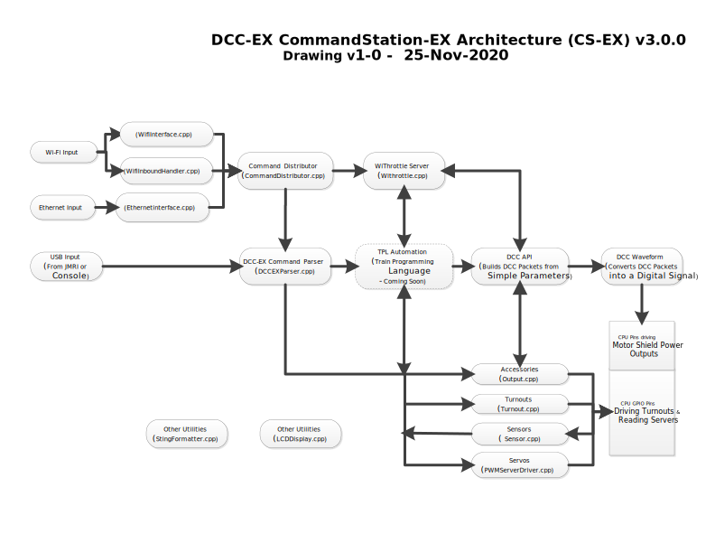

Development
===========

*Work in progress*

**************
Requirements
**************

We assume, since you got here, that you already have a computer up and running being either a Linux, MacOS, or Windows machine, as well as a working internet connection and some disk space available. 

A 64 bit operating system is preferred, running as much as possible the latest version of your chosen OS. This in any case is good practice to keep your environment healthy and up-to-date.

The following sections describe what else you need for participating in the different efforts.

CommandSartion Development
==========================

The Command Station code is written entirely in C++ so a basic understanding is necessary but most of the more advanced C++ features like templates and lamdas are not used as they are not well supported on the Arduino or simply take too much ram. Similarly we NEVER use the String class.

The code is reasonably well compartmentalised and layered so that it is not necessary, for example, to understand a DCC packet format if you just want to tell a loco to change speed, nor to understand the hardware timers and generation of the DCC waveform if you just want to send a DCC packet to the track. The various layers are described in more detail below.

The tools required are listed below. In fact, Chris only used the Arduino IDE and the Github Desktop to write most of the code but you may find the VSCode editor to be more powerful as the Arduino IDE lacks a lot of the aids like intellisense, 'find all references'  and 'go to definition'. 

Git & GitHub
--------------

You should have some knowledge about Git and GitHub, as we manage all of our assets there. Depending on the editing platform of your choice, you may get all the Git functionality you need. You may want to install GitHub Desktop or Sourcetree for getting a good idea on the state of the DCC++EX  GitHub repository.

If you don't have Git installed, now is as good a time as any by going `here <https://git-scm.com/book/en/v2/Getting-Started-Installing-Git>`_ 

Download GitHub Desktop `here <https://desktop.github.com/>`_ 

Download SourceTree `here <https://www.sourcetreeapp.com/>`_ 

Editing/Compiling
-----------------

Visual Studio Code
------------------

We suggest you follow the guidelines here ?????? to install VSCode, the C++ extension and PlatformIO to support your Arduino. 
*Work in progress*
... getting your first compilation/upload done.... VSCode and Arduino IDE... including pics. 
Please note, the command station code is laid out in a single folder to meet the requirements of the Arduino IDE. This is not the default way of doing it in PatformIO but we have tweaked the settings included with the code so that the same structure works for both. (ie DONT try and migrate the project into VSCode, just open the directoru and you will be ok.)

Command Station code structure
==============================

Like ALL Arduino programs, the command station has a setup() phase and a loop() phase. 

During the setup() phase, the code has to
    - Initialise the serial comms and command parser
    - Setup timers to drive the DCC waveform
    - Create MotorDriver instances for each track on the motor shield
    - Detect and setup the Wifi or Ethernet shields
    - Initialise any LCD/OLED display handlers
    - Connect any I2C or other HAL devices
    - Run any optional user setup processes 

During the loop() phase, the code has to
    - check for any input on the USB serial
    - handle any input or state change on the wifi or Ethernet or LCN connection
    - work out which locos need reminding of their speed or function
    - step through any CV processing on the prog track
    - check for power overloads on both tracks
    - execute a step of EXRAIL (if any)
    - Scroll OLED/LCD display
    - Inform JMRI of track currents
    - Check for any JMRI-monitored sensors that have changed
    - adjust any servos that are in motion
    - issue diagnostic messages
    - transmit any pending output to wifi or Ethernet
    - monitor the remaining ram

In addition there is an Interrupt process that triggers every 50uS where the code has to:
    - Generate the DCC waveform by setting the direction pins for both motor shield tracks
    - decide what the directions will be next time based on the bits in the current DCC packet
    - handle the transition from one DCC packet to the next
    - detect ACK currents on the program track if processing a CV read/write 

Understanding all of the above is NOT a prerequisite for helping out, but it's important to recognize just how many things are going on and why its vitally important to consider code size and performance regardless of how isolated you think your part is.

The diagram below gives an overview of the way the parts are interconnected and gives direct jumps to view the original source code in our github repository.

*Work in progress*

each section individually described.

