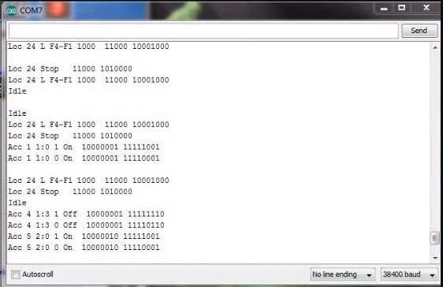

*******************
DCC Inspector-EX
*******************

DCC Inspector-EX is a packet sniffing tool that can connect directly to the signal pins on the Command Station or to the track depending on your circuit. For information in the `Diagnostic Tools Section <../tools/diagnostic-tools.html>`_

.. raw:: html

   <a class="dcclink" href="https://github.com/DCC-EX/DCCInspector-EX/archive/refs/heads/main.zip">DCCInspector-EX source code Zip file</a>

|

.. raw:: html

   <a class="dcclink" href="https://github.com/DCC-EX/DCCInspector-EX">DCCInspector-EX Github Repository</a>
