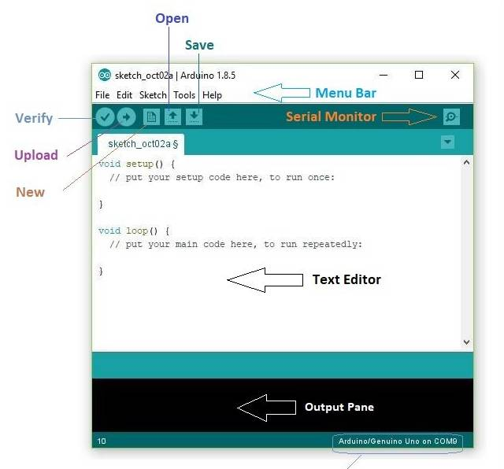
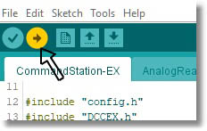

******************************
Install using the Arduino IDE
******************************

The Arduino IDE is an "Integrated Development Environment". Don't let the name scare you away, it is really just a program that lets you open a project, like our DCC++ EX Software files, compile them into instructions the Arduino understands, and uploads them from your computer into the Arduino using a serial cable. It is very easy to use.

Those on the Tinkerer or Engineer path see `Choose Your Path (levels) <levels.html>`_ may want to make changes to the code or just learn more about how the Command Station software works. At a minimum, you may need to change options in the config.h file or use the IDE's "Serial Monitor" to monitor your CS, get logs if something is not working, or enter commands to test out features.

**You can click on most of the images below to enlarge them**

Download and install the Arduino IDE
=====================================

Rather than go into details that are already covered in great detail on the Arduino web page, just follow the instructions in the following link and then return here.

`Arduino IDE Guide <https://www.arduino.cc/en/Guide>`_

Download the DCC++ EX zip file
===============================

Use the link to either the zip or tar file at the bottom of our Github page here:

`DCC++ EX Download Page <https://github.com/DCC-EX/CommandStation-EX/releases>`_

Unzip the file into the Arduino IDE project folder
===================================================

Find the zip file on your computer and unzip it. You should now have a folder with the entire DCC-EX project inside it called "CommandStation-EX". Make sure this folder is at the root level with all your other projects. Note that the name of this folder MUST be "CommandStation-EX"! Do not change it. Because of the way the Arduino IDE works, the folder name must match the .ino file inside it.

Copy the config.example.h file or rename it
=============================================

DCC-EX provides you with an example configuration file. This file holds settings that you can change for things like your choice of motor controller, Wifi login credentials, etc. Rather than a future update potentially have you lose any changes you make to your configuration, we give this file a different name and leave it up to you to edit if you need to. Simply rename this file to ``config.h``.

Run the Arduino IDE
====================

Start the Arduino IDE. You should see something like this:

**Figure 1** - Arduino IDE

Open the CommandStation-EX Project
===================================

Choose "File -> Open" from the menu to open the file manager.

.. image:: ../_static/images/arduino-ide/file_open.jpg
   :alt: File Open Menu
   :scale: 90%

**Figure 2** - File Open Menu

Then click on the "CommandStation-EX" sketch folder to open it. Scroll down to the "CommandStation-EX.ino" file (It should have the round, blue Arduino logo on it) and open that file. We also provide example .ino files for those advanced users who want to use optional features like the "User Command Override" feature, high current motor boards, etc. But for now, and for most users, this will be all you need.

.. image:: ../_static/images/arduino-ide/commandstation-ex.jpg
   :alt: Find the CommandStation-EX.ino File
   :scale: 90%

**Figure 3** - Find the CommandStation-EX.ino file

Edit the config.h file (optional)
===================================

If you are using the standard Arduino Motor Shield and if optionally using one of the supported Wifi boards and want to connect directly to the Command Station in Access Point Mode (AP) from your WiFi controller, there is nothing to do! Just upload the software to the Command Station in the next step.

If you are using a different motor shield or motor controller board, or if you wish to connect your CS to your home network instead of having a separate access point, follow the instructions in the ``config.h`` file

If you want to take a look at this file or make a simple change, just open the file and take a look. You should see many files open in tabs at the top of the IDE Window. Find the down facinng triangle near the upper right of the window and click on it to open the entire list of files. Scroll down to near the bottom and click on the "config.h" file you renamed in the previous step to open it in the editing window. If you are sure of your changes, make sure to click on "File -> Save" from the top menu to save them.

Select the board type and com port
===================================

Before you attempt this step, make sure that you have everything connected properly from the `assembly page <assembly.md>`_. And a final reminder to **make sure you cut the Vin trace** on the bottom of the Arduino Motor Shield. Ready? Proceed.

Connect the computer to the Arduino with the USB cable. Note the 5V coming from your computer/raspberry Pi is enough to power the Mega, since it bypasses the regulator that converts your 7-9V power supply down to 5V and goes right to the 5V bus on the board. So don't be alarmed by lights on your Arduino.

From the "tools" menu select the "board" menu, then "Arduino AVR boards", and then "Arduino Mega or Mega 2560". 

.. image:: ../_static/images/arduino-ide/board_type_mega.jpg
   :alt: Select Arduino Mega
   :scale: 90%

**Figure 5** - Select your board type

Then select "Processor" and make sure it says "ATMega2560"

Last, select "Port" and find the port on your computer that recognizes the Arduino. If you don't see a port listed there and are using a clone board, you may have to install a driver for a CH340 USB chip that is on these boards. See here `Drivers for the CH340 <https://learn.sparkfun.com/tutorials/how-to-install-ch340-drivers/all>`_

.. image:: ../_static/images/arduino-ide/board_port_mega.jpg
   :alt: Select the COM Port
   :scale: 90%

**Figure 6** - Select the correct COM Port

Upload the software
====================

Click on the upload button near the top left. If is a circle with a right arrow next to the compile button that looks like a check mark.

**Figure 7** - Upload the CS Software to the Arduino

The IDE will go through a compile process which will build all the files into an application the Arduino can run and upload it. You may see many lines of logging as it finishes its task. When done, it will upload the file to the Arduino which you may see as some lights blinking on the Arduino. Make sure there are no errors in the log window and that it shows "done uploading" in the status bar and  "SUCCESS" and a listing of how much memory is used on the Arduino in the log window.

Don't unplug the serial cable yet!

Plug in your power adapters
=============================

You should already have the 7-9V adapter plugged into the Arduino and the 13-14V adapter plugged into the motor shield. Now you can plug both of them into the power socket. Nothing should happen. Be sure that nothing bad happens like smoke rising from the board or the boards getting hot. If anything seems wrong, unplug the power adapters immediately.

Use the Serial Monitor to do a quick test
==========================================

.. NOTE:: The programming track (PROG) is for programming only. Make sure you are on the MAIN track if you expect your loco to move or respond to light or sound commands.

The Arduino IDE has a built in serial monitor. That means that in addition to uploading updates to your Command Station, we can interact with the Command Station. Select "Tools -> Serial Monitor". Or click on the "serial monitor" icon near the upper right of the window.

.. image:: ../_static/images/installer/arduino_ide2.jpg
   :alt: Open the Serial Monitor
   :scale: 90%

**Figure 8** - Open the Serial Monitor

Make sure the baud rate at the lower right of the window is set to "115200". Make sure the dropdown next to that says "Both NL & CR". That makes sure you send a new line command and carriage return which the Arduino expects.

.. image:: ../_static/images/installer/serial_monitor.jpg
   :alt: Serial Monitor
   :scale: 90%

**Figure 9** - Serial Monitor

You should see log information immediately display in the window. If you have a Network shield or WiFi shield connected, you will see the CS setup its AP or connect to your network if you gave it your credentials. If you don't have a network, that's fine, the CS will sense that, the network test will fail, but everything else will be working as it should.

Type in a command or two
=========================

There is an entire language that DCC-EX understands. We call this the DCC-EX API for "Application Programming Language". If you are interested, the list of all the commands is here in the `DCC++ EX Wiki <https://github.com/DCC-EX/CommandStation-EX/wiki>`_. Let's just try two commands to make sure everything is working.

All DCC-EX commands begin with a ``<`` and end with a ``>``. In the command window, type ``<1>`` and press the ``send`` button or enter on your keyboard. Power should come on to the main track. You should see 2 red leds light on the "A" power output.

Now enter ``<s>`` (lowercase). You should see status information for your command station appear in the log.

Turn off the power to the track by sending ``<0>`` to the CS. That is a "zero".

**Exit the Arduino IDE software**.

Run your trains!
==================

* Make sure power is off to the track

* Make sure your loco is DCC ENABLED (not DCC Ready!... DCC Ready just means it has the plumbing inside the loco to install an optional DCC decoder, but it is NOT yet DCC compatible)

* Put your loco on the MAIN track. **The loco cannot move or respond to non-programming commands on the PROG track!**

Now either download our exWebThrottle found `here <https://github.com/DCC-EX/exWebThrottle>`_ and run it in your browser, or run it directly from our `web page <../throttle/exwebthrottle.html>`_. Follow the instructions on that page to enable chromium "experimental features".

The rest of the instructions show you how to use exWebThrottle. You should be able to find the CS by its serial port and enable it, then turn on the track power, then acquire your loco by its ID. After that, you should be able to use the throttle slider and function buttons to operate your locomotive!

You can also watch the `exWebThrottle Video <https://www.youtube.com/watch?v=BkgsEOjxWaU>`_.

   .. raw:: html

      <iframe width="336" height="189" src="https://www.youtube.com/embed/BkgsEOjxWaU" frameborder="0" allow="accelerometer; autoplay; clipboard-write; encrypted-media; gyroscope; picture-in-picture" allowfullscreen></iframe>
      