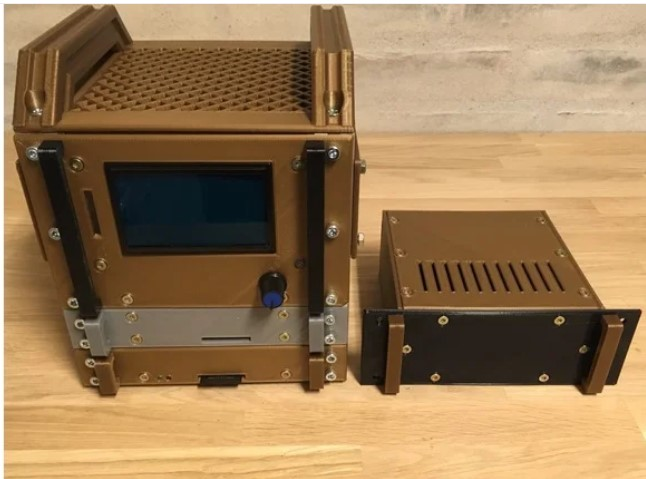

********************************************
Hardware, Software, and Accessory Suppliers
********************************************

Cases / Enclosures
==================

Chesterfield Cases
-------------------

.. image:: ../../_static/images/suppliers/flag_uk.jpg
   :alt: UK Flag
   :scale: 100%
   :align: left
   
`Chesterfield Model Making & Miniature Electronics <https://chesterfield-models.co.uk/>`_

Chesterfield sells a case to fit the Mega DCC-EX Command Station as well as a tiny decoder adapter board (The Dave Falkenburg optoisolator board to pickup the DCC signal from the tracks) that can connect to a microcontroller and operate as a decoder or DCC packet sniffer with the right sketch `See the Myna Bay Website <http://www.mynabay.com/dcc_monitor>`_ .

.. image:: ../../_static/images/suppliers/command_station_case.jpg
    :alt: Chesterfield Command Station Case
    :scale: 80%

`Chesterfiled DCC-EX Command Station Case <https://chesterfield-models.co.uk/product/dccex/>`_

Command Station Rack (The Mac Rack)
-----------------------------------

.. image:: ../../_static/images/suppliers/flag_uk.jpg
   :alt: UK Flag
   :scale: 100%
   :align: left
   
`Neil's DCC++/EX Controller Case <https://wakwak2popo.wordpress.com/2021/01/04/dcc-controller-case/>`_

Created by Neil McKechnie, one of the the DCC-EX Team developers, this is a rack style 3D printed case that can hold the Command Station Arduino, Motor Shield and Raspberry Pi.

