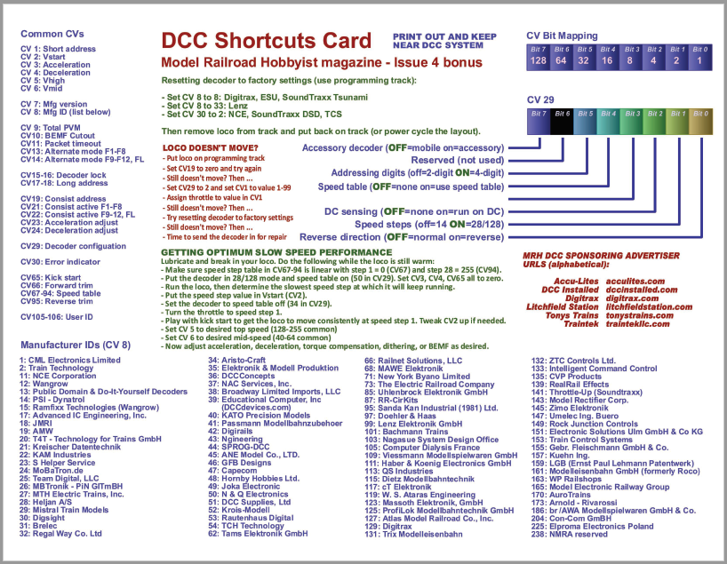
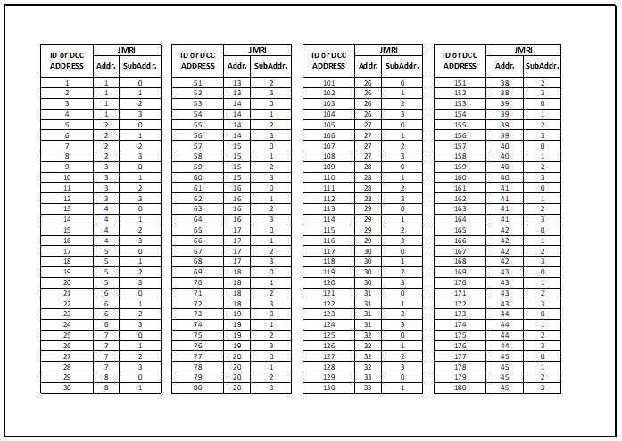

.. include:: /include/include.rst
*********************
Documents
*********************

Java Model Railroad Interface JMRI with DCC++EX
================================================

JMRI 'Java Model Railroad Interface' software suite provides a GUI Graphical User Interface Controller for the |EX-CS|.

The primary JMRI software applications are; 
 - DecoderPro to build and maintain DCC Engine Rosters and read, write, compare & maintain decoder CV’s
 - PanelPro to create and maintain Panels, Turnouts, Sensors, Signal Lighting & create Routes
 - OperationsPro to run operating sessions on your model railroad.
 
JMRI software is supported on Windows & Mac PC’s and on Linux Pi microcontrollers.

With experience JMRI users can prepare Routing and Automation sequences for their engines to run either by manual Routing or Autonomously by writing extensive Jython/Python.py scripts and setting them up through a myriad of user-friendly panels and sensors, turnouts & routing tools.  
These scripts can then be placed in GUI buttons on DecoderPro & PanelPro main menus and also displayed as Routing buttons on smartphones with Engine Driver or WiThrottle and other WiFi Throttle App providers.
 

JMRI Jython.py script to Add Custom DCC++EX Buttons to DecoderPro & PanelPro menus
==================================================================================

Have DCC++EX command references automatically shown through the DecoderPro Script Output Window.

You can also add user defined ATC Automatic Throttle Control Jython.py scripts to GUI buttons on DecoderPro and PanelPro main menus.

.. image:: /_static/images/jmri/DCCEX_JMRI_Script_windows1.jpg
   :alt: DCC++EX JMRI scripts
   :scale: 25%
   :align: left
   
.. rst-class:: dcclink

Download DCC++EX Commands.py script (zip) files for JMRI to display DCC++EX Command Summary Lists through the JMRI Script Output Window. 
   `DCC++ EX Commands JMRI Script </_static/documents/DCCEX_Commands_3.1.py.zip>`_

.. rst-class:: clearer

How To; Create DCC++EX Buttons on JMRI main menus (PDF)
=======================================================

This pdf file provides instruction on how to install our custom scripts in JMRI and assign them to buttons. 
You can have the command references for DCC++ EX shown through the Script Output Window in DecoderPro as seen above.

.. image:: /_static/images/icons/pdf_logo_sm.png
   :alt: DCC++EX JMRI script install instructions
   :scale: 75%
   :align: left
   
.. rst-class:: dcclink

   `DCC++EX + JMRI Custom Buttons SetUp </_static/documents/DCCEX_31_JMRI_Script+Button_Instructions.pdf>`_

.. rst-class:: clearer

Comprehensive DCC++EX & JMRI Getting Started Guide PDF
======================================================

For a more extensive overview of setting up DCC++EX with JMRI DecoderPro please download and review the 

.. image:: /_static/images/icons/pdf_logo_sm.png
   :alt: DCC++EX & JMRI Getting Started Guide
   :scale: 75%
   :align: left
   
.. rst-class:: dcclink

   `DCC++EX 3.1 & JMRI DecoderPro 2.24 Getting Started Guide.pdf version 1.0 </_static/documents/DCCEX_3.1_and_JMRI_Decoder_Pro_4.24-_Getting_Started_Guide-1.pdf>`_

.. rst-class:: clearer

Other Documentation
===================

DCC Shortcuts Card
===================
DCC Manufacture Decoder Identificaton

.. rst-class:: dcclink

   `DCC Shortcuts Card </_static/documents/DCC_Shortcuts_Card.pdf>`_

.. rst-class:: clearer

Stationary Decoder Address Table (xlsx Spreadsheet)
===================================================

With DCC++EX's new linear address function, there is no need to have to convert back and forth between linear addresses and the 2-part address, subaddress format. However, if you use the old format or have a decoder to a switch that uses it, this table can come in handy.

.. rst-class:: dcclink

   `Stationary Decoder Address Table </_static/documents/DCCpp-stationary-decoder-addresses.xlsx>`_
