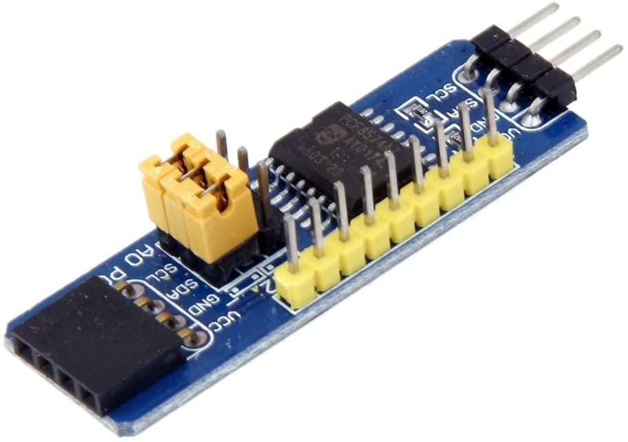

**********************
Accessory Controllers
**********************

Port Expanders
===============

Port expanders allow you to control more devices that you may have as GPIO pins on your Arduino. While a Mega does have quite a few inputs for sensors and outputs for LEDs, Relays, etc., DCC++EX allows you to control many devices through its HAL feature. I2C (pronounced "I squared C") is a serial bus that allows you to communicate with devices using only 2 pins on the Arduino. In this way, you can control 8 devices per board, times 8 boards. That gives you 64 pins from just 2!

PCA8574 Port Expander
-----------------------

8-Bit parallel I2C I/O expander board. Provides 8 GPIO pins per board. It is the same chip used in the piggyback boards on most of the LCD displays. Be careful to NOT buy the piggyback boards as they have all the address pins pulled high and do not give access to the INT pin nor all of the GPIO pins.

`LOVIVER PCF8574 IO Expansion Board <https://www.amazon.com/LOVIVER-PCF8574-Expansion-Evaluation-Development/dp/B07K4RN4ZL>`_

or

`DIYMORE PCF8574 IO Expansion Board <https://www.diymore.cc/products/pcf8574-i2c-bus-evaluation-development-module-io-expansion-board-i-o-expander>`_

Servo Controllers
==================

.. todo::
    Finish this section

