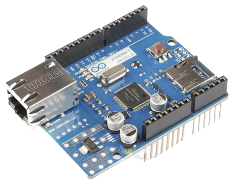
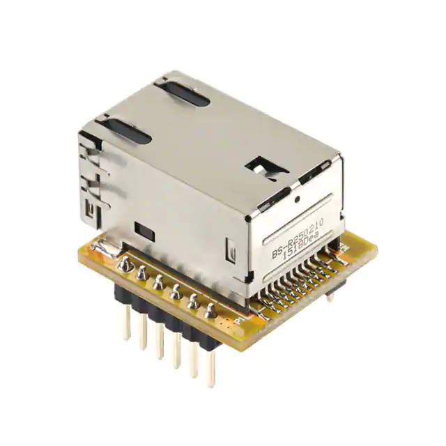
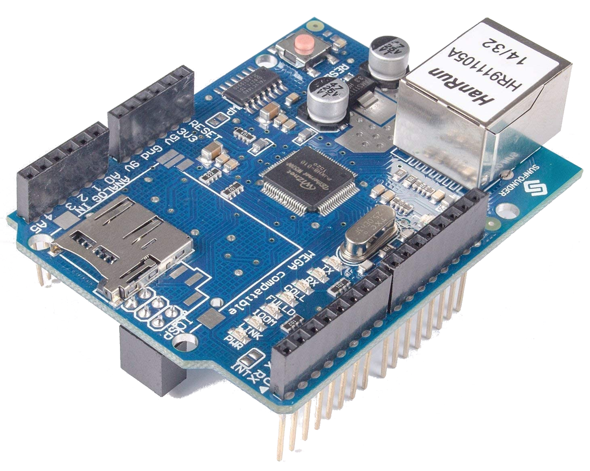

\|EX-REF-LOGO\|

# Ethernet Boards

\|SUITABLE\| \|tinkerer\| \|engineer\| \|support-button\|

:::: {.sidebar .sidebar-on-this-page}

::: {.contents depth="1" local=""}
On this page
:::
::::

\|EX-CS\| supports both wired and wireless network connections. We will
discuss using a wired Ethernet connection here. To connect using a WiFi
board, see the
`WiFi Boards Section </reference/hardware/wifi-boards>`{.interpreted-text
role="doc"}.

To use Ethernet instead of WiFi, follow these simple steps:

- Stick your Ethernet shield onto the stack with your Mega and \|motor
  shield\|
- Open your config.h file in your editor (like the \|Arduino IDE\|)
- Uncomment the line `"#define ENABLE_ETHERNET = true"` by removing the
  \"//\" characters
- Add \"//\" comment lines in front of `"#define ENABLE_WIFI = true"`
  (if it isn\'t already commented out).

::: {.toctree maxdepth="1"}
/reference/hardware/ethernet-boards/arduino-ethernet-shield-2
/reference/hardware/ethernet-boards/wiznet-wiz850io
/reference/hardware/ethernet-boards/sunfounder-ethernet-shield
/reference/hardware/ethernet-boards/nano-ethernet-shield
:::

- `reference/hardware/ethernet-boards:Arduino Network Shield 2`{.interpreted-text
  role="ref"} **\[RECOMMENDED\]**
- `reference/hardware/ethernet-boards:Wiznet WIZ850IO`{.interpreted-text
  role="ref"}
- `reference/hardware/ethernet-boards:Sunfounder Ethernet Shield`{.interpreted-text
  role="ref"}
- `reference/hardware/ethernet-boards:Nano Ethernet Shield`{.interpreted-text
  role="ref"}

## Arduino Network Shield 2

There have been different revisions for the Arduino Network Shields, the
main difference is the version of the WiFi chip on the board. The \"2\"
board uses the Wiznet W5500, other versions used the older W5100 chip.
The only supported chip currently is the W5500, but the other boards may
work as well. The W5500 can handle 8 simultaneous socket connections
while the W5100 can handle 4. These boards provide a network (IP) stack
capable of both TCP and UDP. This board also has an SDCard which can be
used for your own custom features or for storing settings with a
possible future version of \|EX-CS\|.

## Wiznet WIZ850IO

This is a micro Ethernet board no bigger than the RJ45 connector it is
attached to. You have to wire this with jumpers or solder it to a
prototyping PCB.

## Sunfounder Ethernet Shield

This board is tested and works. It is less expensive than the Arduino
brand-name board and based on the Wiznet W5100 instead of the W5500. It
must be the first shield in the stack because it uses the ICSP header
pins.

## Nano Ethernet Shield

This board actually works with an Arduino Nano, you can plug your Nano
directly onto this board or create a stack with the matching \|motor
shield\|. This board will work with an Uno or Mega also, but you have to
connect it with jumpers.

