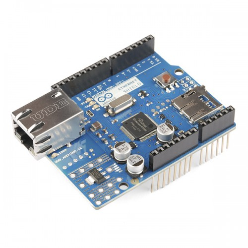
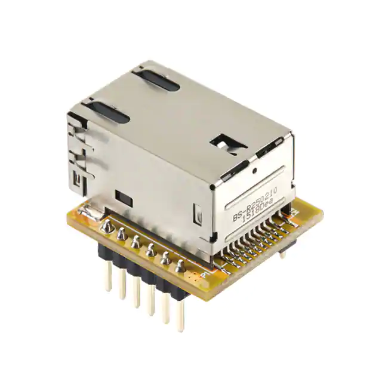
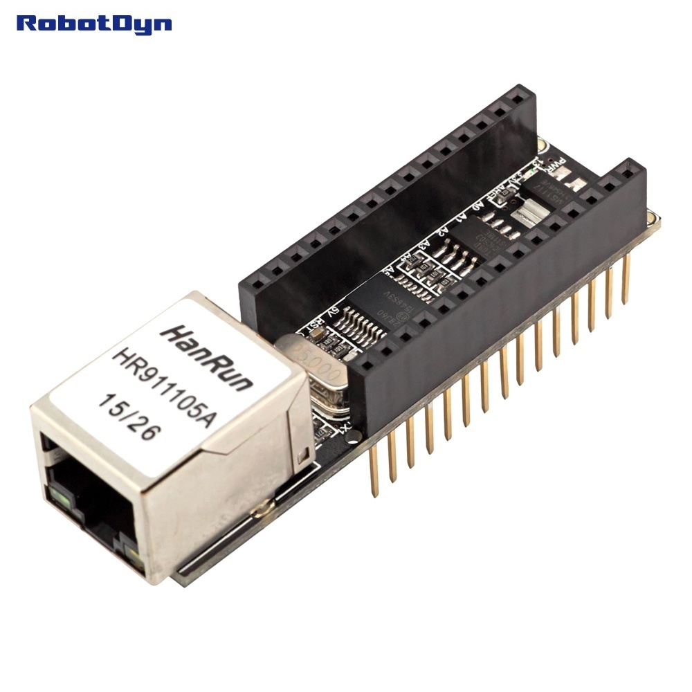

****************
Ethernet Boards
****************

DCC-EX supports both wired and wireless network connections. We will discuss using a wired Ethernet connection here. To connect using a WiFi board, see the `Wifi Boards Section <wifi-boards>`_

To use Ethernet instead of WiFi, you simply plug your Ethernet shield onto the stack with your Mega and Motor Shield, open your config.h file in your editor and uncomment the line "#define ENABLE_ETHERNET = true" by removing the "//" characters, and add "//" comment lines in front of "#defind ENABLE_WIFI = true" (if it isn't already commented out). Then upload the sketch to your Mega.

Arduino Network Shield 2
==========================

There have been different revisions for the Arduino Network Shields, the main difference is the version of the WiFi chip on the board. The "2" board uses the Wiznet W5500, other versions used the older W5100 chip. The only supported chip currently is the W5500, but the other boards may work as well. The W5500 can handle 8 simultaneous socket connections while the W5100 can handle 4. These boards provide a network (IP) stack capable of both TCP and UDP. This board also has an SDCard which can be used for your own custom features or for storing settings with a possible future version of DCC++ EX

Wiznet WIZ850IO
================

This is a micro Ethernet board no bigger than the RJ45 connector it is attached to.  You have to wire this with jumpers or solder it to a prototyping PCB.

Sunfounder Ethernet Shield
============================

We haven't tested this one yet, but it looks like it should work. It is less expensive than the Arduino brand-name board and based on the Wiznet W5100 instead of the W5500. If you test this board, please let us know your results.

.. image:: ../../_static/images/ethernet/sunfounder_ethernet_shield.png
   :alt: Sunfounder Ethernet Shield
   :scale: 50%

Nano Ethernet Shield
=====================

This board actually works with an Arduino Nano, you can plug your Nano directly onto this board or create a stack with the matching motor shield. This board will work with an Uno or Mega also, but you have to connect it with jumpers.

