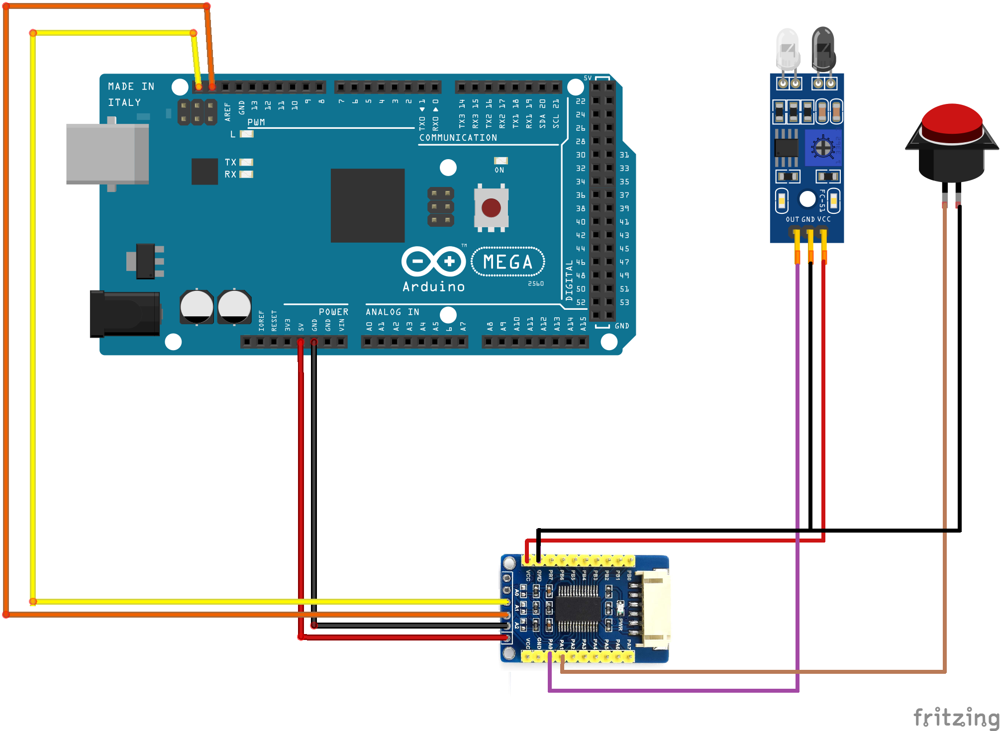

=================
I2C GPIO Modules
=================

GPIO Expander modules, as the name implies, expand the number of General Purpose Input/Output
pins that you can use for interacting with your railway layout components.

GPIO pins, in input mode, can be connected to sensors (such as Block Occupancy Detectors, Hall Effect magnetic sensors,
Infra-Red sensors, microswitches and many more) or to switches, or many other things.  The pins
sense the digital state (on or off) of the sensor or switch.  Typically, when a sensor is ON or ACTIVE
it connects its output pin to the GROUND or 0V pin.  Some sensors may connect the output to +5V when ACTIVE,
so be sure which type of sensor you have.

When used in output mode, the GPIO pin may be connected (via a current-limiting resistor) to an LED indicator, or, via
a suitable power driver, to a motor or solenoid.

A GPIO Expander module typically has 8 or 16 pins that can each be used as an input or
output.  When you reference a pin, it will be configured in the appropriate mode.  
So if you use the EX-RAIL `SET(pin)` call, the pin will be configured as an output; but 
if you use the EX-RAIL `AT(pin)` call, the pin will be configured as an input.  If you 
associate the pin with a DCC++EX 'Sensor' object (through the `<S ...>` commands), then it will
be configured as an input.

A typical GPIO Expander, for which DCC++EX is pre-configured, is the MCP23017.  An 
example board (from PiHut) is shown here.

.. image:: ../../_static/images/i2c/MCP23017_module.jpg
    :alt: MCP23017 Module (PiHut)
    :scale: 80%

It has a connector on the bottom-left side, for which a compatible cable is provided.  It also has 
five connector pads on the top-right side, to which pins or wires may be soldered.
Along the top-left and bottom-right edges are the sixteen GPIO pins, and two Vcc and two GND pins.

Here is another module, from DFRobot:

This module has a row of three pin headers associated with each I/O pin; this allows
each sensor to have its own GND, VCC and signal pin connection, so we can use three-way 
ribbon connectors for each sensor or output.

An example of circuit connections for a module is shown below:

This diagram also shows an infra-red sensor (3-pin device) connected to GPIO0 of the 
MCP23017, and a push-button (2-pin) connected to GPIO1.  

Also generally available is the MCP23017 in IC form (28-pin DIL package).  This can be mounted on 
a breadboard for use, as shown below, or on stripboard if you want a more permanent solution.

.. image:: ../../_static/images/i2c/ArduinoMega_MCP23017_breadboard.png
    :alt: MCP23017 on a Breadboard
    :scale: 30%
 
Pins 15-17 of the MCP23017 allow selection of the I2C address.  If all three pins are connected
to ground (as shown in the diagram with cyan wires) then the address will be 0x20.
In DCC++EX, the sixteen GPIO pins on MCP23017 address 0x20 are accessed using pin numbers
164 to 179, so to associate a sensor object with the switch we would use a command in the form 
`<S 165 165 1>` (the final '1' means enable pull-up for the sensor, so that the pin will
normally be at HIGH level).  Now, when the switch is pressed, 
the input pin is switched to LOW level and a message `<Q 165>` is generated by DCC++EX to indicate that the
pin is active.  When the switch is released, the input pin is pulled back to HIGH and a message 
`<q 165>` is generated to indicate that the pin is inactive.
