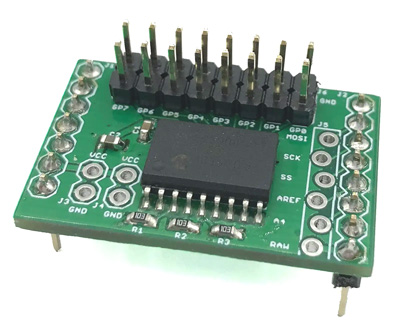
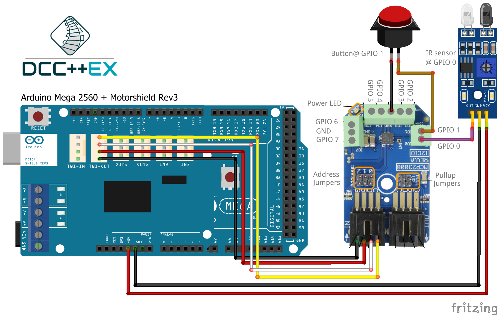
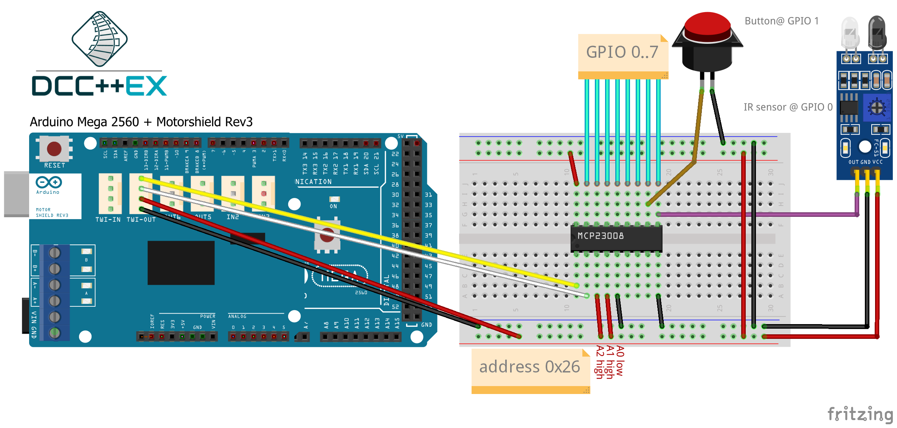
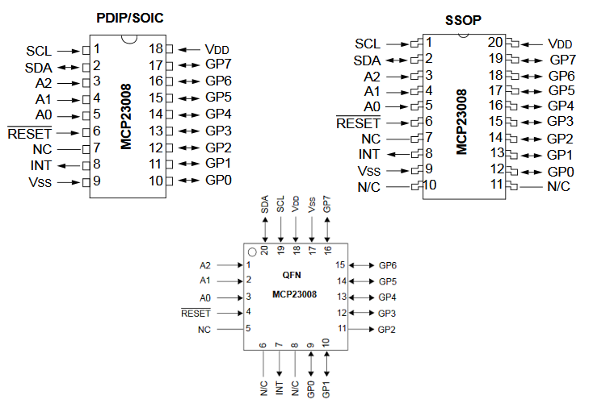

***************************
MCP23008 I²C GPIO Expander
***************************

The MCP23008 chip is a port expander with virtually identical ports
compared to the standard Ports on an Arduino. It brings you 8 General Purpose Input/Output 
pins (GPIO) using an I²C interface as well as comprehensive interrupt control.

.. sidebar:: On this page

   .. contents:: 
      :depth: 2
      :local:
   
MCP23008 Expander modules
-------------------------

The MCP23008 is an extender module that has 8 pins for general purpose
I/O (GPIO). Like the Arduino input/output pins on the Arduino, you can
access any of these in input mode (as a sensor input) or output mode
(driving a digital output and illuminating an LED or switching some
external hardware).

.. image:: ../../_static/images/i2c/mcp23008_3.jpg
    :alt: MCP23008 Module with screw terminals and power plug
    :scale: 50%
    :class: no-scaled-link

.. image:: ../../_static/images/i2c/mcp23008_2.jpg
    :alt: MCP23008 Module with screw terminals
    :scale: 50%
    :class: no-scaled-link

Each module has an address associated with
it, which will be in the range from 0x20 to 0x27. By default, the
module is usually 0x20. The address **must** be changed to prevent conflicts with the
pre-defined MCP23017 modules, usually by moving jumpers on the module or 
by soldering across pads on the circuit board. Refer to the documentation
for your own board for details.

.. seealso:: The address settings can be found in the :ref:`address table`.

Expander wiring examples
-------------------------

This diagram shows an infra-red sensor (3-pin device) connected to
GPIO 0 of the MCP23008, and a push-button (2-pin) connected to GPIO1.

Also generally available is the MCP23008 in IC form (28-pin DIL
package). This can be mounted on a breadboard for use, as shown below,
or on stripboard if you want a more permanent solution.

When used for inputs (sensors or switches), the sensor/switch is usually
connected between the nominated pin and the GND (ground) signal. When
the sensor/switch activates, it connects the pin to GND, and the device 
detects a small current flow. When the sensor/switch deactivates, the
current stops flowing. This behaviour is the same as with the Arduino
digital GPIO pins

Setup and use in EXRAIL
------------------------

MCP23008 modules are NOT pre-configured in DCC-EX and therefor they **must** be defined and configured in myHal.cpp (tinkerer level).  

.. seealso:: :ref:`configuring expanders via myHal.cpp`

Setup for input
~~~~~~~~~~~~~~~~
An sensor or switch may be connected at vPIN164 (MCP23008 first pin). That
can be utilized in EXRAIL as follows:

.. code-block:: C

   AT(164)   // Waits for sensor to be triggered
   AFTER(164)// Waits for sensor to be detected and then off for 0.5 seconds
   IF(164)   // If sensor is activated, continue, else skip to matching ENDIF
   ..do something..
   ENDIF
   IF(164)   // If sensor is activated, continue, else skip to matching ENDIF 
   ..do something.. 
   ENDIF
   IFNOT(164) // If sensor is not activated, continue, else skip to ENDIF 
   ..do something.. 
   ENDIF

Setup for output
~~~~~~~~~~~~~~~~~
An output may be connected at vPIN165 (MCP23008 second pin). That can be
utilized in EXRAIL as follows:

.. code-block:: C

   SET(165)   // Set output pin HIGH
   RESET(165) // Zero an output pin

Setup turnouts
~~~~~~~~~~~~~~~~~~~
If a pin is used as Turnout, it needs to be setup in EXRAIL as follows:

.. code-block:: C
   
   PIN_TURNOUT(26, 166) // ID:26 | vPIN:166

It defines a turnout with ID 26 connected to vPIN 166 (first predefined
MCP23008, third pin).

.. code-block:: C
   
   THROW(26) // Throw the turnout with ID 26
   CLOSE(26) // Close the turnout with ID 26

.. warning:: Please take in account that the pin stays high, therefor not suitable for all turnout drivers!!

Setup signals
~~~~~~~~~~~~~~~~~~
A set of 2 or 3 pins can be used as signal. Setup in EXRAIL as follows:

.. code-block:: C

   SIGNAL(167, 168, 169) // Define a signal(Red,Amber,Green). Red is signal ID
   SIGNAL(167, 0, 169)   // Define a 2 aspect signal(Red,Green)

The first command defines a 3 aspect signal (Red, Amber, Green) with ID 167
connected to vPIN 167, 168, 169 (first predefined MCP23008, pin 4,5 and 6).
The second command defines a 2 aspect signal (Red, Green). The value for RED
is the ID of the defined signal.

.. code-block:: C

   GREEN(167) // Set defined signal green
   AMBER(167) // Set defined signal to amber
   RED(167) // Set defined signal to red

Setup and use (IDE serial monitor or JMRI console)
---------------------------------------------------
Setup input in serial monitor
~~~~~~~~~~~~~~~~~~~~~~~~~~~~~~
An input pin may be configured using the DCC++ EX Sensor commands, as
follows:
.. code-block::
   
   <S 201 164 1> // ID:201 | vPIN:164 | Pull up:enabled

This command associates sensor ID 201 with vPIN 164 (MCP23008 first pin)
and enables the pull up resistor.

When the sensor activates and deactivates, the following messages are
sent by DCC++ EX over the serial output:

.. code-block::

   <Q 201> -- Activation
   <q 201> -- Deactivation

Setup output in serial monitor
~~~~~~~~~~~~~~~~~~~~~~~~~~~~~~~

An output pin may be configured using the DCC++ EX Sensor commands, as
follows:

.. code-block::

   <Z 202 165 1> // ID:202 | vPin:165 | Pull up:enabled

This command associates output ID 202 with vPIN 165 (MCP23008 second
pin) and enables the pull up resistor.

.. code-block::

   <Z 202 1> // activate
   <Z 202 0> // deactivate

When the output activates and deactivates, the following messages are
sent by DCC++ EX over the serial output:

.. code-block::
   
   <Y 202 1> -- Activated
   <Y 202 0> -- Deactivated

Setup turnout in serial monitor
~~~~~~~~~~~~~~~~~~~~~~~~~~~~~~~~

An output pin may be configured using the DCC++ EX Turnout commands, as
follows:
.. code-block::
   
   <T 26 VPIN 166> // ID:26 | vPin:166

This command associates turnout ID 26 with VPIN 166 (MCP23008 third pin)
and enables pullup.

.. code-block::
   
   <T 26 1> // throw
   <T 26 0> // close

When the output activates and deactivates, the following messages are
sent by DCC++ EX over the serial output:

.. code-block::

   <H 26 1> -- Activation
   <H 26 0> -- Deactivation

.. _configuring expanders via myHal.cpp:

Configuring the module via **myHAL.cpp**
-----------------------------------------

Besides the following 
example, there is an example file (myHAL.cpp_example.txt) available in the DCC-EX 
direcory.

.. NOTE:: To prevent conflicts with pre-configured I²C modules, the address must be above 0#21

.. code-block:: C

   #include "IODevice.h" // Always required when defining I/O
   #include "Turnouts.h" // Needed for driving turnouts
   #include "Sensors.h"  // Needed for Input / Sensors
   #include "Outputs.h"  // Needed for Outputs
   #include "IO_MCP23008.h" // MCP23008 specific routines
   // =========================================================
   // This defines a MCP23008 8-port I2C GPIO Extender module.
   // =========================================================
   //                   First Vpin=330
   //                    │  Number of VPINs=8 (numbered 300-307)
   //                    │   │  I2C address of module=0x20
   //                    │   │   │
   //                    V   V   V
   MCP23008 gpioModule5(300, 8, 0x20);
   // ======================================================
   // Every module needs its own unique reference
   //             reference number
   //                    │
   //                    V
   // MCP23008 gpioModule6(306, 8, 0x26, 40);
   //                                    ^
   // Alternative form allows the        │
   // module to request a scan by pulling PIN to ground.
   // Multiple modules can share same pin.
   void mySetup() {
   // =========================================================
   // Create individual inputs/sensors
   // =========================================================
   //             ID for the input/sensor
   //              │   Vpin
   //              │    │  PullUp 1=on|0=off
   //              │    │   │
   //              V    V   V
   Sensor::create(302, 302, 0);
   Sensor::create(303, 303, 0);
   Sensor::create(306, 306, 1);
   Sensor::create(307, 307, 1);
   // =========================================================
   // Create individual outputs
   // =========================================================
   // Parameters as for the <Z> command:
   //             ID for the output
   //              │   Vpin
   //              │    │  PullUp 1=on|0=off
   //              │    │   │
   //              V    V   V
   Output::create(300, 300, 0);
   Output::create(301, 301, 0);
   Output::create(304, 304, 1);
   Output::create(305, 305, 1);
   }

.. _address table:

I²C address table
------------------

======= === === ===
Address A2  A1  A0
0x20    OFF OFF OFF
0x21    OFF OFF ON
0x22    OFF ON  OFF
0x23    OFF ON  ON
0x24    ON  OFF OFF
0x25    ON  OFF ON
0x26    ON  ON  OFF
0x27    ON  ON  ON
======= === === ===

Specifications & Features
--------------------------

- 8-bit remote bidirectional I/O port
   - I/O pins default to input
- Up to 8 devices on the bus
- Configurable interrupt output pins:
   - Configurable as 
      - Active-high,
      - Active-low
      - Open-drain
- High-speed i²c interface:
   - 100kHz / 400kHz / 1.7MHz
- Nominal current per GPIO pin
   - Inputs: ±20mA (max. 25mA)
   - Outputs: ±20mA (max. 25mA)
- Low standby current: 1 μA (max.)
- IntA and IntB can be configured to operate independently or together
- Configurable interrupt source:
   - Interrupt-on-change from configured register defaults or pin changes
- External reset input

IC Packages & Pin Out
----------------------
- 18-pin SPDIP, 300 mil Body
- 18-pin SOIC, Wide, 7.50 mm Body
- 20-pin SSOP, 5.30 mm Body
- 20-pin QFN, 6 x 6 mm Body 

    

Datasheet 
---------

Microchip:
https://ww1.microchip.com/downloads/en/DeviceDoc/MCP23008-MCP23S08-Data-Sheet-20001919F.pdf
