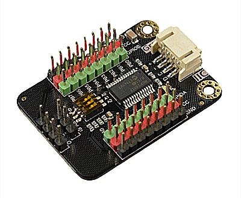
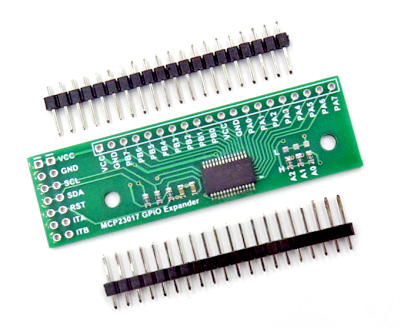
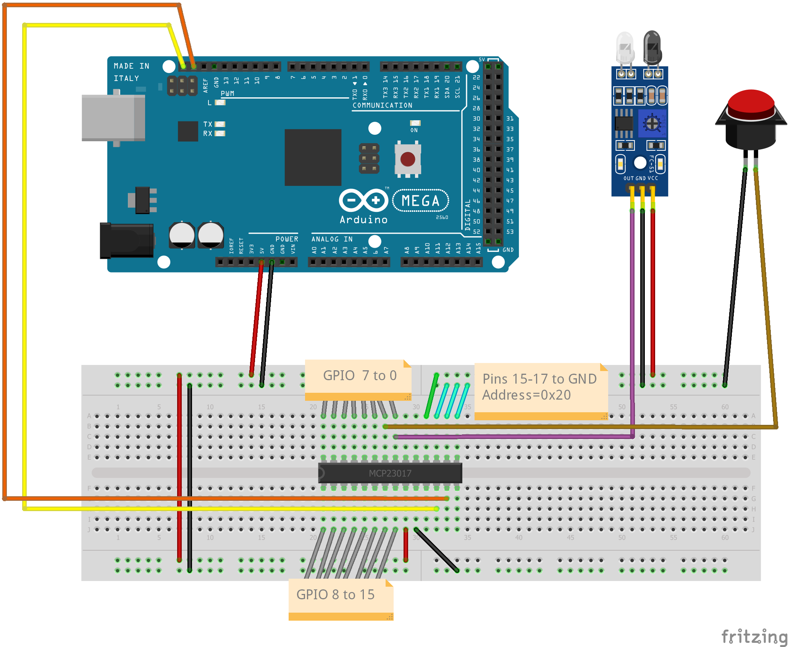
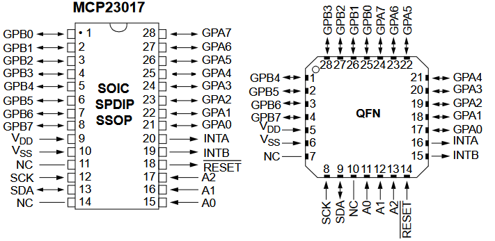

***************************
MCP23017 I²C GPIO expander
***************************

The MCP23017 chip is a port expander with virtually identical ports compared 
to the standard Ports on an Arduino. It brings you 16 General Purpose Input/Output 
pins (GPIO) using an I²C interface as well as comprehensive interrupt control.

.. sidebar:: On this page

   .. contents:: 
      :depth: 3
      :local:
   
MCP23017 Expander modules
==========================

The MCP23017 is an extender module that has 16 pins for general purpose
I/O (GPIO). Like the Arduino input/output pins on the Arduino, you can
access any of these in input mode (as a sensor input) or output mode
(driving a digital output and illuminating an LED or switching some
external hardware).

.. image:: ../../_static/images/i2c/MCP23017_module.jpg
    :alt: MCP23017 Module with Gravity connector
    :scale: 50%
    :class: no-scaled-link

Each module has an address associated with 
it, which will be in the range from 0x20 to 0x27. By default, the
module is usually 0x20. If using more then 1 module, the address 
**must** be changed to prevent conflicts with the predefined 
MCP23017 modules, usually by moving jumpers on the module or 
by soldering across pads on the circuit board. Refer to the documentation
for your own board for details.

.. seealso:: The address settings can be found in the :ref:`MCP23017 address table`.

Expander wiring examples
_________________________

Both diagrams show an infra-red sensor (3-pin device) connected to
GPIO 0 of the MCP23017, and a push-button (2-pin) connected to GPIO 1.
In these examples the MCP23017 is connected to an Arduino Mega.

.. image:: ../../_static/images/i2c/ArduinoMega_MCP23017.png
    :alt: Diagram: Arduino Mega, MCP23017 Expansion Board with IR-Sensor and Push-button
    :height: 400px

When used for inputs (sensors or switches), the sensor/switch is usually
connected between the nominated pin and the GND (ground) signal. When
the sensor/switch activates, it connects the pin to GND, and the device
detects a small current flow. When the sensor/switch deactivates, the
current stops flowing. This behaviour is the same as with the Arduino
digital GPIO pins

GPIO use in EXRAIL
___________________
As long as the predefined MCP23017 boards are used, there is no extra setup
needed to use them as sensor/input or output within EXRAIL.

Inputs in EX-RAIL
^^^^^^^^^^^^^^^^^^
An sensor or switch may be connected at vPIN164 (MCP23017 first pin). That
can be utilized in EXRAIL as follows:

.. code-block:: C

   AT(196)   // Waits for sensor to be triggered

   AFTER(197)// Waits for sensor to be detected and then off for 0.5 seconds
   
   IF(200)   // If sensor is activated
     .. do something..
   ELSE
     .. do something different
   ENDIF

   IFNOT(201) // If sensor is not activated, continue, else skip to ENDIF 
     .. do something..
   ELSE
     .. do something different
   ENDIF

Outputs in EX-RAIL
^^^^^^^^^^^^^^^^^^
An output may be connected at vPIN165 (MCP23017 second pin). That can be
utilized in EXRAIL as follows:

.. code-block:: C

   SET(198)   // Set output pin HIGH
   RESET(199) // Zero an output pin

Turnouts in EX-RAIL
^^^^^^^^^^^^^^^^^^
If a pin is used as Turnout, it needs to be setup in EXRAIL as follows:

.. code-block:: C
   
   PIN_TURNOUT(26, 199) // ID:26 | vPIN:199 | optional description
   PIN_TURNOUT(202,202, "Coleyard") // ID == vPIN:202 > preferred

This code defines a turnout with ID 26 connected to vPIN 234 and another 
turnout were the ID is equal to the vPin.

.. code-block:: C
   
   THROW(26) // Throw the turnout with ID:26 | vPIN:199
   CLOSE(26) // Close the turnout with ID:26 | vPIN:199
   THROW(202)// Throw the turnout ID:202

.. warning:: Please take in account that the pin stays high, therefor not suitable for all turnout drivers!!

.. 
   .. code-block:: C
      
      /**********************************************
          HOW TO SETUP TWIN COIL TURNOUTS (PULSED)  
      **********************************************/
      VIRTUAL_TURNOUT(2233,"description")
      
      // THROW 1st COIL for TURNOUT
      ONTHROW(2233) 
         SET(166) 
         DELAY(150) // pulse length 150ms
         UNSET(166) 
      DONE
      // THROW 2nd COIL for STRAIGHT
      ONCLOSE(2233) 
         SET(167) 
         DELAY(150) // pulse length 150ms
         UNSET(167)
      DONE

 .. 
    .. see-also:: EX-RAIL cookbook example 

Signals in EX-RAIL
^^^^^^^^^^^^^^^^^^^
A set of 2 or 3 pins can be used as signal. Setup in EXRAIL as follows:

.. code-block:: C

   SIGNAL(198, 199, 200) // Define a signal(Red, Amber, Green). Red is signal ID
   SIGNAL(202, 0, 203)   // Define a 2 aspect signal(Red and Green)

The first command defines a 3 aspect signal (Red, Amber, Green) with ID 230 connected 
to vPIN 198, 199, 200. The second command defines a 2 aspect signal (Red and Green). 
The first value equals RED and is always the ID of the defined signal.

.. code-block:: C

   GREEN(198) // Set defined signal green
   AMBER(198) // Set defined signal to amber
   RED(198)   // Set defined signal to red

Setup with Serial Monitor or JMRI console
___________________________________________ 
The Serial Monitor in the Arduino IDE can be used to setup, test and configure I/O 
connected to the DCC-EX Command Station. 

This can also be achieved from within JMRI. There is a tool called JMRI console. In 
the next section where it states "serial monitor" you may also read "JMRI console".

Setup inputs in serial monitor
^^^^^^^^^^^^^^^^^^^^^^^^^^^^^^^^
An input pin may be configured using the DCC++ EX Sensor commands, as
follows:

.. code-block::
   
   <S 1096 196 1> // ID:1096 | vPIN:196 | Pull up:enabled
   <S 197 197 1>  // ID == vPIN:197    | Pull up:enabled

The first command associates sensor ID 1096 with vPIN 196 and enables the pull up 
resistor. The second one does the same, but ID is equal to vPIN (preferred).

When the sensor activates and deactivates, the following messages are
sent by DCC++ EX over the serial output:

.. code-block::

   <Q 1096> // Activation
   <q 1096> // Deactivation

Setup outputs in serial monitor
^^^^^^^^^^^^^^^^^^^^^^^^^^^^^^^^^^^^

An output pin may be configured using the DCC++ EX Output commands, as
follows:

.. code-block::

   <Z 1098 198 1> // ID:1098 | vPin:198 | Pull up:enabled
   <Z 199 199 1> // ID == vPin:199 | Pull up:enabled

The first command associates output ID 2030 with vPIN 230 and enables the pull up 
resistor. The second one does the same, but ID is equal to vPIN (preferred).

After setup, the outputs can be tested with following commands:
.. code-block::

   <Z 1098 1> // command to activate output
   <Z 1098 0> // deactivate to deactivate output

When the output activates and deactivates, the following messages are
sent by DCC++ EX over the serial output:

.. code-block::
   
   <Y 1098 1> -- Activated
   <Y 1098 0> -- Deactivated

Setup turnouts in serial monitor
^^^^^^^^^^^^^^^^^^^^^^^^^^^^^^^^^^^^
.. 
   Output::create(198, 198, 0);
   Output::create(199, 199, 0);
   Output::create(202, 202, 1);
   Output::create(203, 203, 1);

An output pin may be configured using the DCC++ EX Turnout commands, as
follows:
.. code-block::
   
   <T 3198 VPIN 198> // ID:3198 | vPin:198

This command associates turnout ID 26 with VPIN 166 (MCP23017 third pin)
and enables pullup.

.. code-block::
   
   <T 3198 1> // throw
   <T 3198 0> // close

When the output activates and deactivates, the following messages are
sent by DCC++ EX over the serial output:

.. code-block::

   <H 3198 1> -- Activation
   <H 3198 0> -- Deactivation

.. _configuring mcp23017 via myHal.cpp:

Configure the modules in **myHAL.cpp**
________________________________________________

Setup and configure extra MCP23017 modules is done in the file *myHal.cpp*.
If the file is not present in the Commandstation-EX folder, create the file 
or rename *myHal.cpp_example.txt*. 

In DCC-EX, two MCP23017 modules are pre-configured: 

   #. Address **0x20** configured with VPINs **164-179** 
   #. Address **0x21** configured with VPINs **180-195**

.. NOTE:: To avoid conflicts with preconfigured I²C modules, both address and pin range must be different.

In the next example, we will add a third MCP23017 module with address 0x22 wih vpins 196-211

.. code-block:: C

   #include "IODevice.h"    // Always required when defining I/O
   #include "Turnouts.h"    // Needed for driving turnouts
   #include "Sensors.h"     // Needed for Input / Sensors
   #include "Outputs.h"     // Needed for Outputs
   #include "IO_MCP23017.h" // MCP23017 specific routines
   // =========================================================
   //  Define a MCP23017 16-port I²C GPIO Extender module.
   // =========================================================
   //              First Vpin=196
   //                │  Number of VPINs=16 (numbered 196-211)
   //                │    │  I²C address of module=0x22
   //                │    │   │
   //                V    V   V
   MCP23017::create(196, 16, 0x22);
   // ======================================================
   //  Define a MCP23017 16-port I²C GPIO Extender module
   //  with an interrupt pin. Pull down to request a scan.
   //        Multiple modules can share same pin.
   //                   First Vpin=212
   //                    │  Number of VPINs=16 (numbered 212-227)
   //                    │    │  I²C address of module=0x23
   //                    │    │   │  Interrupt pin
   //                    │    │   │    │
   //                    V    V   V    V
   // MCP23017::create(212, 16, 0x23, 40);

   void mySetup() {
   // =========================================================
   // Create individual inputs/sensors
   //  NOTE: Does not apply to EXRAIL
   // =========================================================
   //             ID for the input/sensor
   //              │   Vpin
   //              │    │  PullUp 1=on|0=off
   //              │    │   │
   //              V    V   V
   Sensor::create(196, 196, 0);
   Sensor::create(197, 197, 0);
   Sensor::create(200, 200, 1);
   Sensor::create(201, 201, 1);
   // =========================================================
   // Create individual outputs
   //  NOTE: Does not apply to EXRAIL
   // =========================================================
   //             ID for the output
   //              │   Vpin
   //              │    │  PullUp 1=on|0=off
   //              │    │   │
   //              V    V   V
   Output::create(198, 198, 0);
   Output::create(199, 199, 0);
   Output::create(202, 202, 1);
   Output::create(203, 203, 1);
   }

.. _MCP23017 address table:

I²C Address table
___________________

======= === === ===
Address A2  A1  A0
0x20    OFF OFF OFF
0x21    OFF OFF ON
0x22    OFF ON  OFF
0x23    OFF ON  ON
0x24    ON  OFF OFF
0x25    ON  OFF ON
0x26    ON  ON  OFF
0x27    ON  ON  ON
======= === === ===

Specifications & Features
___________________________

- 16-bit remote bidirectional I/O port
   - I/O pins default to input
- Up to 8 devices on the bus (max. 128 additional GOPIO pins)
- Interrupt output pins, configurable as:
      - Active-high,
      - Active-low
      - Open-drain
- High-speed i2c interface:
   - 100kHz / 400kHz / 1.7MHz
- Nominal current per GPIO pin
   - Inputs: ±20mA (max. 25mA)
   - Outputs: ±20mA (max. 25mA)
- Low standby current: 1 μA (max.)
- IntA and IntB can be configured to operate independently or together
- Configurable interrupt source:
   - Interrupt-on-change from configured register defaults or pin changes
- External reset input

IC Packages & Pin Out
_______________________
- 28-pin SOIC, Wide, 7.50mm body
- 28-pin SPDIP, 300 mil body
- 28-pin SSOP, 5.30mm body
- 28-pin QFN, 6mm x 6mm body 

    

Datasheet 
___________

Microchip:
https://ww1.microchip.com/downloads/en/devicedoc/20001952c.pdf
