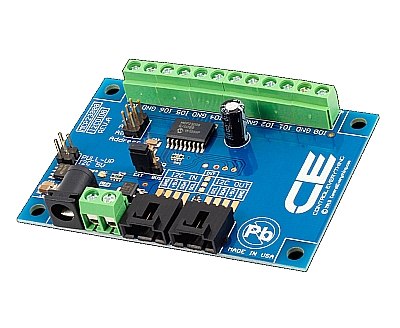
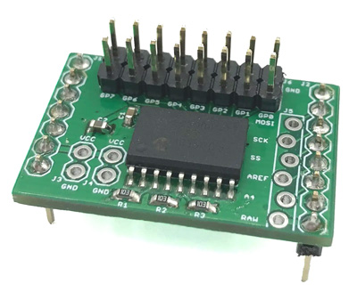
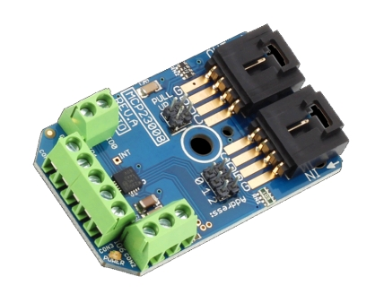

**************************
PCF8574 I²C GPIO Expander
**************************
The PCF8574 chip is a port expander with virtually identical ports
compared to the standard Ports on an Arduino. It brings you an extra 8
I/O pins using an I²C interface as well as comprehensive interrupt
control.

.. sidebar:: On this page

   .. contents:: 
      :depth: 2
      :local:

    
PCF8574 and PCF8574A Expander modules
--------------------------------------

Setup of the module
--------------------
   
Setup and use of the module via **myHAL.cpp**
----------------------------------------------

An alternative way to setup and configure the PCF8574 (tinkerer level)
can be reached by defining the modules in a file named myHal.cpp.
Besides the following example, there is an example file available in the
DCC-EX direcory, named myHAL.cpp_example.txt.

.. code-block:: C

   #include "IODevice.h" // Always required when defining I/O
   #include "Turnouts.h" // Needed for driving turnouts
   #include "Sensors.h"  // Needed for Input / Sensors
   #include "Outputs.h"  // Needed for Outputs
   #include "IO_PCF8574.h" // MCP23008 specific routines
   // =========================================================
   // This defines a PCF8574 8-port I2C GPIO Extender module.
   // =========================================================
   //                  First Vpin=200
   //                   │  Number of VPINs=8 (numbered 200-207)
   //                   │   │  I2C address of module=0x23
   //                   │   │   │
   //                   V   V   V

   PCF8574 gpioModule1(200, 8, 0x23);
   // ====================================================== 
   //  Every module needs its own unique reference 
   //        reference number
   //                   │ 
   //                   V
   // PCF8574 gpioModule2(208, 8, 0x20);
   void mySetup() {
   // =========================================================
   // Create individual inputs/sensors
   // =========================================================
   //             ID for the input/sensor  
   //              │   Vpin 
   //              │    │  PullUp 1=on|0=off
   //              │    │   │
   //              V    V   V
   Sensor::create(202, 202, 0);
   Sensor::create(203, 203, 0);
   Sensor::create(206, 206, 1);
   Sensor::create(207, 207, 1);
   // =========================================================
   // Create individual outputs
   // =========================================================
   // Parameters as for the <Z> command:
   //             ID for the output  
   //              │   Vpin 
   //              │    │  PullUp 1=on|0=off
   //              │    │   │
   //              V    V   V
   Output::create(200, 200, 0);
   Output::create(201, 201, 0);
   Output::create(204, 204, 1);
   Output::create(205, 205, 1);
   }

I²C Address table
------------------

======= === === ===
Address A2  A1  A0
0x20    OFF OFF OFF
0x21    OFF OFF ON
0x22    OFF ON  OFF
0x23    OFF ON  ON
0x24    ON  OFF OFF
0x25    ON  OFF ON
0x26    ON  ON  OFF
0x27    ON  ON  ON
======= === === ===

Specifications & Features
--------------------------
