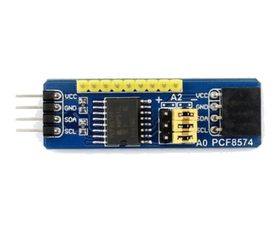
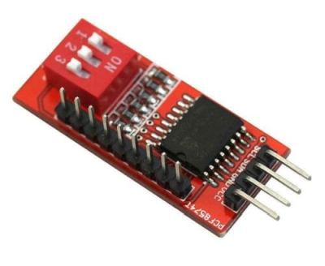
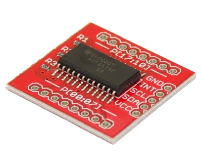
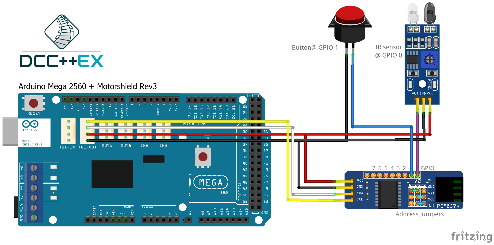
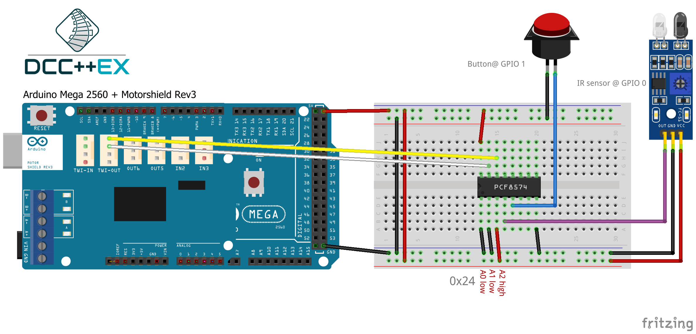
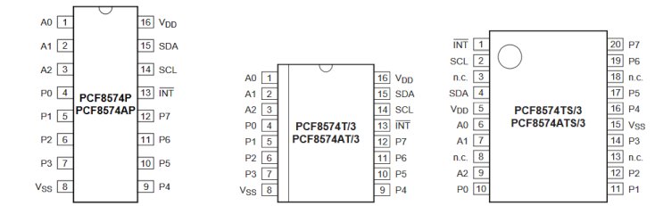

**************************
PCF8574 I²C GPIO Expander
**************************
The PCF8574 chip is a port expander with virtually identical ports
compared to the standard Ports on an Arduino.  It brings you 8 General Purpose Input/Output 
pins (GPIO) using an I²C interface as well as comprehensive interrupt
control.

.. sidebar:: On this page

   .. contents:: 
      :depth: 2
      :local:
   
PCF8574 Expander modules
-------------------------

The PCF8574 is an extender module that has 8 pins for general purpose
I/O (GPIO). Like the Arduino input/output pins on the Arduino, you can
access any of these in input mode (as a sensor input) or output mode
(driving a digital output and illuminating an LED or switching some
external hardware).

Each module has an address associated with it, which will be in the range from 
0x20 to 0x27 (PCF8574) or 0x38 to 0x3F (PCF8574A). By default, the module is usually 0x20. The address **must** be changed to prevent conflicts with the
predefined MCP23017 modules, usually by moving jumpers on the module or 
by soldering across pads on the circuit board. Refer to the documentation
for your own board for details.

.. seealso:: The address settings can be found in the :ref:`address table`.

Expander wiring examples
-------------------------

This diagram shows an infra-red sensor (3-pin device) connected to
GPIO 0 of the PCF8574, and a push-button (2-pin) connected to GPIO1.

Also generally available is the PCF8574 in IC form (28-pin DIL
package). This can be mounted on a breadboard for use, as shown below,
or on stripboard if you want a more permanent solution.

When used for inputs (sensors or switches), the sensor/switch is usually
connected between the nominated pin and the GND (ground) signal. When
the sensor/switch activates, it connects the pin to GND, and the device 
detects a small current flow. When the sensor/switch deactivates, the
current stops flowing. This behaviour is the same as with the Arduino
digital GPIO pins

GPIO use in EXRAIL
-------------------

PCF8574 modules are NOT pre-configured in DCC-EX and therefor they **must** be defined and configured in myHal.cpp (tinkerer level).  

.. seealso:: :ref:`configuring PCF8574 via myHal.cpp`

Inputs in EX-RAIL
~~~~~~~~~~~~~~~~~~
An sensor or switch may be connected at vPIN164 (PCF8574 first pin). That
can be utilized in EXRAIL as follows:

.. code-block:: C

   AT(228)   // Waits for sensor to be triggered
 
   AFTER(229)// Waits for sensor to be detected and then off for 0.5 seconds
 
   IF(232)   // If sensor is activated
     .. do something..
   ELSE
     .. do something different..
   ENDIF
 
   IFNOT(233) // If sensor is not activated 
     .. do something.. 
   ELSE
    .. do something different..
   ENDIF

Outputs in EX-RAIL
~~~~~~~~~~~~~~~~~~~
An output may be connected at vPIN165 (PCF8574 second pin). That can be
utilized in EXRAIL as follows:

.. code-block:: C

   SET(230)   // Set output pin HIGH
   RESET(231) // Zero an output pin

Turnouts in EX-RAIL
~~~~~~~~~~~~~~~~~~~~
If a pin is used as Turnout, it needs to be setup in EXRAIL as follows:

.. code-block:: C
   
   PIN_TURNOUT(27, 234) // ID:27 | vPIN:166 | optional description 
   PIN_TURNOUT(235, 235, "Coleyard") // ID == vPIN:235 > preferred

This code defines a turnout with ID 26 connected to vPIN 234 and another 
turnout were the ID is equal to the vPin.

.. code-block:: C
   
   THROW(27) // Throw the turnout with ID 27
   CLOSE(27) // Close the turnout with ID 27
   THROW(235)// Throw the turnout ID:235

.. warning:: Please take in account that the pin stays high, therefor not suitable for all turnout drivers!!
.. 
   .. code-block:: C
      
      /**********************************************
          HOW TO SETUP TWIN COIL TURNOUTS (PULSED)  
      **********************************************/
      VIRTUAL_TURNOUT(2233,"description")
      
      // THROW 1st COIL for TURNOUT
      ONTHROW(2233) 
         SET(166) 
         DELAY(150) // pulse length 150ms
         UNSET(166) 
      DONE
      // THROW 2nd COIL for STRAIGHT
      ONCLOSE(2233) 
         SET(167) 
         DELAY(150) // pulse length 150ms
         UNSET(167)
      DONE

 .. 
    .. see-also:: EX-RAIL cookbook example 

   Output::create(230, 230, 0);
   Output::create(231, 231, 0);
   Output::create(234, 234, 1);
   Output::create(235, 235, 1);

Signals in EX-RAIL
~~~~~~~~~~~~~~~~~~~
A set of 2 or 3 pins can be used as signal. Setup in EXRAIL as follows:

.. code-block:: C

   SIGNAL(230, 231, 235) // Define a 3 aspect signal(Red, Amber, Green). Red (230) is signal ID
   SIGNAL(234, 0, 235)   // Define a 2 aspect signal(Red and Green)

The first command defines a 3 aspect signal (Red, Amber, Green) with ID 230 connected 
to vPIN 230, 231, 235. The second command defines a 2 aspect signal (Red and Green). 
The first value equals RED and is always the ID of the defined signal.

.. code-block:: C

   GREEN(230) // Set defined signal green
   AMBER(230) // Set defined signal to amber
   RED(230)   // Set defined signal to red

Setup with Serial Monitor or JMRI console
------------------------------------------ 
The Serial Monitor in the Arduino IDE can be used to setup, test and configure I/O 
connected to the DCC-EX Command Station. 

This can also be achieved from within JMRI. There is a tool called JMRI console. In 
the next section where it states "serial monitor" you may also read "JMRI console".
 

Setup inputs in serial monitor
~~~~~~~~~~~~~~~~~~~~~~~~~~~~~~~~~~~~~~~~
An input pin may be configured using the DCC++ EX Sensor commands, as
follows:

.. code-block::
   
   <S 2028 228 1> // ID:2028 | vPIN:228 | Pull up:enabled
   <S 229 229 1>  // ID == vPIN:229 | Pull up:enabled

The first command associates sensor ID 2028 with vPIN 228 and enables the pull up 
resistor. The second one does the same, but ID is equal to vPIN (preferred).

When the sensor activates and deactivates, the following messages are
sent by DCC++ EX over the serial output:

.. code-block::

   <Q 2028> // Activation
   <q 2028> // Deactivation

Setup outputs in serial monitor
~~~~~~~~~~~~~~~~~~~~~~~~~~~~~~~~
 
An output pin may be configured using the DCC++ EX Output commands, as
follows:

.. code-block::

   <Z 2030 230 1> // ID:2030 | vPin:230 | Pull up:enabled
   <Z 231 231 1> // ID == vPin:231 | Pull up:enabled

The first command associates output ID 2030 with vPIN 230 and enables the pull up 
resistor. The second one does the same, but ID is equal to vPIN (preferred).

After setup, the outputs can be tested with following commands:
.. code-block::

   <Z 2030 1> // command to activate output
   <Z 2030 0> // deactivate to deactivate output

When the output activates and deactivates, the following messages are
sent by DCC++ EX over the serial output

.. code-block::
   
   <Y 2030 1> -- Activated
   <Y 2030 0> -- Deactivated

Setup turnouts in serial monitor
~~~~~~~~~~~~~~~~~~~~~~~~~~~~~~~~~
.. 
   Output::create(230, 230, 0);
   Output::create(231, 231, 0);
   Output::create(234, 234, 1);
   Output::create(235, 235, 1);

An output pin may be configured using the DCC++ EX Turnout commands, as
follows:
.. code-block::
   
   <T 3230 VPIN 230> // ID:3230 | vPin:230

This command associates turnout ID 26 with VPIN 166 (PCF8574 third pin)
and enables pullup.

.. code-block::
   
   <T 3230 1> // throw
   <T 3230 0> // close

When the output activates and deactivates, the following messages are
sent by DCC++ EX over the serial output:

.. code-block::

   <H 3230 1> -- Activation
   <H 3230 0> -- Deactivation

.. _configuring PCF8574 via myHal.cpp:

Configure and setup PCF8574 GPIO modules in **myHal.cpp**
----------------------------------------------------------

Setup and configure PCF8574 modules is done in the file *myHal.cpp*.
If the file is not present in the Commandstation-EX folder, create the file 
or rename *myHal.cpp_example.txt*. 

In DCC-EX, two MCP23017 GPIO modules are pre-configured: 

   #. Address **0x20** configured with VPINs **164-179** 
   #. Address **0x21** configured with VPINs **180-195**

.. NOTE:: To avoid conflicts with preconfigured I²C modules, both address and pin range must be different.

In the next example, we will add a PCF8574 module with address 0x24 wih vpins 228-235.

.. code-block:: C

   #include "IODevice.h" // Always required when defining I/O
   #include "Turnouts.h" // Needed for driving turnouts
   #include "Sensors.h"  // Needed for Input / Sensors
   #include "Outputs.h"  // Needed for Outputs
   #include "IO_PCF8574.h" // PCF8574 specific routines
   // =========================================================
   //  Define a PCF8574 8-port I²C GPIO Extender module.
   // =========================================================
   //               First Vpin=228
   //                │  Number of VPINs=8 (numbered 228-235)
   //                │   │  I2C address of module=0x24
   //                │   │   │
   /                 V   V   V
   PCF8574::create(228, 8, 0x24);
   // ========================================================
   // Define a PCF8574 8-port I²C GPIO Extender module
   // with an interrupt pin. Pull down to request a scan.
   //       Multiple modules can share same pin.
   //                  First Vpin=236
   //                   │  Number of VPINs=8 (numbered 236-243)
   //                   │    │  I²C address of module=0x23
   //                   │    │   │  Interrupt pin
   //                   │    │   │    │
   //                   V    V   V    V
   // PCF8574::create(236, 8, 0x25, 40);
  
   void mySetup() {
   // =========================================================
   // Create individual inputs/sensors
   //  NOTE: Does not apply to EXRAIL
   // =========================================================
   //             ID for the input/sensor
   //              │   Vpin
   //              │    │  PullUp 1=on|0=off
   //              │    │   │
   //              V    V   V
   Sensor::create(228, 228, 0);
   Sensor::create(229, 229, 0);
   Sensor::create(232, 232, 1);
   Sensor::create(233, 233, 1);
   // =========================================================
   // Create individual outputs
   //  NOTE: Does not apply to EXRAIL
   // =========================================================
   //             ID for the output
   //              │   Vpin
   //              │    │  PullUp 1=on|0=off
   //              │    │   │
   //              V    V   V
   Output::create(230, 230, 0);
   Output::create(231, 231, 0);
   Output::create(234, 234, 1);
   Output::create(235, 235, 1);
   }

.. _address table:

I²C address table
------------------

======= === === === ========
PCF8574             PCF8574A
Address A2  A1  A0  Address
0x20    OFF OFF OFF 0x38
0x21    OFF OFF ON  0x39
0x22    OFF ON  OFF 0x3A
0x23    OFF ON  ON  0x3B
0x24    ON  OFF OFF 0x3C
0x25    ON  OFF ON  0x3D
0x26    ON  ON  OFF 0x3E
0x27    ON  ON  ON  0x3F
======= === === === ========

Specifications & Features
--------------------------

- 8-bit remote bidirectional I/O port
   - I/O pins default to input
- Up to 8 devices on the bus
- Configurable interrupt output pins:
   - Configurable as 
      - Active-high,
      - Active-low
      - Open-drain
- High-speed i²c interface:
   - 100kHz / 400kHz / 1.7MHz
- Nominal current per GPIO pin
   - Inputs: ±20mA (max. 25mA)
   - Outputs: ±20mA (max. 25mA)
- Low standby current: 1 μA (max.)
- IntA and IntB can be configured to operate independently or together
- Configurable interrupt source:
   - Interrupt-on-change from configured register defaults or pin changes
- External reset input

IC Packages & Pin Out
----------------------
- 18-pin SPDIP, 300 mil Body
- 18-pin SOIC, Wide, 7.50 mm Body
- 20-pin SSOP, 5.30 mm Body
- 20-pin QFN, 6 x 6 mm Body 

    

Datasheet 
---------

Microchip:
https://ww1.microchip.com/downloads/en/DeviceDoc/PCF8574-MCP23S08-Data-Sheet-20001919F.pdf