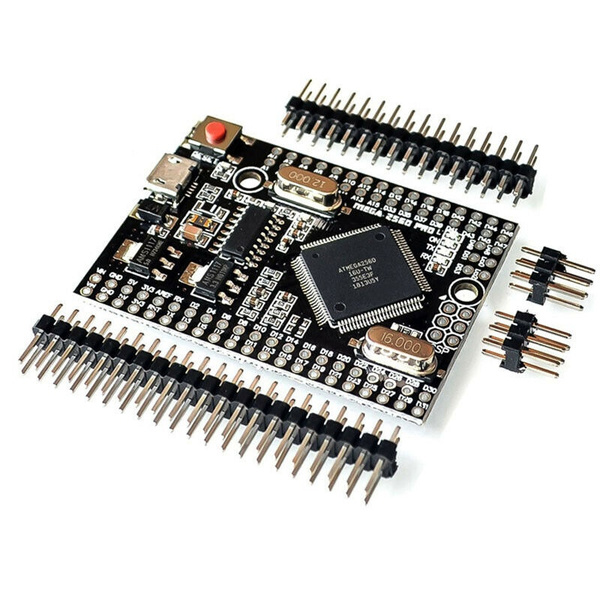

***********************
Microcontroller Boards
***********************

CommandStation-EX currently is designed for Arduino and select microcontrollers. Out of the box, it is compatible with the following boards:

* :ref:`reference/hardware/microcontroller-boards:Arduino Mega` **[RECOMMENDED]**
* :ref:`reference/hardware/microcontroller-boards:Mega+Wifi` (Tinkerer Level)
* :ref:`reference/hardware/microcontroller-boards:Arduino Uno`
* :ref:`reference/hardware/microcontroller-boards:Arduino Nano` (Tinkerer Level)
* :ref:`reference/hardware/microcontroller-boards:Nano Every` (Tinkerer Level)
* :ref:`reference/hardware/microcontroller-boards:Teensy 3.x & 4.x` (Engineer Level)

Arduino Mega
===============================

Why do we recommend the Mega?
------------------------------

* When compiled, our code just barely squeezes onto an Arduino Uno. **A mega allows you to add more features** like networking and displays because it has more memory.
* The Mega has many more GPIOs (General Purpose Input/Outputs) available to you for constructing control panels and controlling turnouts, signals and other accessories.
* The Mega has more hardware serial ports. You can connect a WiFi board and something else like Bluetooth at the same time.
* The mega is only modestly more expensive than an Uno, with clones available for less than $10 USD.
* See the special note about the Mega+WiFi board below for a board that has the microcontroller and WiFi already on one board.

.. image:: ../../_static/images/microcontrollers/mega2.jpg
   :alt: Arduino Mega Microcontroller
   :scale: 75%

Note that if the size of the regular Mega board is an issue, there are condensed Mega clones that are only 52mm long! They don't take shields, so you will need to use headers and jumper wires, but they will fit in a very small box. Look for boards by the name "Arduino Mega 2560 PRO Embedded" or "Mini MEGA 2560 Pro Micro" or just "Mega Pro 2560". Be careful to get the correct one for what you are trying to do because they can come in 3.3V versions or 5V versions and have a Micro-USB port (which you probably want) or just pins to a TTL serial port, and come with header pins you have to solder or not. Remember it must be a 2560 not a 328.

Arduino Uno
=============

If you already have an Uno, or will use JMRI to control your trains, then by all means use an Uno. Just remember that you can't have WiFi, Ethernet or a few other options due to memory limitations. But as a Command Station connected to JMRI with a USB cable it works great.

Arduino Nano
=====================

The Arduino Nano shares the same processor with the Arduino Uno, so we support it. The Nano has a different form factor than the Uno or Mega, so motor driver shields will usually need to be attached with jumper wires. There *is* a carrier board with an Arduino Motor Shield compatible circuit you can plug your Nano into. Other than having to solder and size, the Nano is in every way as capable as an Arduino Uno.

See our section on :doc:`Using a Nano <../../advanced-setup/supported-microcontrollers/nano>`

Mega+WiFi
==============

**Tinkerer level**

Do you know you are going want WiFi connectivity to connect your Throttle directly to your Command Station? Are you okay with having to throw a few switches and upload a bit of firmware onto the built-in ESP8266 WiFi chip? The process is easy, but since in involves having to use another bit of software and requires a couple of more steps, we labelled this option for Tinkerers, but it doesn't involve any soldering or jumper wiring.

See our section on Using the :doc:`WiFi+Mega Page <../../advanced-setup/supported-microcontrollers/wifi-mega>`

Nano Every
===========

**Tinkerer level**

The Nano Every is an updated Nano. It uses a completely different processor family than the Uno and Nano. S

See the detailed section on the :doc:`Nano Every <../../advanced-setup/supported-microcontrollers/nano-every>`

Teensy 3.x & 4.x
=================

**Engineer level**

The Teensy Series by PJRC is a next generation microcontroller. It has loads of RAM, a faster clock speed and a host of add-ons. 

See the detailed section on the :doc:`Teensy <../../advanced-setup/supported-microcontrollers/teensy>`

Will you support other microcontrollers in the future?
=======================================================

Yes, that is on our :doc:`roadmap </roadmap/index>`.

Click here for a complete :doc:`Shopping List </reference/hardware/shopping-list>`.

Boards that will NOT work
==========================

**WAVGAT Uno clone** - This board is NOT 100% Uno compatible. It uses a LGT8F328P processor from a company in China called "Logic Green". It has no EEPROM and requires a bit of configuration in the Arduino IDE to get it to be seen correctly and compile sketches. It is, however, a good board for developing other applications on because it can be switched to run at 32mHz instead of 16. It also has 12 bit analog pins instead of 10 bit. That means higher resolution readings, 0-4096 instead of 0-1024. It could potentially work as a CS with more testing and some code changes, but we will leave that to someone else to attempt. Megas and Mega clones offer more memory, more serial ports and more GPIO pins and are just a better way to go for the future.

**ESP32** - Great little board, however it is a completely different architecture so the same code will not work on it. It is made by Espressif. We currently support only the Atmel family of processors and the PJRC Teensy. It also is a smaller board so shields would have to be connected with jumpers.

Click here for a complete :doc:`Shopping List </reference/hardware/shopping-list>`.

