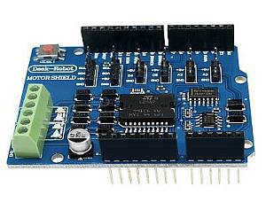
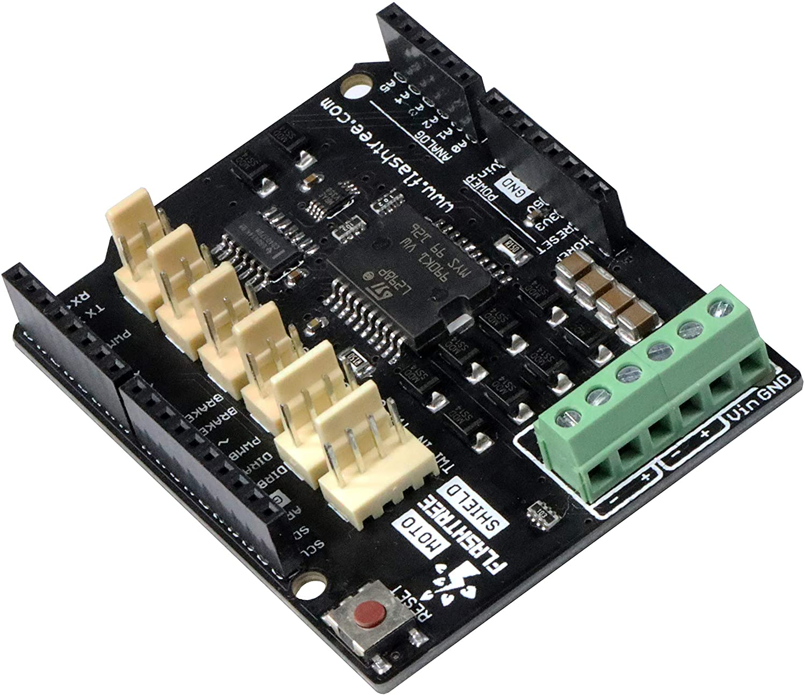
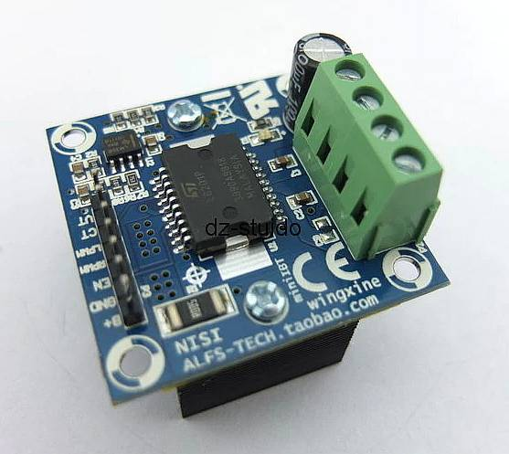
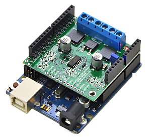
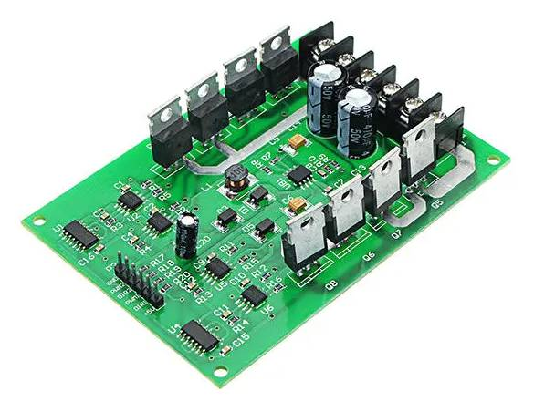
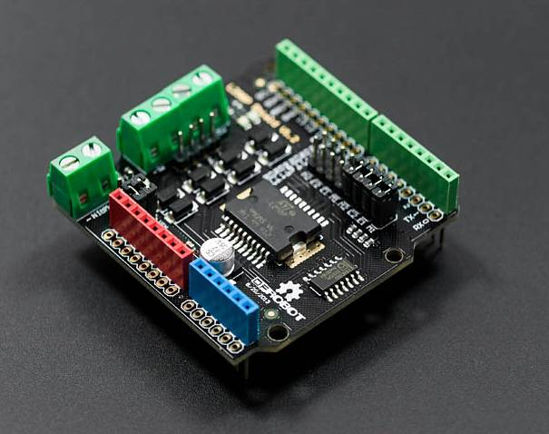

*************
Motor Boards
*************

CommandStation-EX is compatible with a wide variety of motor boards, also known as "dual H-bridges" and "motor shields". We've sorted them from least difficult to most difficult to use to help you decide what to use. When it comes to selecting a board, some considerations are size, whether it is a shield or needs to be connected with jumper wires, the amount of current you need, and whether it has current sensing capability built-in or if you have to supply it yourself.

If you have trouble finding a particular board from the list, try searching based on it's name or the type of chip on the board and the terms "H-Bridge" or "Motor Shield". There are often many places that sell these, especially the Chinese sites like AliExpress and Banggood.

**TL;DR** (aka short version): We currently recommend the Arduino Motor Shield R3 or a supported clone board like the Deek-Robot. See the `Shopping List <shopping-list.html>`_

.. image:: ../../_static/images/deek_robot1_sm.jpg
   :alt: Deek Robot Motor Shield
   :scale: 100%

.. note:: Where appropriate, we have used the terms "single" and "dual" to indicate on the non-shield type boards, which ones have just a single H-Bridge for one track and which ones have two. A single H-Bridge board will power your main track, but you will then need another board of some kind to connect to your programming track

What is a Motor Controller?
============================

A motor controller (aka shield, aka board) is just a high voltage, high current switch. While initially designed to power electric motors, we use it to create the DCC signal to the track in a clever misapplication of technology. Normally, a pulse width modulated (PWM) signal would be applied to a motor with the PWM pin to control speed and the direction pin would switch the voltage from positive to negative to control the motor spin direction. Instead, we send full DC track voltage to the PWM pin and switch the direction pin at the DCC frequency (around 8000 times a second) to generate the bi-polor square wave. In this way, we use the 5V DC (or 3.3V) microcontroller output to switch the voltage from separate 12-18V DC power supply connected to the motor controller, and create a pulse train signal of 1's and 0's that a mobile decoder can interpret as commands.

Boards currently supported
===========================

  **Easy to use boards**

   * :ref:`Arduino Motor Shield` - 2A rated, 1.5 possible **[RECOMMENDED]**
   * :ref:`Deek-Robot Motor Shield` - 2A rated, 1.5 possible **[RECOMMENDED]**
   * :ref:`Flashtree Motor Shield` - 2A rated, 1.5 possible
   * :ref:`DIY More L298NH Motor Shield` - 2A
   * :ref:`YFRobot L298P Motor Shield` - 2A
   * :ref:`Pololu MC33926` - 3A - current sensing is not appropriate for most CV programming

  **Intermediate boards (Tinkerer Level)** - require wiring

   * :ref:`L298N Motor Driver (dual)` - 2A
   * :ref:`MiniIBT Motor Driver L6201P (single)` - 5A
   * :ref:`Makerfabs H-Bridge Motor Shield` - 8A
   * :ref:`BTS7960 IBT_2 Board (single)` - 43A
   * :ref:`Dual Motor Driver Module H-bridge MOSFET IRF3205` - 15A

  **Expert Level Boards (Tinkerer or Engineer Level)** - these boards require you to add your own config to the config.h file, and may not have good current sensing. That said, if you buy a separate current sense board, we particularly like the IBT_2 board (though you will need 2 of them or some other board for the programming track)
  
   * :ref:`Keyes/Fundumoto ("Beeper Board")` - 2A
   * :ref:`Velleman KA03 (kit) VMA03 (soldered)` - 2A
   * :ref:`DFRobot 2x2A DC Motor Shield (DRI0009)` - 2A

  **Non-compatible boards**

   * VNH2SP30 - Sparkfun Monster Moto and others. It can't switch fast enough to generate a reliable DCC signal
   * IFX9202ED - Infineon Dual H-Bridge. Can't switch fast enough.
   * :ref:`Dfrobot Romeo V2` - Well, an Engineer could perhaps get this one to work.
   * Kuman Board (and any L293D based boards) - not enough current.
   
Other boards, while not fully supported and tested, can be used. Look for the following criteria:

* We recommend a dual h-bridge board or two discrete h-bridge boards. They can be different sizes, one bigger for main track and one smaller for programming track operations.
* It must handle enough current for the layout. 2 amps will drive 3-5 HO scale locomotives.
* It must have working and accurate current sensing (many do not)
* It must be able to switch at least 10000 times per second (some do not)
* Look for an Arduino shield form factor to eliminate wiring (not required but preferred)

.. Note:: Current capabilities of these boards, especially the boards based on the L298 with no heat sink fins like the Arduino Motor Shield can really not deliver 2 Amps. A realistic number would be 1.5 Amps IF you added a heat sink and a cooling fan. If you need 2 Amps or more, you will need to go with a higher current board.

Arduino Motor Shield
=====================

**Conductor level**

Easy to use, widely available and is rated 2A load per channel. In reality, without a heatsink and fan, it can only handle about 1.3 Amps. This is the standard by which we campare other boards that are about the same, worse, or better. 

.. image:: ../../_static/images/motorboards/arduino_motorshield2.jpg
   :alt: Arduino Motor Shield R3
   :scale: 100%

`Install the Arduino Motor Shield <../../get-started/assembly.html>`_

|

Deek-Robot Motor Shield
------------------------

**Conductor Level**

Electrically identical in most every regard to the Arduino motor shield. Often cheaper. Supports 2A per channel, but can deliver realistically 1.3 or maybe 1.5 Amps with an added heatsink and cooling fan.

`Install the Deek-Robot Motor Shield <../../get-started/assembly.html>`_

|

Flashtree Motor Shield
-----------------------

**Conductor Level**

Electrically identical in most every regard to the Arduino motor shield. Often cheaper. Supports 2A per channel, but can deliver realistically 1.3 or maybe 1.5 Amps with an added heatsink and cooling fan. Since it identical to the Arduino and the Deek-Robot boards, use the Deek-Robot install below.

https://flashtree.com/products/flashtree-motor-shield-r3-5v-to-12v-for-a000079

`Install the Flashtree (same as Deek-Robot) Motor Shield <../../get-started/assembly.html>`_

|

DIY More L298NH Motor Shield
-----------------------------

**Conductor Level**

Another similar board to the Arduino motor shield. Supports 2A per channel. This board uses the L298HN, which is the same L298 internally as the Arduino Motor Shield but in a different form factor with a larger heat sink tab. Current sense and other features are identical to the Arduino version.

.. image:: ../../_static/images/motorboards/diy_more_motor.jpg
   :alt: DIY More Motor Shield
   :scale: 100%

`DIY More Website <https://www.diymore.cc/products/replace-l298p-for-arduino-uno-r3-dual-channel-dc-motor-driver-shield-expansion-board-l298nh-module-driving-module-mega2560-one>`_
   
`Install the DIY More Motor Shield (same as Deek-Robot) <../../get-started/assembly.html>`_

|

YFRobot L298P Motor Shield
---------------------------

**Conductor Level**

This board is electrically the same, though a different layout than the Arduino motor shield. Often cheaper. Supports 2A per channel, but can deliver realistically 1.3 or maybe 1.5 Amps with an added heatsink and cooling fan. **Do NOT confuse this with the DFRobot Motor Shield, which is not plug and play!**

.. image:: ../../_static/images/motorboards/yfrobot1.png
   :alt: YFRobot L298P Motor Driver Shield
   :scale: 30%

`Install the YFRobot Motor Shield (same as Deek-Robot) <../../get-started/assembly.html>`_

**Remember to select YFROBOT_MOTOR_SHIELD in your config.h file or from the motor board dropdown if using EX-Installer**

Pinout for reference:

| PWM1/MAIN Enable - D5 (normally pin 3)
| PWM2/PROG Enable- D6 (normally pin 11)
| DIR1/MAIN Signal - D4 (normally 12)
| DIR2/PROG Signal - D7 (normally pin 13)
| Current Sense MAIN - A0
| Current Senst PROG - A1

.. Note:: This configuration uses the normal accuracy waveform to avoid having to use jumpers. To use the high-accuracy waveform, you would need to use pins 3 and 11 in your motor board definition in config.h and jumper them to D5 and D6 on the shield. For information about high-accuracy mode, See:

`High Accuracy Waveform <../../advanced-setup/motor-board-config.html#using-high-accuracy-waveform-mode>`_

.. Todo:: Give a link to how to handle the jumper reconfig

|

L298N Motor Driver (dual)
-------------------------

**Tinkerer level**

THIS BOARD HAS NO CURRENT SENSE! This is a high-current alternative to the Arduino and Deek-Robot shields. It uses the same L298 chip as the Arduino motor shield, only in a different form factor and with better cooling. You'll need to connect jumper wires from the correct pins on the Arduino to this board. IMPORTANT: You will also need to snip two long chip pins and add 2 resistors to enable current sense in order to have overload protection and be able to acknowledge CV reads and writes. As with any of these boards with current sense issues, you can also add a small current sense board like the MAX471  instead.

.. image:: ../../_static/images/motorboards/l298_board.jpg
   :alt: L298 Motor Driver
   :scale: 100%

`L298N Motor Driver on Amazon <https://www.amazon.com/Qunqi-Controller-Module-Stepper-Arduino/dp/B014KMHSW6/ref=asc_df_B014KMHSW6/?tag=hyprod-20&linkCode=df0&hvadid=167139094796&hvpos=&hvnetw=g&hvrand=1461693454543934465&hvpone=&hvptwo=&hvqmt=&hvdev=c&hvdvcmdl=&hvlocint=&hvlocphy=9009681&hvtargid=pla-306436938191&psc=1>`_
https://www.smart-prototyping.com/L298N-Dual-H-bridge-Motor-Driver-Board

`Install the L298N Motor Driver <../../advanced-setup/supported-motorboards/L298N-motor-board-setup.html>`_

|

MiniIBT Motor Driver L6201P (single)
-------------------------------------

Found on Ebay, Amazon and the Chinese sites, this board uses the L6201P H-Bridge chip and is rated for 5 Amps. With a fan and heat sink, it can handle 3 or 4 Amps at 12-14V. Search for MiniIBT or Wingxine to find it. Be careful to match the picture since there is another board that sometimes comes up in searches.

|

https://www.ebay.com/c/852876730
https://www.aliexpress.com/i/32790131503.html
https://www.aliexpress.com/item/32722458131.html
https://www.aliexpress.com/item/531569334.html

***Dave Bodnar Tested this board***

http://trainelectronics.com/DCC_Arduino/DCC++/

Makerfabs H-Bridge Motor Shield
--------------------------------

**Engineer Level**

THIS BOARD HAS NO CURRENT SENSE! See the section below about *** current sensing *** . The higher current capability and efficient power MOSFETs, make this board a good choice if you are running more than 3-5 locos.

Select MAKERFABS_MOTOR_SHIELD in your config.h file.

Pinout

| PWM1 - D9 (normally pin 3)
| PWM2 - D10 (normally pin 11)
| CNTRL1A (DIR1A) - D4 (normally 12)
| CNTRL1B (DIR1B) - D5
| CNTRL2A (DIR2A) - D7 (normally 13)
| CNTRL2B (DIR2B) - D8
| ENABLE/SHUTDOWN - D6

|

Pololu MC33926
---------------

**Tinkerer Level**

Comes soldered or in a kit where you just have to solder the headers and connector. While we have a motor board type for this board, the current sense is not acceptable. We recommend using an external current sense board like the MAX471. Many people still use this board.

|

BTS7960 IBT_2 Board (single)
-----------------------------

**Tinkerer to Engineer Level**

.. warning:: This board can supply a LOT of current. The maximum reccommended current is 5A for N and HO scale. This board can supply a whopping 43A, enough to cause a LOT of damage. To use this board, make sure you have fuses or circuit breakers connected in line with both rails. SOFTWARE ALONE CANNOT PROTECT YOU IN ALL CASES. 

You will either need 2 of these or one of these and another board to run your programming track. Most people using this board use the Arduino Motor shield for the program track and add this board for MAIN. These boards can provide high current. We have built boosters using these boards. If the 2 Amps (really 1.5A) of the L298 boards aren't enough for your track, this is one of the best options. IBT_2 is the manufacturer's name for this board, BTS7960 is the model number of the H-Bridge chip used as the motor controller. The H-Bridge generates a clean wave form, has very low signal propagation delay and no significant voltage drop.

.. image:: ../../_static/images/motorboards/ibt_2_bts7960.jpg
   :alt: IBT_2 Board
   :scale: 100%

Just search for "IBT 2 Motor Driver" or "IBT 2 H-Bridge"

`IBT_2 Intstallation Instructions <../../advanced-setup/supported-motorboards/IBT_2-motor-board-setup.html>`_

|

Dual Motor Driver Module H-bridge MOSFET IRF3205
-------------------------------------------------

**Tinkerer to Engineer Level**

.. warning:: This board can supply a LOT of current. The maximum reccommended current is 5A for N and HO scale. This board can supply a 15A, enough to cause a LOT of damage. To use this board, make sure you have fuses or circuit breakers connected in line with both rails. SOFTWARE ALONE CANNOT PROTECT YOU IN ALL CASES. You will also need external current sense. 

You can use this board to handle both your MAIN and PROG track, or you can use one of the H-Bridges to power your MAIN track and use the Arduino Motor Shield for your PROG track. This board can provide up to 15A when you need more current than the 1.2-1.5A the Arduino Motor Shield can provide. IRF3205 is the model number of the N Channel MOSFETS used in the H-Bridge circuit. MOSFETS are a type of transistor, and rather than many other boards that use an integrated circuit for the H-Bridge, this board uses 4 discrete transistors per H-Bridge. This allows for a highly efficient motor controller with a negligible voltage drop.

`Dual Motor Driver IRF3205 Intstallation Instructions <../../advanced-setup/supported-motorboards/IRF3205-motor-board-setup.html>`_

|

Keyes/Fundumoto ("Beeper Board")
---------------------------------

**Engineer Level**

You have to lift two traces and solder 2 resistors and use 2 jumpers to the current sense pins. This board is immediately recognizable because it has a cylindrical beeper or buzzer on the board. ***TODO:More details on this fix soon***

.. image:: ../../_static/images/motorboards/keyes_fundumoto.jpg
   :alt: Keyes/Fundumoto Motor Shield
   :scale: 100%

|

Velleman KA03 (kit) VMA03 (soldered)
-------------------------------------

**Engineer Level**

Must cut traces and solder resistors to get current sensing on the soldered board. Much easier to simply not solder the pins on the kit version. Pin assignments must be added to a new motorboard entry in the config.h file.

.. image:: ../../_static/images/motorboards/velleman_motor.jpg
   :alt: Velleman KA03
   :scale: 100%

|

DFRobot 2x2A DC Motor Shield (DRI0009)
---------------------------------------

**Engineer Level**

This is another L298 based board with inadequate cooling. Fan and/or heat sink recommended. Max current realistically 1.3A. This board has NO CURRENT SENSE. As with many boards like this, both L298 current sense pins are tied to ground. Cutting traces and adding sense resistors or the use of an eternal current sense board is required for short circuit protection and loco programming. If you don't use current sense, you must ground pins A0 and A1 on the Arduino or you will get an overcurrent condition.

Speed Control Jumpers need to all be on the PWM side of the shield (all 4 jumpers on the right 4 pins)
Power Source Selection Jumpers need to both be on PWRIN (to the left) and NOT VIN

| ENABLE1 (EN1) - D5 (normally pin 3)
| ENABLE2 (EN2) - D6 (normally pin 11)
| DIR1 (M1)     - D4 (normally pin 12)
| DIR2 (M2)     - D7 (normally pin 13)

On the schematic, pin 1 of the jumper bank is the right side as you read the labels, the PWM side.

NOTE: There is a "Twin" version of this board that uses pins 10, 11 and 12, 13 instead

|

DFRobot Romeo V2
-----------------

**Engineer Level**

On the surface, this seems like a great idea, an Aduino and motor controller on one board. It is a very thin surface ;) While we don't recommend it, an Engineer who reads these notes, may still find a use for it. The V2 uses the ATmega32u4 chip instead of either of the chips used on an Uno or a Mega. It only has 2 interrupts that are usable and it reverses their pin assignments. It uses serial on the chip, not with a UART as on the other boards. It may need a sofware change to accomodate the timer. It also has the same amount of memory as an Uno, which will only run the basic version of DCC++ EX without options. In addition, the serial port uses memory to operate, so you have even less memory free to use than on an Uno.

Onboard is the L298 dual H-Bridge, with the same lack of cooling as on the Arduino Motor Shield. It will only deliver 1.2 to 1.3A instead of 2A, if you add a fan. Very importantly it has NO CURRENT SENSE for either track. The sense outputs are tied to ground. You would have to cut traces and add resistors at the least, or buy current sense boards.

.. image:: ../../_static/images/motorboards/romeo_v2.jpg
   :alt: Romeo V2
   :scale: 40%

Click here for a complete `Parts Shopping List <./shopping-list.html>`_

Configuring Motor Boards
=========================

If your board is not in the list of supported motor board types, or if you need to make changes or have more information about how motor boards are configured in DCC++ EX, see:

`Motor Board Configuration Guide <../../advanced-setup/motor-board-config.html>`_
