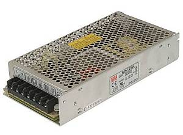

Power Supplies
==============

The power supply is one of the most important parts of your setup. You need to select a clean, filtered power supply that can supply the correct voltage and deliver the amount of current required by your devices. 

Do I need two power supplies?
-----------------------------

Well, you at least need two voltages. While it is possible to get multiple voltages from one power supply, how to do that will be covered in the advanced section. Both your microcontroller (the Arduino) and the motor controller need power. While we recommend a 9 Volt, 1 Amp, DC power supply for the microcontroller, there are other ways to power it. The voltage requirement to the motor controller does not change based on how you power your Arduino, you need the correct voltage and amperage for your guage and layout.

Three ways to power the Arduino
^^^^^^^^^^^^^^^^^^^^^^^^^^^^^^^

**Barrel Connector** - This is where we can connect our 7-9V DC supply. The power goes through a voltage regulator on the Arduino and converts the 7-9V to the 5V the board can use. You will still need a separate source of power for the motor controller.

**Vin pin** - You can connect a 7-9V DC power supply with jumper wires. The positive from the power supply goes to Vin and negative to any pin marked "gnd" for ground. This also uses the voltage regulator on the Arduino to convert your supply voltage to 5V. You will still need a separate power supply for the motor controller.

**USB Connector** - If you always will have a computer connected to your Command Station (for example when using JMRI or exWebThrottle), the 5V from your computer can power it. You won't need separate power supply in addition to the one you need for the motor controller. Most USB ports can only supply 500 milliamps, and this input is protected by a 500mA polyfuse that resets when a short is removed, so be careful about adding anything that will draw current from the CS. A motor shield, a wifi shield and a fan that draws 50mA should be fine. Even if you don't have a laptop, you can use a 5V, 800mA or more USB power supply like a phone charger and connect it to the USB port.

**5V pin** - Engineers only! Arduino recommends against this. You can connect a good quality 5V power supply directly to the 5V pin and ground. You can NOT ever plug anything into the other power connectors if you connect power this way! This bypasses the voltage regulator on the board which means you can use more current. But it also connects voltage to the output of the 5V regulator. Be aware that there is no diode for reverse voltage protection and no fuse for overcurrent. Research this option before attempting it.

**Barrel Connector and USB at the same time?** You may wonder what happens if you have a 7-9V power supply connected to the barrel connector and plug your laptop into the USB port to use the serial monitor. The Uno and Mega actually have a conflict protection circuit. If you plug in a 7V or more power supply to the barrel connector, the Arduino automatically switches internally to use that power supply. So regardless of which connector you plug in first, if the barrel connector has voltage applied to it, that is the voltage the Arduino will use and the USB connection will just provide communication signals.

.. warning:: We recommend only a 7-9V DC power supply for your Arduino because, despite what may be said on a specification sheet, anything over 5V is generated as heat in the voltage regulator on an Arduino. There is a 2V voltage drop in this regulator, so you need a minimum of 7 volts to power the board. 7-9 is perfect. If you used 12V and connected a WiFi board or other devices that also use the 5V power supply on the arduino, the voltage regulator is likely to overheat.

Powering the Motor Controller
^^^^^^^^^^^^^^^^^^^^^^^^^^^^^

Voltage
~~~~~~~

N and Z scale layouts should run at at about 12V-14V to avoid damage to the motors. See this thread to learn more about the pros and cons of running at higher voltages at this `Trainboard Thread <https://www.trainboard.com/highball/index.php?threads/dcc-voltage-and-n-scale-locomotives.56342/>`_ Another good link (along with just about anything written by Mark Gurries), is here: `Mark Gurries - Choosing the Right Booster <https://sites.google.com/site/markgurries/home/technical-discussions/boosters/choosing-the-right-booster>`_

Most larger scales will run higher voltages. For reference, Digitrax systems put the rails at around 14V. Do some homework to determine what voltage is best for your system.

Amperage
~~~~~~~~

A 3A power supply will give you plenty of current to handle the maximum of 2A on channel A to the MAIN track (assuming you're using the Arduino motor shield or Pololu motor shield). Channel B for the programming track will only be used occasionally and does not need much current. In fact, it is limited to protect your trains. Running trains on main and programming a loco on Prog at the same time will be fine. The overcurrent limit set in the CS will automatically cut power if you go over that number of Amps. A rule of thumb is you can operate 3 to 5 N or HO sound locos on the 2A boards. For larger layouts with higher current requriements on the MAIN track and a motor driver that can handle those currents, you'll want power supply that can deliver that larger current. See `Motor Boards <motor-boards.html>`_ for more information about higher current motor controllers.

A device will only draw the current it needs. So whether you have a 2A power supply or a 20A power supply, if you setup only needs 1A, then both supplies will work just fine, but no sense paying for more than you need. And it is also worth noting that devices that can supply a large current can cause a large amount of damage if you don't have proper safety features installed like the overprotection feature of the CS AND fuses to the track.

.. warning:: If you think you need more that 5 Amps to your track, you should strongly consider using boosters and power districts. 

Recommended Power Supplies
--------------------------

* Wall warts are a good choice for beginners and those not comfortable with mains wiring. You can get a 12V, 3A, relatively small one for around $8 US. 

.. image:: ../../_static/images/12v-3A-wall-wart-sm.jpg
   :align: left
   :scale: 100%
   :alt: 12V Wall Wart

|
|
|
|
|
|
|
|
|
|

* You can also find plenty of laptop type "brick" power supplies. They come in ranges from 12V to 18V and 3-5 Amps.

.. image:: ../../_static/images/12v-3A-brick.jpg
   :align: left
   :scale: 100%
   :alt: 12V 3A Brick Power Supply

|
|
|
|
|
|
|
|
|
|

* The Meanwell LRS-100-15 power supply is a good choice for larger scales. It supplies 15V and 105W (that's 7 amps), so it is plenty for running two channels simutaneously. At only $18, it is an inexpensive and solid option.

.. image:: ../../_static/images/meanwell-lrs100.jpg
   :align: left
   :scale: 100%
   :alt: Meanwell

`See on Digi-Key <https://www.digikey.com/product-detail/en/mean-well-usa-inc/LRS-100-15/1866-3313-ND/7705005>`_

.. warning:: For the Meanwell LRS-100-15 you will need to do your own mains wiring. If you don't have experience with this get a friend who does or hire an electrician to do it for you. MAINS POWER IS DANGEROUS.

Dual voltage power supplies
^^^^^^^^^^^^^^^^^^^^^^^^^^^

With a dual voltage power supply, you can provide 12V for the motor controller and 5V for the Arduino. You may also be able to find higher voltage units if you need such as 14-15V if your scale trains require it.

* Mean Well Dual Voltage Power Supply (5V and 12V)

`See on Amazon <https://www.amzn.com/B005T9FF4I/>`_

.. warning:: For the Meanwell RD125A, you will need to do your own mains wiring. If you don't have experience with this get a friend who does or hire an electrician to do it for you. MAINS POWER IS DANGEROUS.
