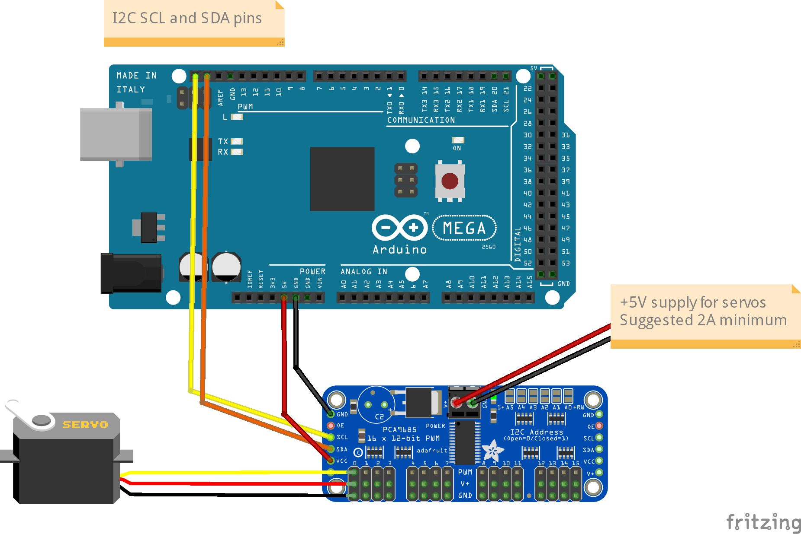
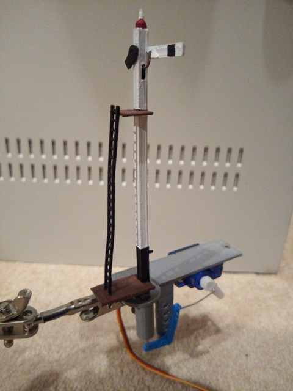

============================
Connecting a Servo Module
============================

To connect a servo module to DCC++EX, you first need to get a module, based on the PCA9685 chip.

.. image:: ../../_static/images/i2c/pca9685.jpg
   :alt: PCA9685 Servo Module
   :scale: 40%

These are widely available from ebay, Amazon, etc. for a few dollars.

Note the pin connectors along the left side of the module - these are where you connect to the
Arduino.  

The 16 columns of three pins along the bottom of the module are where you connect the servos.
The pins are arranged so that you can just plug a servo connector directly onto them, but be
sure that the wire colours match the colours of the pins, i.e. yellow to yellow, red to red and black to black.

The servo module itself is powered from the Arduino, but the servos themselves contain motors that
consume more current than the Arduino is able to supply, and so a separate 5V supply is required for the
servos.  This is connected to the green terminal block at the top of the module, with terminals labelled V+ and GND.
The V+ terminal is connected to 5V and the GND to the 0V (ground) wire of the supply.

Connections to the Arduino are made with four jumper wires (+5V power and GND, and SCL and SDA), as shown on the following diagram:

In DCC++EX, the drivers for the PCA9685 module is already installed, and made available to for use as
pin numbers 100-115.
A servo is shown in the diagram, connected to the first set of pins on the module.  This will be accessed 
using pin number 100.

Once you've made all of the connections, apply power to the Arduino.

Then, in the Serial Port Monitor, enter the command `<D SERVO 100 450>`.  The servo should move, as long as it
isn't (by some fluke) already in that position.

Enter `<D SERVO 100 110>` and this time it should definitely move.  For the last parameter (servo position) 
you can use any value between about 105 and 490.

Try `<D SERVO 100 450 3>` and the servo should move slowly back.

You can use the servo to control turnouts, semaphore signals, engine shed doors, and other layout components, to make your
layout more dynamic and exciting.  In the picture below, you can see a servo mounted below the baseboard 
with a piece of wire passing through the baseboard, to operates a turnout.

.. image:: ../../_static/images/i2c/TurnoutServoMount.jpg
   :alt: Servo mount to operate a turnout
   :scale: 60%

And in the next picture you can see a servo that operates a semaphore signal.  The signal, and its
mounting bracket, were 3d-printed on a Creality Ender-3 printer.

