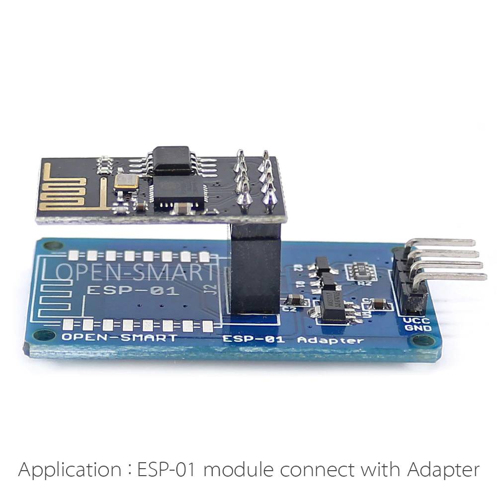
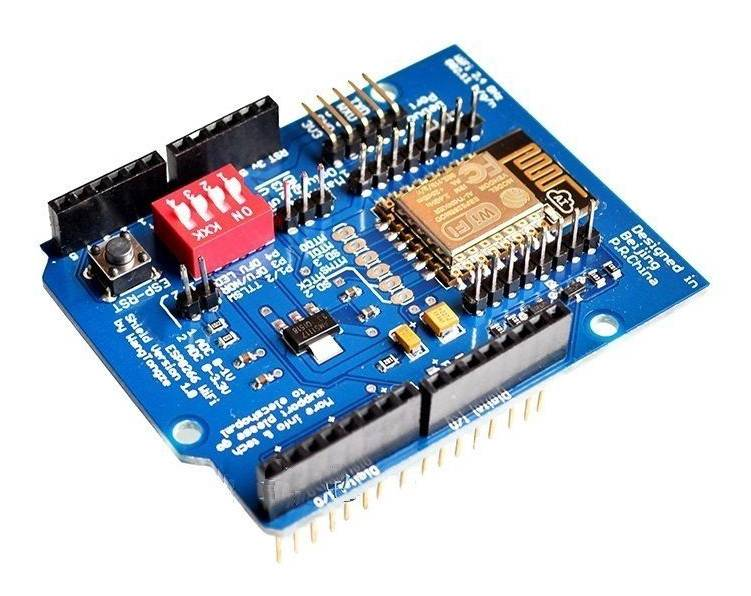
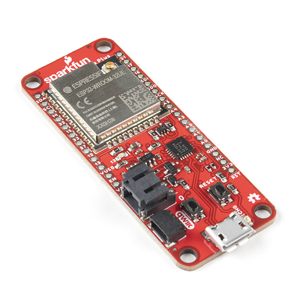
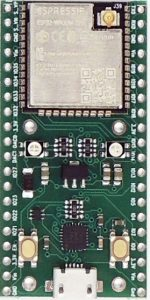

************
WiFi Boards
************

You can connect up to 5 WiFi throttles. For the standard Mega board, we recommend the Conductor-Friendly Makerfabs WiFi shield below. Keep in mind you can also purchase a Mega+WiFi board online that has both a Mega clone and an ESP8266 built onto the same board. However, you will have to upload new firmware to that board, so that would be a Tinkerer option. See the :doc:`Mega+WiFi page <../../advanced-setup/supported-microcontrollers/wifi-mega>`

For more information on how to configure your CS to use the boards below, see :doc:`Wifi Setup <../../get-started/wifi-setup>`

- :ref:`reference/hardware/wifi-boards:Makerfabs WiFi Shield`.
- :ref:`reference/hardware/wifi-boards:Duinopeak WiFi Shield`.
- :ref:`reference/hardware/wifi-boards:ESP-01S`.
- :ref:`reference/hardware/wifi-boards:WangTongze Board`.
- :doc:`Mega+WiFi </advanced-setup/supported-microcontrollers/wifi-mega>`. (this link will take you to another page)
- :ref:`reference/hardware/wifi-boards:SparkFun Thing Plus (ESP32)`.
- :ref:`reference/hardware/wifi-boards:ESP32_Ant-01 Breakout and Development Board (ESP32)`.

.. NOTE:: This is NOT to make a connection to JMRI. Use a USB cable instead. The WiFi and Ethernet solutions are designed to allow throttles to connect directly to the DCC-EX CS without the need for any other software such as JMRI. While using a WiFi/Ethernet connection to JMRI will work, the overhead required internally will slow performance, take up valuable system memory, and prevent broadcast messages for sensors and power state.

Makerfabs WiFi Shield
======================

Conductor Friendly

* `Makerfabs ESP-8266 WiFi Shield (recommended) <https://www.makerfabs.com/esp8266-wifi-shield.html>`_

.. image:: ../../_static/images/wifi_jumpers1.jpg
   :alt: Makerfabs ESP-8266 WiFi Shield
   :scale: 70%

:doc:`Installation Instructions for WiFi <../../get-started/wifi-setup>`

Duinopeak WiFi Shield
======================

Tinkerer

* `Duinopeak ESP-8266 WiFi Expansion Board (plus an ESP-01 or 01s) <https://usa.banggood.com/Duinopeak-ESP8266-ESP-01-WiFi-Expansion-Board-Shield-Without-ESP8266-Module-p-1391961.html?cur_warehouse=CN>`_

.. image:: ../../_static/images/duinopeak.jpg
   :alt: Duinopeak ESP-8266 WiFi Shield
   :scale: 60%

You will need an ESP-01s to plug into this board. This is just an expansion shield board. It allows you to plug an ESP8266 onto an Arduino with no jumper wires. This board also has a voltage regulator, level shifters and a reset button for programming.

:doc:`Installation Instructions <../../get-started/wifi-setup>`

See the ESP-01S in the next section below that must be installed on this board

ESP-01S
=========

Tinkerer Level

* `ESP-01 or ESP-01S Board (This is not a shield. You will need to use jumpers) <https://www.amzn.com/B00O34AGSU/>`_

.. image:: ../../_static/images/esp-01s_2.jpg
   :alt: ESP-01S
   :scale: 60%

You can use this board stand-alone with jumpers, or use the Duinopeak ESP-8266 Wifi Expansion Board above and plug this board into it. 

There are also other boards that require jumper wires (they are not shields) but they work great and provide a voltage regulator to take 5V and convert it to the 3.3V these boards need. They also have level shifters to offer more protection by converting the 5V from the Arduino Tx pin to 3.3V and convert the Tx pin on the ESP8266 from 3.3V to 5V which offers a little more certainty that the signal is read properly. It is better to power the board from the 5V output of the Arduino because it can deliver more current than the 3.3V regulator on the Arduino.

`Esp8266 Serial Wi-Fi Wireless Esp-01 Breakout Adapter Board <https://www.aliexpress.com/i/32842569436.html>`_

Buy the one that looks like this:

We have used the ones that look like the one below just as well, but you have to make sure to wire power to 3.3V NOT 5V and there is no voltage regulation and NO LEVEL SHIFTERS. The GPIO pins on the ESP8266 appear to be 5V tolerant, but there is not guarantee it won't shorten its life to have a 5V signal on the Tx pin. Several test versions are running fine like this after a year, but if you are going to buy a board to stick this into instead of wiring it directly, then why not buy one with the extra circuitry? 

.. image:: ../../_static/images/esp_breakout1.jpg
   :alt: ESP8266 Breakout Board
   :scale: 25%

:doc:`Installation Instructions <../../get-started/wifi-setup>`

WangTongze Board 
==================

AKA: Uno R3 Mega Esp8266 Serial Wifi Shield / ESP-12E Board

Tinkerer to Engineer Level

This board has many names, the easiest way to identify it is by the red dipswitch bank. Then zoom in on the pictures you see on the supplier site and look for "WangTongze" on the board. They may blur it out. DO NOT buy this board unless you know you are getting a genuine WangTongze board! If you get a "good" board, it will work perfectly, if you get a bad clone, it won't work without employing workarounds. A genuine Wangtongze has no misspellings.

One board has "shield" spelled incorrectly as "shiald". The "shiald" version works, but some say it has an unreliable WiFi connection. 

There is another version where the "more" in "more info" is spelled "moer" and "Arduino" is spelled "Arbuino". This board has the wrong transistors soldered onto it in the level shifter circuit. Get out your cell phone, take a picture of your board and zoom in on the section of the board you see here:

.. figure:: ../../_static/images/wifi/wangtongze_transistors.png
   :alt: Wangongze level shifter transistors
   :class: with-shadow
   :scale: 15%

   WiFi board level shifting transistors should be J1Y (click the image to enlarge)

If these 2 transistors are labelled "JIY" you are lucky and the board with work with no modifications. If they are labelled "J3Y", you have two choices to get this to work:

 1. **Tinkerer way** - You could bypass the header connections and use jumpers to wire directly to the debug pins of the ESP8266, but that bypasses the Tx/Rx level shifters. The ESP8266 Tx/Rx pins are 5V tolerant, but it is always best if you can to shift 5V from the Arduino to 3.3V. You could also make a small 2 resistor voltage divider to connect to the debug header Rx pin. The Tx pin to the Arduino will be fine as is.

 .. figure:: ../../_static/images/wifi/wangtongze_jumpered.jpg
    :alt: Wangtongze Jumpering to the debug header
    :scale: 30%

    Using Jumpers Directly to the Debug Header

 And here is a voltage divider with just two resistors you can use as a signal level shifter circuit:

 .. figure:: ../../_static/images/wifi/esp_level_shifter.png
    :alt: 
    :scale: 70%

    Voltage Divider Level Shifter for ESP8255 Rx Debug Header Pin

 2. **Engineer way** - You can buy the correct surface mount transistors and replace two of them using a magnifier as we did when we had nothing better to do that day, but that's a lot of trouble to go through unless this is the only board you can find. If they are labelled "J3Y", you can order "J1Y" replacements, remove the old ones, and solder in the new ones. This is a job for a skilled solderer.

The bottom line is that we don't recommend this board because you would have to be very careful and know which one you are buying. That said, we can provide more information on these boards if you have one and want to get it to work.

Here is a link to the `Video and info from Wang Tongze himself <https://www.youtube.com/watch?v=LJcYgR479Vw>`_

SparkFun Thing Plus (ESP32)
=============================

Tinkerer Level

This is a very powerful board in its own right. It almost seems a shame to use it just for WiFi, though with custom firmware, it could handle WiFi duty and a lot more. The advantage of this board is it has a connector for an external antenna. The board is relatively expensive, but SparkFun has quality products and top notch support. Detailed installation instructions can be found at: https://docs.espressif.com/projects/esp-at/en/latest/Get_Started/index.html

https://www.sparkfun.com/products/17381

ESP32_Ant-01 Breakout and Development Board (ESP32)
========================================================

Tinkerer Level

Like the SparkFun board, this board is a very powerful board in its own right. It almost seems a shame to use it just for WiFi, though with custom firmware, it could handle WiFi duty and a lot more. The advantage of this board is it has a connector for an external antenna. It is half the price of the SparkFun board and comes with an antenna. Detailed instructions on installation can be found at: https://docs.espressif.com/projects/esp-at/en/latest/Get_Started/index.html

https://www.ezsbc.com/product/wifi01u/

