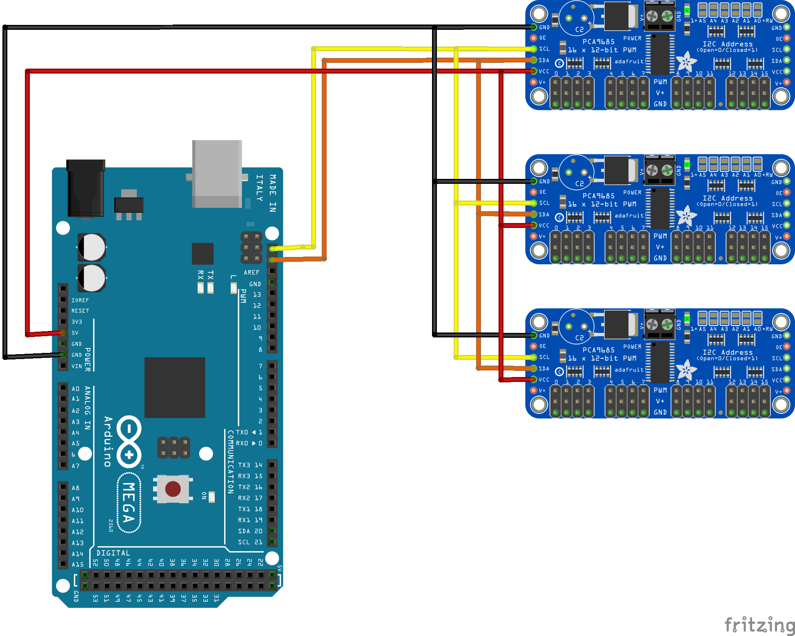
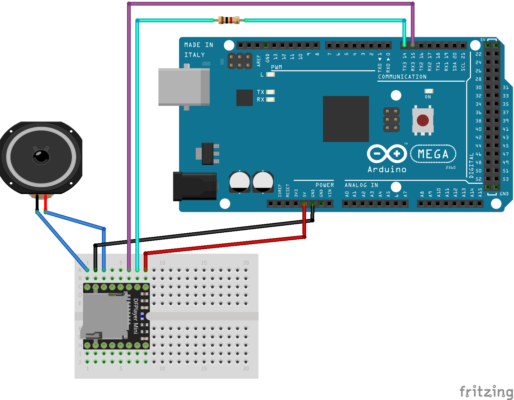

.. include:: /include/include.rst
.. include:: /include/include-l2.rst
**************************
I/O Device Drivers and HAL
**************************

|engineer|

.. sidebar::

  .. contents:: On this page
    :depth: 1
    :local:

The DCC++ EX controller has always had built-in support for turnout control, output control and input sensors attached to the Arduino pins.  However, you may 
outgrow the built-in capabilities and want to access more output pins than the Arduino has available.  Or you may wish to attach servos to the controller
for turnout control or for animating a layout component, such as the doors to an engine shed.  

|EX-CS|, as of version 3.2.0, provides support for a wider set of input and output devices than previous versions.  This is thanks to a 
piece of software called the **HAL** or **H**\ardware **A**\bstraction **L**\ayer.  
The HAL provides support for a range of different input and output modules through drivers that are supplied with DCC++ EX.
In addition, its simple interface allows engineers and tinkerers to add new plug-in device support to |EX-CS| 
without having to change a line of the core application code.  

The HAL exposes a standard set of functions which the rest of |EX-CS| code is able to call upon, and the HAL directs the 
calls to the appropriate device driver.
The specific device end-points are given by a kind of pin number, called a **V**\irtual **pin** or VPIN.
Any module has one or more VPINs associated with it.

When |EX-CS| code needs to write to an Arduino digital output pin, the output is uniquely identified by a pin number.  
The Arduino Mega has digital I/O pin numbers ranging up to 69.  For example, you may set up an Output in |EX-CS| using the 
`<Z 1 40 0>` command (id=1, pin=40).  Then the command `<Z 1 1>` will set pin 40 HIGH and `<Z 1 0>` will set pin 40 LOW.

The HAL extends this model to other devices.  If you want to write to a digital output pin on an external GPIO Extender Module, 
then you do exactly the same thing, but the pin number identifies a virtual pin number associated with an extender module.  The call is passed to
the driver software for that module, and a command is sent to the module to modify its pin state.
|EX-CS| does not need to know what type of device it is, or what low-level commands are necessary to operate it.  
It just sends an instruction for the pin to be set on or off.
If you want to reposition a servo, the same function is called, but with a VPIN number that identifies a pin
on a servo controller module; consequently, a command is sent to the servo control module to move the servo to the appropriate position.

The same principle applies to Sensors (inputs).  You can configure a sensor object on |EX-CS| by using the command `<S 2 40 1>` command (id=2, pin=40, pull-up=enabled). 
When pin 40 is connected to 0V (ground), a message `<Q 2>` is generated, and when it is disconnected, `<q 2>` is generated.  But if you have an MCP23017
GPIO Extender module connected up, and you replace the pin number 40 with 164 (the number of the first pin on the MCP23017), 
then you will get the messages when the MCP23017 pin is connected to 0V or disconnected.

So how are these 'VPINs' configured?  

The standard |EX-CS| build for an Arduino Mega already contains support for four external modules, two GPIO Extender modules
and two servo modules.  The GPIO Extender modules are MCP23017 modules which each have 16 pins that can be configured as inputs or outputs.  The Servo modules are
PCA9685 modules which each have 16 pins that each provide a pulse-width-modulated signal that may be used to control a servo.  That's sixteen independently controlled
servos on each module.

If you need more modules, then they can be added from a user-specific configuration file, as described further on.

**IMPORTANT NOTE**  The Arduino Nano and Arduino Uno both have very limited FLASH program space and RAM memory, compared to the Arduino Mega.
The rest of the |EX-CS| code takes up most of the FLASH program space, and so there is very little spare for any HAL code.  Consequently, when 
|EX-CS| is compiled for a Nano or Uno, a *reduced HAL* is included in place of the full HAL.  This provides limited functionality and supports 
only for the Arduino digital input and output functions and analogue input functions.  No advanced drivers (Servos, external GPIO etc.) can be installed.
It is theoretically possible to create an 'on-line only' version of |EX-CS| which excludes the loco programming functions and 
therefore frees up FLASH on the Uno and Nano to allow the full HAL to operate, but this is not currently supported.

Catching the I2C Bus
====================

Many of the external modules are connected to the Arduino via the I2C (Inter Integrated Circuit) interface.  
This has four connections, usually labelled SDA (data), SCL (clock), VSS (+5V power usually) and GND (ground, or zero volts).  
Your motor shield may have convenient connectors for I2C devices; for example, the DeekRobot shield has two sets of
four I2C pins on the top.  If not, then check the Arduino's data sheet to find the applicable I2C and power connections.  
For an Arduino Mega, SCL and SDA are the two connectors nearest the reset button, in the connector block running along the edge of the Arduino.

**WARNING**  *There is no standard pin order for the I2C bus connectors, so be careful that you identify which pin is
which, and always connect SDA to SDA, SCL to SCL, GND to GND and VSS/+5V to VSS/+5V.*

All I2C devices are connected in parallel to this bus, and when the Arduino sends commands, all attached devices receive them.
However, only a device with a matching address will respond.  Each device attached to the bus should have a unique address.

   Example I2C Bus Topology with Arduino Mega and Three I2C modules

Pull-Ups
--------
The I2C bus requires pull-up resistors in order for it to operate.  However, most I2C modules contain
10kOhm pull-up resistors built in, and the Arduino also has built-in pull-up resistors which are sufficient for
installations with short bus cables, so you don't have to be concerned about this unless you're
really *pushing the envelope*\!

For example, if you have 6 or more I2C modules connected to the same bus, you may need to remove the built-in 
pull-up resistors from one or more of them since the minimum permitted pull-up is generally 1.7kOhm (at 5V supply), to avoid too much current flowing.
Also, if your I2C bus cable is long then a pull-up value closer to the minimum is desirable.

Identifying What Devices Are Connected
--------------------------------------

During the startup phase of |EX-CS|, the I2C bus is queried to identify what (if any) devices are connected.
The list of active I2C addresses is shown on the serial output during startup.  An example is shown below, with annotations.
Note that the address does not necessarily tell you what the device is, since different modules may have the same default
address.

.. code-block::

  <* License GPLv3 fsf.org (c) dcc-ex.com *>
  <* I2C Device found at x20 *>    -- GPIO Extender device
  <* I2C Device found at x3C *>    -- OLED display
  <* I2C Device found at x40 *>    -- PWM (Servo) Control Module
  <* I2C Device found at x48 *>    -- 4-pin Analogue Input Module

MCP23017 Modules
================

The MCP23017 GPIO Extender module has 16 input/output pins.  Like the Arduino input/output pins, you can access any of these in input mode (as a sensor input)
or output mode (driving a digital output and illuminating an LED or switching some external hardware).  Each module has an address associated with it, which 
is generally either 0x20, 0x21, 0x22 or 0x23.  By default, the module is usually 0x20.  The address will only need to be changed if you have more
than one module, in which case the second one will have to be set to address 0x21, usually by moving jumpers on the module or by soldering across pads on 
the circuit board.  Refer to the documentation for your own board for details.

When used for inputs (sensors or switches), the sensor/switch is usually connected between the nominated pin and the GND (ground) signal.  
When the sensor/switch activates, it usually connects the pin to GND, and the device detects a small current flow.  When the sensor/switch deactivates,
the current stops flowing.  This is just the same as the Arduino digital GPIO pins.

Two MCP23017 modules are pre-configured, one is address 0x20 and uses VPINs 164-179.  The second is address 0x21 and uses VPINs 180-195.

An input pin may be configured using the DCC-EX Sensor commands, as follows:

.. code-block::

	<S 201 164 1>  

This command associates sensor ID 201 with VPIN 164 (MCP23017 first pin) and enables pull-up.

When the sensor activates and deactivates, the following messages are sent by |EX-CS| over the serial output:

.. code-block::

	<Q 201>         -- Activation
	<q 201>         -- Deactivation

PCA9685 Modules
===============

The PCA9685 PWM (servo) controller module has 16 input/output pins.  In addition, next to each PWM pin is a +5V and a GND pin, so that a servo connector may
be directly plugged onto the group of three pins.  Even better, the pins are usually colour-coded to match the colours of the servo cables!

Like the MCP23017 module, each PCA9685 has an address.  The default address is 0x40, and may be changed, for example to 0x41, 0x42 or 0x43 for the second, third and fourth module 
on the bus.

Servos contain motors, and so may draw more power than the Arduino can support.  Therefore, the PCA9685 module usually has a block connector allowing connection
of an external 5V power supply, to power the servo motors.  If this power isn't connected and on, then the servos won't move.

Two PCA9685 modules are pre-configured, one is address 0x40 and uses VPINs 100-115.  The second is address 0x41 and uses VPINs 116-131.

A servo turnout may be configured using the DCC-EX Turnout commands, as follows:

.. code-block::

	<T 301 SERVO 100 410 205 2>		
  
This command associates turnout ID 301 with VPIN 100 (PCA9685 first pin).
When the turnout is 'thrown', the PWM position is set to 410.
When the turnout is 'closed', the PWM position is set to 205.
The movement of the turnout is Medium speed (2).  The movement profile may be 0 (Immediate), 1 (Fast=0.5 sec), 
2 (Medium=1 sec), 3 (Slow=2 sec), or 4 (Bounce profile for semaphore signals).

Many references quote a PWM pulse length of 1ms to 2ms, which corresponds to PWM values of 205 to 410.  
However, I've found, with SG90 servos, that 102 to 490 gives a full servo sweep of nearly 180 degrees.
*But use with care, as an attempt to position a servo outside of its range may 
cause damage to the servo gearing, or to any layout components you have connected to the servo!*

.. code-block::

	<T 301 1>  -- Instructs the turnout to move to the 'thrown' position.
	<T 301 0>  -- Instructs the turnout to move the the 'closed' position.

In EX-RAIL, the servo can be controlled directly via the **SERVO(pin,position,profile)** or **SERVO2(pin,position,duration)** commands.
	
**Good to know:** The PCA9685 is not only used for servos.  It generates pulses of variable mark-to-space
ratio, with a value of 0 being full off, and 4095 being full on.  So it can be used to control an LED
to different brightness levels.  the EX-RAIL automation has a command **FADE(pin,value,ms)** which operates the 
PCA9685 to do exactly this.

Other Drivers
=============

There are also drivers included with |EX-CS| for the following modules:

* PCF8574 - 8-channel GPIO extender module, like the MCP23017 but fewer inputs/outputs (I2C).
* MCP23008 - Another 8-channel GPIO extender module.
* PCA/TCA9555 - Another 16-channel GPIO extender module (see notes below).
* DFPlayer - MP3 Media player with microSD card holder.  You can play different sounds from the player by activating or de-activating
  output VPINs from within |EX-CS|.
* ADS1115 - Four-channel analogue input module (I2C).  Also designed to work with the ADS1113 and ADS1114 single-channel modules.
* VL53L0X - Laser Time-Of-Flight (TOF) range sensor (I2C).  Its VPIN activates when a reflecting object is within a defined distance of the sensor.
* HC-SR04 - Ultrasound 'sonar' range sensor.  Its VPIN activates when a reflecting object is within a defined distance of the sensor.
* Turntable-EX - Integrated, stepper motor based turntable controller, refer to :doc:`/ex-turntable/index`.

Notes on the PCA9555/TCA9555 I2C GPIO Extenders
-----------------------------------------------

The PCA9555 is made by Texas Instruments and NXP, the TCA9555 by Texas Instruments alone, and using these GPIO extenders is similar to the the MCP23017 with a few key differences.

The PCA/TCA9555 has an always-on internal pull-up resistor for ports configured as an input, and the INT pin is always enabled, meaning it will always trigger on the rising and falling edge of an input port. The PCA/TCA9555 will work with either 3.3v or 5V.

When used for inputs (sensors or switches), the sensor/switch is usually connected between the nominated pin and the GND (ground) signal. When the sensor/switch activates, it usually connects the pin to GND, and the device detects a small current flow. When the sensor/switch deactivates, the current stops flowing. This is just the same as the Arduino digital GPIO pins.

The PCA/TCA9555 shares the same address space (0x20 to 0x27) on the I2C bus, so you need to take this into account given by default, two MCP23017s are defined in the CommandStation code at addresses 0x20 and 0x21. It is recommended you set the address of the first PCA/TCA9555 to 0x22.

If you need to locate a PCA/TCA9555 at 0x20 or 0x21, you will need to comment out the relevant line(s) in IODevice.cpp in the CommandStation code:

.. code-block:: cpp

  MCP23017::create(164, 16, 0x20);
  MCP23017::create(180, 16, 0x21);

To configure an input pin using the DCC-EX Sensor commands, use the <S> command:

.. code-block:: 

  <S 801 211 1> or <S 801 211 0>

As per the notes above, the 0 or 1 for the pull-up is redundant as this is always on, but the <S> command requires the parameter to be set.

An output port may be configured using the DCC-EX Output commands, as follows:

.. code-block:: 
  
  <Z 901 196 0>

Adding a New Device
===================

If you want to add a device that is not handled by |EX-CS| 'out-of-the-box', then you will need to create a device 
configuration file, with details of the device driver and how to access the device.

|EX-CS| already has a few useful device drivers for different types of sensors, and new ones are appearing regularly.  The
device drivers can be installed in |EX-CS| just by adding them to the configuration file, using the steps shown below.
No change is required to the |EX-CS| base code in order to do this, the device driver is configured in a user-specific 
configuration file.

Many device drivers are completely contained within an "#include" file, with a ".h" file extension.  Some may also have one or
more ".cpp" files too.  You need to ensure that the driver files are present in the |EX-CS| source file folder.  If you have 
received them from another source, then copy them to this folder.

Many of the driver ".h" files also include a description of how the driver operates, and what configuration lines are
required in order to use it, together with examples.  If you can't find documentation elsewhere, then check at the top of the
".h" file.

Now you need to create a configuration file to include the device driver in the build.  You can either copy the supplied
file ``myHal.cpp_example.txt`` to ``myHal.cpp`` and then edit it, or you can create a new ``myHal.cpp`` from scratch.
In fact, the file can have any name you like.  You could use ``AA_setup.cpp`` for example, then it will appear at the beginning of the
list of files in the Arduino IDE.

Adding A New Device Configuration File
======================================

This will need to be done in the :doc:`Arduino-IDE </ex-commandstation/advanced-setup/arduino-ide>`, so first make sure you have followed these steps to load up the Arduino IDE.

Create a new tab
----------------

First you will need to add a new file, just like the :ref:`config.h file <ex-commandstation/advanced-setup/arduino-ide:Copy the config.example.h file (or rename it)>`.
Create a new tab using the following menu option.

.. figure:: /_static/images/arduino-ide/arduino_ide_newtab.jpg
   :alt: Arduino IDE New Tab
   :scale: 40%

   Creating a new tab in the Arduino IDE

Creating the myHal.cpp file
---------------------------

At the bottom of the IDE window, a yellow bar will appear asking for a `Name for new file`, here make sure to enter ``myHal.cpp``
and click ``OK`` to create the new file.

.. figure:: /_static/images/i2c/arduino_ide_myHal.jpg
   :alt: Arduino IDE New Tab
   :scale: 40%

   Choosing a file name for the new file, use ``myHal.cpp``

Adding in the configuration commands
------------------------------------

Within the new file that has been created, you can add in the definitions of new devices.  But first you need to add the following lines:

.. code-block:: cpp

	#include "IODevice.h"
	
	void halSetup() {
	  // Insert your commands here...
		
	}

Suppose you want to add a driver for the DFPlayer MP3 Player.  This module is widely available for a few dollars and allows MP3 files to be 
played from a Micro-SD card (up to 32GB).  The module is connected to an Arduino serial port, for example on the Mega the pins TX1(14)/RX1(15) which is Serial 3.
Connect the DFPlayer's RX to the Arduino TX3 (14) via a 1kOhm resistor, and DFPlayer's TX direct to the Arduino RX3 (15).  You also need to connect +5V power to VCC, 
and GND on the Arduino to GND on the DFPlayer.  Connect a small speaker to the pins SPK1 and SPK2 on the DFPlayer, and that's the hardware set up. 

   Arduino Mega with DFPlayer

Copy a few MP3 files to a Micro-SD card.  The order in which you copy them is important, as the first file copied is referenced as file 1, the second as file 2, etc.
The names of the files are not used, but best keep them below 8 characters (excluding the .mp3 file extension).  Don't include any other files (.txt etc) on the 
card, including hidden files - the DFPlayer may find them and attempt to play them!  When you're done, insert the card into the DFPlayer.

Now you're ready to set up the software.

Add the following line to the top of the ``myHal.cpp`` file:

.. code-block:: cpp

  #include "IO_DFPlayer.h"

This makes the driver software for the DFPlayer known to the compiler.  Now add the following line within the curly braces of the ``halSetup() { }`` function definition:

.. code-block:: cpp

  DFPlayer::create(1000, 5, Serial3);

This instructs the HAL to create a driver for the DFPlayer module configured to communicate on Serial3, and allocates 5 virtual pins (VPINs) to interface
with it.  Save the file.

The file contents should now look like:

.. code-block:: cpp

  #include "IODevice.h"
  #include "IO_DFPlayer.h"

  void halSetup() {
    // Insert your commands here...
    DFPlayer::create(1000, 5, Serial3);
  }

Upload the new version of the software
--------------------------------------

Finally, upload the code to the Arduino as you would do during the standard :ref:`Arduino IDE Setup <ex-commandstation/advanced-setup/arduino-ide:upload the software>`.
Restart the Command Station and the new device will be configured at startup.  

Checking the Driver
-------------------

Start the Arduino IDE's serial monitor program, and set its speed to 115200 baud.  If you enter the following command:

.. code-block:: none

  <D HAL SHOW>

You will see a list of the configured devices, and among them should be the new device, as follows:

.. code-block:: none

  <* Arduino Vpins:2-69 *>
  <* PCA9685 I2C:x40 Configured on Vpins:100-115 *>
  <* PCA9685 I2C:x41 Configured on Vpins:116-131 *>
  <* MCP23017 I2C:x20 Configured on Vpins:164-179 *>
  <* MCP23017 I2C:x21 Configured on Vpins:180-195 *>
  <* DFPlayer Configured on Vpins:1000-1004 *>           <<== New device

Using the Device
----------------

The five VPINs, 1000 to 1004, allow the first five MP3 files on the Micro-SD card to be played directly.  You just need to
write to the pins as if they were real digital output pins on the Arduino.  For example, set up
some outputs using the Arduino IDE's serial monitor program, by entering the following commands:

.. code-block:: none

  <Z 1000 1000 0>
  <Z 1001 1001 0>
  <Z 1002 1002 0>
  <Z 1003 1003 0>
  <Z 1004 1004 0>

Now you can trigger any of the five MP3 files by using one of the following commands:

.. code-block:: none

  <Z 1000 1>
  <Z 1001 1>
  <Z 1002 1>
  <Z 1003 1>
  <Z 1004 1>

To stop the player, use ``<Z 1000 0>`` etc.

You may also control the player by writing to the first two VPINs as analogue output capable pins. Try the following commands:

.. code-block:: none

  <D ANOUT 1000 5>        // play MP3 file number 5.
  <D ANOUT 1000 4 10>     // play MP3 file number 4 at low volume (10).
  <D ANOUT 1001 30>       // set volume to maximum (range 0-30).
  <D ANOUT 1001 10>       // set volume to low.

Note: The volume commands apply to the device, not to the specific MP3 files.

You can also control the DFPlayer through EX-RAIL, using commands like the following:

.. code-block:: none

  SET(1000)             // Start playing first sound
  AT(-1000)             // Wait for playing to finish

  RESET(1000)           // Stop player

  SERVO(1000,4,Instant)      // Start playing 4th sound at volume level 10
  SERVO(1001,20,Instant)        // Set volume level to 20
  
Note: As per the standard SERVO commands, the last parameter is the name of a servo profile, not a number.
