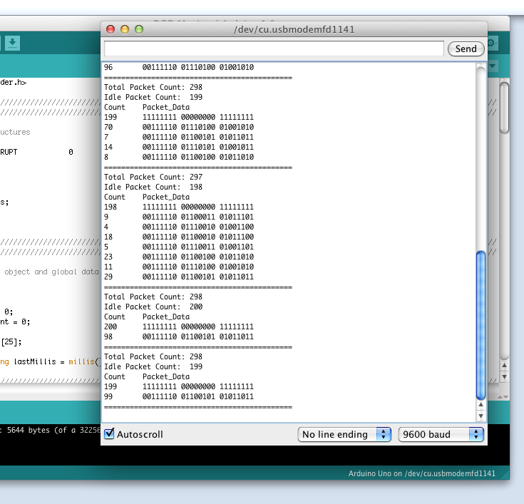
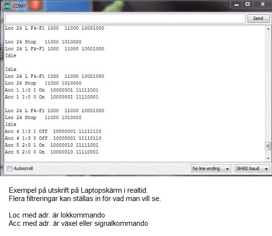
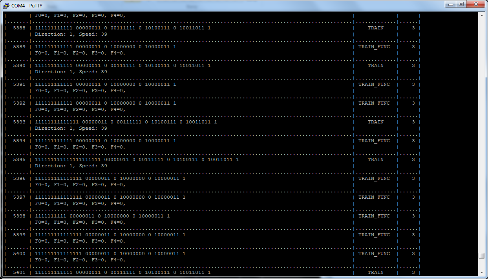
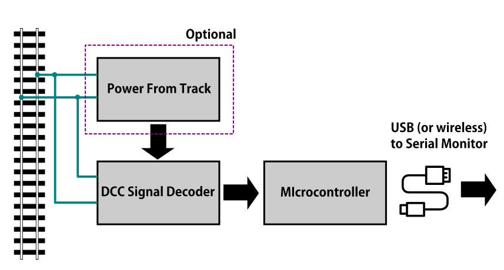
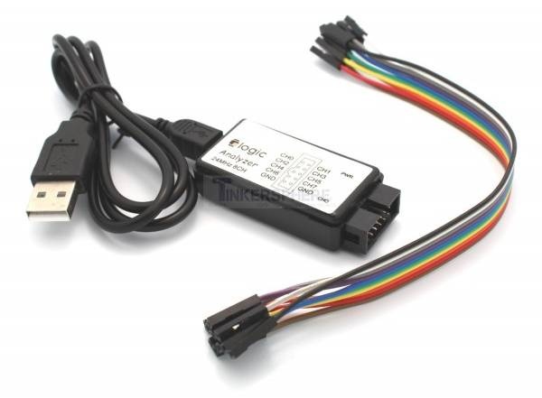

DCC Diagnostic Tools
=====================

There are many tools to help you operate your layout and find issues with your trains and accessories. We will list some of the most helpful tools here including whwere to buy them assembled or how to build them yourself.

* :ref:`Sniffer vs. Analyzer`
* :ref:`DCC Sniffer (packet analyzer)`
* :ref:`Logic Analyzer/Decoder`
 
Sniffer vs. Analyzer
----------------------

Sniffer
^^^^^^^^

A "sniffer" is a device (often made with an Arduino) that connects to the track to read the data packets and display them as the human readable DCC commands on a serial monitor.

|
|
|
|
|
|
|
|
|
|
|

Figure 1: Example outputs of a DCC Sniffer. Click on any of the images to view them full size.

Analyzer
^^^^^^^^^^

A logic analyzer is a device that connects to the Command Station signal pins and to a computer via a USB connection and uses software to capture the DCC waveform for a set period of time. The software can also decode the packets and display them along with the waveform. The display looks similar that what would appear on an oscilloscope. Since it captures the waveform, it can let you see details about the signal that may be causing issues like irregular pulses.

.. figure:: ../../_static/images/tools/dccpp_ex_acc_packet.jpg
   :align: center
   :scale: 100%
   :alt: DCC Signal Analyzer output
   :figclass: align-center

   Figure 2: Example Packet Sniffer output

DCC Sniffer (packet analyzer)
------------------------------

Buy it
^^^^^^^

Well it isn't quite a turnkey solution, but it's close. You need this shield and an Arduino Uno or Mega and then to download a free sketch file. This is really a well-designed board. It is not only a packet sniffer, but can also be used as a decoder with different software. It has a wealth of configuration options and can even deliver ACK pulses if you use it as a programmable mobile decoder.

https://www.iascaled.com/store/ARD-DCCSHIELD

Build It
^^^^^^^^^

Now things get fun. A DCC sniffer is a very simple device that contains only 2 or 3 simple sections. Tinkerers and Engineers will have no trouble cobbling one together or buying a board and soldering on a few parts.

   Figure 3: DCC Packet Sniffer Block Diagram

- **Power From Track** This part is optional. You can use the USB cable connected to your computer to power everything. If you want the sniffer to be self-contained, for example if you attach a display to see the data or use WiFi to connect to the sniffer from a phone or another computer, then you can power the sniffer from the track.

- **DCC Signal Decoder** This is the part that connects to your track and reads the DCC signal and converts it to a safe level for your microcontroller. This can be as simple as a diode, two resistors and an opto-isolator chip.
 
- **Microcontroller** This is usually an Arduino of some kind or a WiFi Capable board like an ESP8266.

Logic Analyzer/Decoder
----------------------------

   Figure 4: Logic Analyzer

No need to make this yourself, simply buy it. You will need the following items. They are available under many manufacturer names from many suppliers. Ebay and AliExpress are good sources:

* 8 Channel 24mHz USB Logic Anayzer ($8-10)
* Logic Analyzer Probe Setup ($7)
* Sigrok PulseView Sofware (FREE)
* DCC Decoder Plugin for PulseView (FREE)

