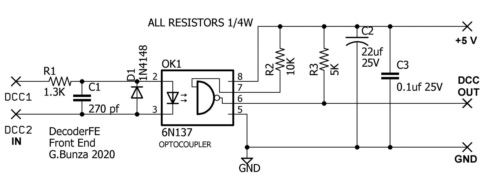
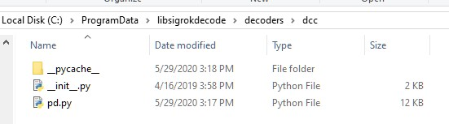

#####################
DCC Diagnostic Tools
#####################

***Work in Progress. More detail and pictures soon!***

**Engineers or Serious Tinkerer Level Only**

There are many tools to help you operate your layout and find issues with your trains and accessories. We will list some of the most helpful tools here including whwere to buy them assembled or how to build them yourself.

* :ref:`Sniffer vs. Analyzer`
* :ref:`DCC Sniffer (packet analyzer)`
* :ref:`Logic Analyzer/Decoder`
 
*********************
Sniffer vs. Analyzer
*********************

Sniffer
========

A "sniffer" is a device (often made with an Arduino) that connects to the track to read the data packets and display them as the human readable DCC commands on a serial monitor.

.. image:: ../../_static/images/tools/sniffer_out1.png
   :align: left
   :scale: 35%
   :alt: Example Sniffer Output 1

.. image:: ../../_static/images/tools/sniffer_out2.jpg
   :align: left
   :scale: 50%
   :alt: Example Sniffer Output 2

.. image:: ../../_static/images/tools/sniffer_out3.png
   :align: left
   :scale: 24%
   :alt: Example Sniffer Output 3

|
|
|
|
|
|
|
|
|
|
|

Figure 1: Example outputs of a DCC Sniffer. Click on any of the images to view them full size.

Analyzer
=========

A logic analyzer is a device that connects to the Command Station signal pins and to a computer via a USB connection and uses software to capture the DCC waveform for a set period of time. The software can also decode the packets and display them along with the waveform. The display looks similar that what would appear on an oscilloscope. Since it captures the waveform, it can let you see details about the signal that may be causing issues like irregular pulses.

.. figure:: ../../_static/images/tools/dccpp_ex_acc_packet.jpg
   :align: center
   :scale: 100%
   :alt: DCC Signal Analyzer output
   :figclass: align-center

   Figure 2: Example Packet Sniffer output

******************************
DCC Sniffer (packet analyzer)
******************************

Buy it
=======

Well it isn't quite a turnkey solution, but it's close. You need this shield and an Arduino Uno or Mega and then to download a free sketch file. This is really a well-designed board. It is not only a packet sniffer, but can also be used as a decoder with different software. It has a wealth of configuration options and can even deliver ACK pulses if you use it as a programmable mobile decoder.

.. figure:: ../../_static/images/tools/iowa_scale_eng_dcc_board.jpg
   :align: left
   :scale: 60%
   :alt: Iowa Scale Engineering DCC Sniffer/Decoder Board
   :figclass: align-left

   Figure 3: Iowa Scale Engineering DCC Sniffer/Decoder Board

|
|
|
|
|
|
|
|
|
|
|
|
|
|

https://www.iascaled.com/store/ARD-DCCSHIELD

Build It
=========

Now things get fun. A DCC sniffer is a very simple device that contains only 2 or 3 simple sections. Tinkerers and Engineers will have no trouble cobbling one together or buying a board and soldering on a few parts.

.. figure:: ../../_static/images/tools/sniffer_block_diag.png
   :align: center
   :scale: 70%
   :alt: Packet Sniffer Block Diagram
   :figclass: align-center

   Figure 4: DCC Packet Sniffer Block Diagram

- **Power From Track** This part is optional. You can use the USB cable connected to your computer to power everything. If you want the sniffer to be self-contained, for example if you attach a display to see the data or use WiFi to connect to the sniffer from a phone or another computer, then you can power the sniffer from the track.

- **DCC Signal Interface** This is the part that connects to your track and reads the DCC signal and converts it to a safe level for your microcontroller. This can be as simple as a diode, two resistors and an opto-isolator chip.
 
- **Microcontroller Decoder** This is usually an Arduino of some kind or a WiFi Capable board like an ESP8266 with a DCC Decoder sketch.

DCC Signal Interface
---------------------

Connect directly to the PWM output pin of the Arduino
^^^^^^^^^^^^^^^^^^^^^^^^^^^^^^^^^^^^^^^^^^^^^^^^^^^^^^

Easy, don't need an interface since we are already at 5V and seeing only positive going pulses, etc. Downside, wiring, getting under the benchwork.

Connect to the track
^^^^^^^^^^^^^^^^^^^^^

Let's us connect anywhere, easy wiring with clips. Downside, need a circuit.

In order to connect directly to the track, we need something that can isolate the track voltage, rectify the DCC signal so we just get the positive (or negative) going pulses, and level shift the track voltage to a safe 5 Volts to connect to an Arduino. It turns out a diode, a resitor and an optoisolator (aka optocoupler) are all you need for the job! However, to do it right, we do recommend a few other components.

**Simplest circuit**

image and description goes here

**Recommended circuit (courtesy of Geoff Bunza)**

   Figure XX: Geoff Bunza DCC Interface Schematic

The above is actually a simple circuit to build. To make it easy, Geoff has provided the CAD files that you can download, unzip, and then send the board file to one of many fabricators (like Oshpark) and have the make boards for you. DCC-EX may be selling these, so keep checking back. Here is what the boards look like:

.. figure:: ../../_static/images/tools/bunza_dcc_interface.jpg
   :align: center
   :scale: 40%
   :alt: Geoff Bunza DCC Interface Board
   :figclass: align-center

   Figure XX: Geoff Bunza DCC Interface Board

All you need to create your DCC Sniffer is to solder up this board and connect it to an Arduino. You can wire it to an Uno or Mega, but we like to use an Arduino Pro Mini because you can connect them both on another board or mount them in a case. The Pro Mini is powered from the USB connection to your computer running a serial monitor, and it, in turn, powers the DCC Interface Board.

Please check out Dr. Geoff's excellent blog on this board here:

https://model-railroad-hobbyist.com/node/41187

*** add info on wiring and sketches here ***

**Optional Power Supply Circuit**

If you always intend to have your computer or laptop connectd via the USB port to read the decoded DCC packets, then you can power everything from the 5V coming out of your USB port. But if you want something standalone, for example a sniffer with a display or that has wireless capability, then you are either going to have to power it from a 5V power supply (like a car charger) or take your power from the track.

We will show you here how to add a power supply, but see the section below on Geoff Bunza's 17 function decoder because you can use that little board to do just about anything you would ever want to do on your layout. Not only can it be programmed to be a DCC Sniffer, but it can be a fully functional decoder with up to 17 functions. It even has the option to have an H-Bridge chip (motor controller) right on the board to power motors!

*** power supply info goes here ***

**Ready made circuit boards**

- 17 function decoder

http://www.modelrailroadcontrolsystems.com/improved-geoff-bunzas-low-cost-17-channel-dcc-decoder-bare-board/

Have them fabricated

- DCC Interface board

fritzing diagram

***********************
Logic Analyzer/Decoder
***********************

.. figure:: ../../_static/images/tools/logic_analyzer.jpg
   :align: left
   :scale: 50%
   :alt: Logic Analyzer
   :figclass: align-left

   Figure 5: Logic Analyzer

|
|
|
|
|
|
|
|
|
|
|
|

No need to make this yourself, simply buy it. You will need the following items. They are available under many manufacturer names from many suppliers. Ebay and AliExpress are good sources:

* `8 Channel 24mHz USB Logic Anayzer ($8-20) <https://www.amazon.com/KeeYees-Analyzer-Device-Channel-Arduino/dp/B07K6HXDH1/ref=pd_lpo_193_t_0/130-6340217-7680634?_encoding=UTF8&pd_rd_i=B07K6HXDH1&pd_rd_r=c23ee4b0-ca9d-4b32-90ab-cdb4c48fe5be&pd_rd_w=gRofP&pd_rd_wg=8hefY&pf_rd_p=7b36d496-f366-4631-94d3-61b87b52511b&pf_rd_r=AD9WHN4F5RT3XHSJVX42&psc=1&refRID=AD9WHN4F5RT3XHSJVX42>`_
* `Logic Analyzer Probe Setup ($7-18) May come with your analyzer <https://www.amazon.com/10PCS-Grabber-Jumper-Analyzer-Colors/dp/B083PRVPCR/ref=sr_1_4?dchild=1&keywords=logic+probe+with+hooks&qid=1608658759&sr=8-4>`_
* `Sigrok PulseView Sofware (FREE) <https://sigrok.org/wiki/PulseView>`_
* `DCC Decoder Plugin for PulseView (FREE) <https://github.com/littleyoda/sigrok-DCC-Protocoll/archive/master.zip>`_

.. note:: Search for the best source. As usual, you can often find the hardware items from online stores or Amazon, but also find them cheaper on eBay or AliExpress  or BangGood direct from China.

Any set of probes that will connect to the pins that are exposed between the Arduino and the Motor Shield will do, however we really like these "T" or "swept wing" probes. They are easy to hold and to open, can accept jumper wires from either side, and are pointed and use tiny hooks so they fit in tight spaces.

.. figure:: ../../_static/images/tools/logic_probes.jpg
   :align: center
   :scale: 18%
   :alt: Logic probes
   :figclass: align-center

   Figure 6: Logic Probes

Install PulseView
====================

Since the install instructions are particular for your operating system, we will just refer you to the SigRok page where you can follow their detailed instructions:

`SigRok PulseView Installation Instructions <https://sigrok.org/doc/pulseview/0.4.1/manual.html#installation>`_

Install the Plugin
===================

Download the plugin from the link above and unzip it. Then install it in the user protocol decoder folder. This folder is NOT the main Sigrok folder where the factory installed decoders are. Here is that folder in Windows::

   C:\Program Files (x86)\sigrok\PulseView\share\libsigrokdecode\decoders

You want to drop the "dcc" folder you unzipped inside this folder::

   C:\ProgramData\libsigrokdecode\decoders

It will look something line this. There will be just 2 files. The "cache" file will get created the first time you run PulseView and select the DCC decoder:

   Figure 7: Installing the DCC protocol decoder

Download USB Drivers
=====================

These device need USB drivers from Saleae. Download and install the 1.x drivers from here:

`USB Analyzer Drivers Download <https://support.saleae.com/logic-software/legacy-software/latest-beta-release>`_

Connect the Analyzer
=====================

* Connect a jumper wire into a probe if you haven't already and then connect that into pin 0 or 1 on the logic analyzer
* Connect a jumper wire into a probe and connect the other end of the jumper into the GND pin on the analyzer
* Connect the GND probe to GND on the Arduino
* Connect pin 0 or pin 1 probe to the PWM output you want to measure on the Arduino/MotorShield connection. For the MAIN track, this would usually be pin 13 for a STANDARD_MOTOR_SHIELD. Pin 12 would be the PROG track.
* Connect the Analyzer to the USB port of your computer

Capture the samples in PulseView
=================================

* Open the PulseView software
* Click on the "select device" dropdown and select the Saleae Analyzer
* Click on the red probe icon to "configure channels". Check channel 1 (you could add two more. See below)
* Click on the new channel in the left column and give it a name and a height (Main and 26 or more)
* If you want to have a channel for PROG and one for a trigger if you want to use a trigger output in DCC-EX to begin the capture, you can add those too.
* Select the waveform icon to add a protocol decoder. Choose "DCC"
* Click on the new channel and change the name to DCC, then link it in the "data line" dropdown to MAIN (or whatever you named your first channel)
* For "01 or 10", select 10 to display both the bits and the decoded packets. 01 will show just the bits
* In the main PulseView window, select "100kHz" for the sampling rate
* Next select your data sample size, which will determin how many seconds of data you save. If you select 100kHz sample rate and 100k samples, that is only 1 second. 1 M (as in Mega) is 1 Million sample, so that is 10 seconds.
* Get ready to send whatever commands you want to monitor, then hit the "run" button in the upper left corner and run your tests for however many seconds you are capturing.
* Analyze the data. You may want to click the "zoom/+" button several times to be able to see the waveform pulses and to have the decoder.

You can save your captures and display them again at any time. More details coming soon.

