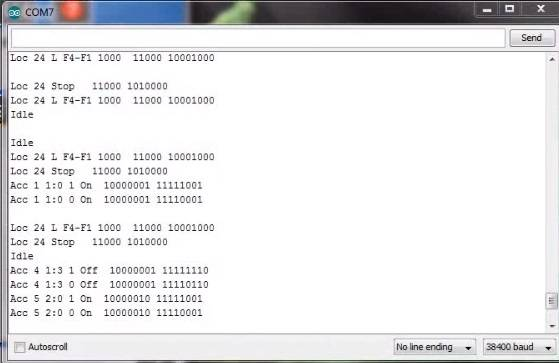

DCC Diagnostic Tools
=====================

There are many tools to help you operate your layout and find issues with your trains and accessories. We will list some of the most helpful tools here including whwere to buy them assembled or how to build them yourself.

 :ref:`Sniffer vs. Analyzer`

 :ref:`DCC Sniffer (packet analyzer)`

 :ref:`Signal Analyzer/Decoder`
 
Sniffer vs. Analyzer
----------------------

Sniffer
^^^^^^^^

A "sniffer" is a device (often made with an Arduino) that connects to the track to read the data packets and display them as the human readable DCC commands on a serial monitor.

.. image:: ../../_static/images/tools/sniffer_out1.png
   :align: left
   :scale: 35%
   :alt: Example Sniffer Output 1

.. # define a hard line break for HTML
.. |br| raw:: html

    

Example outputs of a DCC Sniffer. Click on any of the images to view them full size. |br|

Analyzer
^^^^^^^^^^

A signal analyzer is a device that connects to the Command Station signal pins and to a computer via a USB connection and uses software to capture the DCC waveform for a set period of time. The software can also decode the packets and display them along with the waveform. The display looks similar that what would appear on an oscilloscope. Since it captures the waveform, it can let you see details about the signal that may be causing issues like irregular pulses.

.. image:: ../../_static/images/tools/dccpp_ex_acc_packet.jpg
   :align: left
   :scale: 100%
   :alt: DCC Signal Analyzer output

DCC Sniffer (packet analyzer)
------------------------------

Signal Analyzer/Decoder
----------------------------

