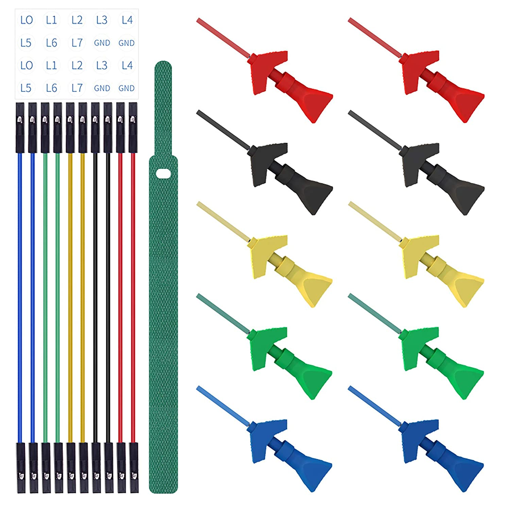

*********************
DCC Diagnostic Tools
*********************

***Work in Progress. More detail and pictures soon!***

**LEVEL: Engineers or Serious Tinkerers**

There are many tools to help you operate your layout and find issues with your trains and accessories. We will list some of the most helpful tools here including where to buy them assembled or how to build them yourself.

* :ref:`Sniffer vs. Analyzer`
* :ref:`DCC Sniffer (packet analyzer)`
* :ref:`Logic Analyzer/Decoder`
* :ref:`DCC Track Phase Detector`
 

Sniffer vs. Analyzer
=====================

Sniffer
----------

A "sniffer" is a device (often made with an Arduino) that connects to the track to read the data packets and display them as the human readable DCC commands on a serial monitor. It is also sometimes called a "PACKET analyzer" which shouldn't be confused with "LOGIC analyzer" in the next section. We recommend using our `DCCInspector-EX <../../download/dcc-inspector-ex.html>`_ sketch.

.. image:: ../../_static/images/tools/sniffer_out2.jpg
   :align: left
   :scale: 50%
   :alt: Example Sniffer Output 2

.. image:: ../../_static/images/tools/sniffer_out3.png
   :align: left
   :scale: 24%
   :alt: Example Sniffer Output 3

|
|
|
|
|
|
|
|
|
|
|

Figure 1: Example outputs of a DCC Sniffer. Click on any of the images to view them full size.

Analyzer
---------

A logic analyzer is a device that connects to the Command Station signal pins and to a computer via a USB connection and uses software to capture the DCC waveform for a set period of time. The software can also decode the packets and display them along with the waveform. The display looks similar that what would appear on an oscilloscope. Since it captures the waveform, it can let you see details about the signal that may be causing issues like irregular pulses.

.. figure:: ../../_static/images/tools/dccpp_ex_acc_packet.jpg
   :align: center
   :scale: 100%
   :alt: DCC Signal Analyzer output
   :figclass: align-center

   Figure 2: Example Logic Analyzer output

DCC Sniffer (PACKET analyzer)
===============================

Buy it
-------

Well it isn't quite a turnkey solution, but it's close. You need this shield and an Arduino Uno or Mega and then to download our free `DCCInspector-EX <../../download/dcc-inspector-ex.html>`_  file and upload it to your microcontroller with the Arduiono IDE. This is really a well-designed board. It is not only a packet sniffer, but can also be used as a decoder with different software. It has a wealth of configuration options and can even deliver ACK pulses if you use it as a programmable mobile decoder.

.. figure:: ../../_static/images/tools/iowa_scale_eng_dcc_board.jpg
   :align: left
   :scale: 60%
   :alt: Iowa Scale Engineering DCC Sniffer/Decoder Board
   :figclass: align-left

   Figure 3: Iowa Scale Engineering DCC Sniffer/Decoder Board

|
|
|
|
|
|
|
|
|
|
|
|
|
|
|
|

https://www.iascaled.com/store/ARD-DCCSHIELD

**It costs about $30 US.**

And since it is a shield, you just stick it on top of an Uno or Mega, upload `DCCInspector-EX <../../download/dcc-inspector-ex.html>`_, connect two jumpers to your track, connect the Arduino to your laptop USB and open your serial monitor and you are done.

*** Wiring and more info goes here ***

Build It
----------

Now things get fun! A DCC sniffer is a very simple device that contains only 2 or 3 simple sections. Tinkerers and Engineers will have no trouble cobbling one together or buying a board and soldering on a few parts. You don't even need anything other than an Arduino or an ESP8266 or ESP32 if you connect to the signal pin of the DCC++EX Command Station instead of to the track.

You will need to upload our `DCCInspector-EX <../../download/dcc-inspector-ex.html>`_ software to whatever microcontroller you choose.

.. figure:: ../../_static/images/tools/sniffer_block_diag.png
   :align: center
   :scale: 70%
   :alt: Packet Sniffer Block Diagram
   :figclass: align-center

   Figure 4: DCC Packet Sniffer Block Diagram

- **Power From Track** This part is optional. You can use the USB cable connected to your computer to power everything. If you want the sniffer to be self-contained, for example if you attach a display to see the data or use WiFi to connect to the sniffer from a phone or another computer, then you can power the sniffer from the track OR from batteries.

- **DCC Signal Interface** This is the part that connects to your track and reads the DCC signal and converts it to a safe level for your microcontroller. This can be as simple as a diode, two resistors and an opto-isolator chip.
 
- **Microcontroller Decoder** This is usually an Arduino of some kind or a WiFi Capable board like an ESP8266 with the DCCInspector-EX sketch.

DCC Signal Interface
^^^^^^^^^^^^^^^^^^^^^

Connect directly to the Signal output (enable pin) of the Arduino CS
~~~~~~~~~~~~~~~~~~~~~~~~~~~~~~~~~~~~~~~~~~~~~~~~~~~~~~~~~~~~~~~~~~~~~~

Easy! You don't need an interface since you will bypass the track and connect to the Arduino signal pins that are already at 5V (or 3.3V for some Teensy's) and seeing only positive going pulses. You jumper wires directly to your command station logic-level direction signal pin to the input pin on your sniffer and from GND to GND on both devices. (DO NOT WIRE TO THE MOTOR BOARD OUTPUTS!!) See the  `DCCInspector-EX <../../download/dcc-inspector-ex.html>`_ download page for which pins to use.

Connect to the track
~~~~~~~~~~~~~~~~~~~~~~

With this option, you can connect to anywhere on your track. Wiring can be temporary with alligator clips. In order to connect directly to the track, we need something that can isolate the track voltage from your sniffer, rectify the DCC signal so we just get the positive (or negative) going pulses, and level shift the track voltage to a safe 5 Volts to connect to an Arduino. It turns out a diode, a resitor and an optoisolator (aka optocoupler) are all you need for the job! However, to do it right, we do recommend a few other components.

.. NOTE:: While you could substitute other optoisolator chips and get mixed results, the 6N137 was specifically chosen for it's switching speed. This allows for more reliable decoding and can even check the accuracy of the DCC signal.

**Simplest circuit**

.. figure:: ../../_static/images/tools/dcc_interface_1.png
   :align: center
   :scale: 90%
   :alt: Minimum recommended circuit
   :figclass: align-center

   Figure 5: Minimum recommended circuit

The circuit above represents the minimal number of components to potentially interface the track signal to the microcontroller running your sniffer software. It has been tested and eliminates the issues with many of the circuits available on the web. There should also ideally be a .1uF capacitor across pins 8 and 5 as close to the pins as possible. If you have one, a 1.3k resistor for R1 gives a little better range for track voltages from 10V up to 18V and a LED can be substituted for D1 as a track voltage indicator, though our DCCInspector-EX sketch uses the pin 13 LED to provide the same function.

**Another tested circuit (courtesy of Geoff Bunza)**

.. figure:: ../../_static/images/tools/dcc_fe2_schematic.jpg
   :align: center
   :scale: 35%
   :alt: Geoff Bunza DCC Interface Schematic
   :figclass: align-center

   Figure 6: Geoff Bunza DCC Interface Schematic

The above is actually a simple circuit to build. To make it easy, Geoff has provided the CAD files that you can download, unzip, and then send the board file to one of many fabricators (like Oshpark) and have them make boards for you. DCC-EX may be selling these, so keep checking back. Here is what the boards look like:

.. figure:: ../../_static/images/tools/bunza_dcc_interface.jpg
   :align: center
   :scale: 60%
   :alt: Geoff Bunza DCC Interface Board
   :figclass: align-center

   Figure 7: Geoff Bunza DCC Interface Board

All you need to create your DCC Sniffer is to solder up this board and connect it to an Arduino. You can wire it to an Uno or Mega, but we like to use an Arduino Nano or ESP32 because you can connect the microcontroller and interface both on another carrier board or mount them in a case. The Nano and ESP32 are powered from the USB connection to your computer running a serial monitor, and it, in turn, can send that power to the DCC Interface Board.

Please check out Dr. Geoff's excellent blog on this board here:

https://model-railroad-hobbyist.com/node/41187

*** add info on wiring and sketches here ***

**Optional Power Supply Circuit**

If you always intend to have your computer or laptop connectd via the USB port to read the decoded DCC packets, then you can power everything from the 5V coming out of your USB port. But if you want something standalone, for example a sniffer with a display or that has wireless capability, then you are either going to have to power it from a 5V power supply (like a wall charger) or take your power from the track.

Showing you how to build a power supply here wouldn't make much sense when you see Geoff Bunza's 17 function decoder board. It already has everything on it you need, power, optoisolator and space for an Arduino Pro Mini or Nano! You can use that little board to do just about anything you would ever want to do on your layout. Not only can it be programmed to be a DCC Sniffer, but it can be a fully functional decoder with up to 17 functions. It even has the option to have an H-Bridge chip (motor controller) right on the board to power motors!

**Geoff Bunza's 17 Function Decoder AND Sniffer**

If you just need the power supply for your own board, use the schematic to get what you need. Here at DCC-EX labs, we use lots of these decoders and solder just the components we need. If we need a DCC interface, we just solder those components. If we need to connect it to the track, we add the rectifier and voltage regulator components. 

**Ready made circuit boards**

- 17 function decoder

http://www.modelrailroadcontrolsystems.com/improved-geoff-bunzas-low-cost-17-channel-dcc-decoder-bare-board/

Have them fabricated

- DCC Interface board

fritzing diagram

***TODO: Add this board***

https://www.tindie.com/products/tanner87661/dcc-interface-breakout-board-with-grove-port/

**Build it in a case with a display!**

And if you want to get into the development of DCCInspector-EX and why we recommend the circuits we do, and see how to add a display and put it in a neat little case, please visit DCC-EX team member Neil McKechnie's blog. This version has plans for a 3D printed case and uses an ESP32 development board with an OLED display attached.

.. figure:: ../../_static/images/tools/neil_sniffer.png
   :align: center
   :scale: 60%
   :alt: Neil's DCC-EX Sniffer
   :figclass: align-center

   Figure 8: Neil's DCC-EX Sniffer in a 3D Printed Case

HERE:
https://wakwak2popo.wordpress.com/2020/12/11/dcc-sniffer/

and HERE:
https://wakwak2popo.wordpress.com/2021/01/28/stand-alone-dcc-diagnostics/

Logic Analyzer/Decoder
=========================

.. figure:: ../../_static/images/tools/logic_analyzer.jpg
   :align: left
   :scale: 50%
   :alt: Logic Analyzer
   :figclass: align-left

   Figure 5: Logic Analyzer

|
|
|
|
|
|
|
|
|
|
|
|

No need to make this yourself, simply buy it. You will need the following items. They are available under many manufacturer names from many suppliers. Ebay and AliExpress are good sources:

* `8 Channel 24mHz USB Logic Anayzer ($8-20) <https://www.amazon.com/KeeYees-Analyzer-Device-Channel-Arduino/dp/B07K6HXDH1/ref=pd_lpo_193_t_0/130-6340217-7680634?_encoding=UTF8&pd_rd_i=B07K6HXDH1&pd_rd_r=c23ee4b0-ca9d-4b32-90ab-cdb4c48fe5be&pd_rd_w=gRofP&pd_rd_wg=8hefY&pf_rd_p=7b36d496-f366-4631-94d3-61b87b52511b&pf_rd_r=AD9WHN4F5RT3XHSJVX42&psc=1&refRID=AD9WHN4F5RT3XHSJVX42>`_
* `Logic Analyzer Probe Setup ($7-18) May come with your analyzer <https://www.amazon.com/10PCS-Grabber-Jumper-Analyzer-Colors/dp/B083PRVPCR/ref=sr_1_4?dchild=1&keywords=logic+probe+with+hooks&qid=1608658759&sr=8-4>`_
* `Sigrok PulseView Sofware (FREE) <https://sigrok.org/wiki/PulseView>`_
* `DCC Decoder Plugin for PulseView (FREE) <https://github.com/littleyoda/sigrok-DCC-Protocoll/archive/master.zip>`_

.. note:: Search for the best source. As usual, you can often find the hardware items from online stores or Amazon, but also find them cheaper on eBay or AliExpress  or BangGood direct from China.

Any set of probes that will connect to the pins that are exposed between the Arduino and the Motor Shield will do, however we really like these "T" or "swept wing" probes. They are easy to hold and to open, can accept jumper wires from either side, and are pointed and use tiny hooks so they fit in tight spaces.

   Figure 6: Logic Probes

Install PulseView
--------------------

Since the install instructions are particular for your operating system, we will just refer you to the SigRok page where you can follow their detailed instructions:

`SigRok PulseView Installation Instructions <https://sigrok.org/doc/pulseview/0.4.1/manual.html#installation>`_

Install the Plugin
-------------------

Download the plugin from the link above and unzip it. Then install it in the user protocol decoder folder. This folder is NOT the main Sigrok folder where the factory installed decoders are. Here is that folder in Windows::

   C:\Program Files (x86)\sigrok\PulseView\share\libsigrokdecode\decoders

You want to drop the "dcc" folder you unzipped inside this folder::

   C:\ProgramData\libsigrokdecode\decoders

It will look something line this. There will be just 2 files. The "cache" file will get created the first time you run PulseView and select the DCC decoder:

.. figure:: ../../_static/images/tools/pv_install_folder.jpg
   :align: center
   :scale: 100%
   :alt: Installing the DCC protocol decoder
   :figclass: align-center

   Figure 7: Installing the DCC protocol decoder

Download USB Drivers
---------------------

These device need USB drivers from Saleae. Download and install the 1.x drivers from here:

`USB Analyzer Drivers Download <https://support.saleae.com/logic-software/legacy-software/older-software-releases>`_

Connect the Analyzer
---------------------

* Connect a jumper wire into a probe if you haven't already and then connect that into pin 0 or 1 on the logic analyzer
* Connect a jumper wire into a probe and connect the other end of the jumper into the GND pin on the analyzer
* Connect the GND probe to GND on the Arduino
* Connect pin 0 or pin 1 probe to the DCC signal output (enable pin) you want to measure on the Arduino/MotorShield connection. For the MAIN track, this would usually be pin 13 for a STANDARD_MOTOR_SHIELD. Pin 12 would be the PROG track.
* Connect the Analyzer to the USB port of your computer

Capture the samples in PulseView
---------------------------------

* Open the PulseView software
* Click on the "select device" dropdown and select the Saleae Analyzer
* Click on the red probe icon to "configure channels". Check channel 1 (you could add two more. See below)
* Click on the new channel in the left column and give it a name and a height (Main and 26 or more)
* If you want to have a channel for PROG and one for a trigger if you want to use a trigger output in DCC-EX to begin the capture, you can add those too.
* Select the waveform icon to add a protocol decoder. Choose "DCC"
* Click on the new channel and change the name to DCC, then link it in the "data line" dropdown to MAIN (or whatever you named your first channel)
* For "01 or 10", select 10 to display both the bits and the decoded packets. 01 will show just the bits
* In the main PulseView window, select "100kHz" for the sampling rate
* Next select your data sample size, which will determin how many seconds of data you save. If you select 100kHz sample rate and 100k samples, that is only 1 second. 1 M (as in Mega) is 1 Million sample, so that is 10 seconds.
* Get ready to send whatever commands you want to monitor, then hit the "run" button in the upper left corner and run your tests for however many seconds you are capturing.
* Analyze the data. You may want to click the "zoom/+" button several times to be able to see the waveform pulses and to have the decoder.

You can save your captures and display them again at any time. More details coming soon.

.. TODO:: Finish this above

DCC Track Phase Detector
==========================

If you aren't using boosters or don't have isolated track sections/blocks, then you usually won't have to worry about the phase of your DCC Signal so you can skip this section. But if you do use boosters, this is am important tool to add to your arsenal. And the best part, is anyone can make one!

Why is Phase Important?
------------------------

The short answer is that if one block is out of phase with another and your loco bridges the gap, you will have a dangerous short circuit! Let's look at this situation in a bit more detail for the Engineers.

The DCC Signal energizes one track with a short voltage pulse (58us) for a "1" and a long one (116us)
for a "0". It then immediately switches and does the same thing on the other track. The "pulse train" looks a bit like this and is the way most people first "see" the DCC Waveform:

.. figure:: ../../_static/images/dcc/dcc_signal.png
   :align: center
   :scale: 35%
   :alt: DCC Waveform
   :figclass: align-center

   Figure 7: DCC Waveform

But those familiar with how DC and AC voltage works might look at that and see a square wave where there is positive and negative voltage. That isn't what is happening, there is never any negative voltage! Only the current changes direction inside something connected to the track, like the decoder in your loco. There is no "ground", only the voltage present on one rail with respect to the other.

In order to fully understand how this works, we have to stop thinking in terms of analog electronics and think in terms of the digital world. The DCC pulses provide both the voltage to operate locomotives and accessories connected to the tracks, and the data decoders need to operate them. Each rail carries the same information, just 180 degrees out of phase from the other. When one rail has a pulse of full voltage, the other is zero. We believe we are the first to present DCC in this fashion. Look at figure 8 and see that the pulses energize one rail with respect to the other back and forth.

.. figure:: ../../_static/images/dcc/dcc_pulse_train1.png
   :align: center
   :scale: 25%
   :alt: DCC Pulse Train
   :figclass: align-center

   Figure 8: DCC Pulse Train

Now let's see things from a different perspective, both literally and figuratively by tilting the track away from you and imagining the pulse train operating like your model train and riding down the track.

.. figure:: ../../_static/images/dcc/dcc_pulse_train2.png
   :align: center
   :scale: 25%
   :alt: DCC Pulse Train in Perspective
   :figclass: align-center

   Figure 9: DCC Pulse Train in Perspective

If it helps, you can think in the analog/DC world again for the purposes of connecting one piece of track in one block to a piece of track in another. Each rail is like a wire connected to our power supply, we have just cut it to length and are connecting to another piece connected to a different power supply.

At any given instant, one rail or the other is at our full 12-24 Volts and the other is at zero. If our loco is rolling over the gap from one block or power district to another, we need to make sure that the signal, and therefore votage, is at the same level on both sides. We call this being "in phase". So if there is +15V on Rail A of the first block, we need that same +15V on Rail A of the next block. If not, and rail A on block 1 is at 15V and Rail A on block 2 is at 0V, and the metal wheels of our loco temporarily connect those two rails as they roll over them, we have a short circuit. Thus, if the rails of two blocks are out of phase with each other, then they are always at at a the opposite potential (except for a tiny transition period) and will represent a short circuit when crossing from one to the other.

.. figure:: ../../_static/images/dcc/dcc_phasing.png
   :align: center
   :scale: 25%
   :alt: DCC Phasing Diagram
   :figclass: align-center

   Figure 9: DCC Phasing Diagram

So how can we check our phase? We can use any of the simple circuits below or a more complicated one listed at the end.

Using a Digital Multimeter (DMM)
--------------------------------

This is pretty easy. Set your DMM to AC Volts (important, NOT DC) in a range above your track voltage. For example, if your track voltage is 15 Volts, your meter may need to be set to the 20 volt range. Then follow these steps noting that unless you have a very expensive "TRUE RMS" Meter. we will just get an indication that there is a DCC signal is on the track, but the voltage will be off by a few volts.

| 1. Put one probe on Rail A of the known block and the other prob on Rail B. For our expected voltage of a 15 Volt supply, depending on your meter, it should read anywhere from 12-28 Volts AC. If not, you have a power issue or a Motor Driver issue.

| 2. Move your meter to the other block. Connect one probe to Rail A and the other to Rail B. You should measure the same voltage as before. If not, you have a power issue in your booster. It is either putting out DC or no voltage at all.

| 3. If tests 1 and 2 are good, move one lead of the meter back to Rail A of the known good block and connect the other lead to Rail A of the block you are testing. This will bridge the gap between the 2 sections where the rail is isolated. The meter should read close to 0 voltage. If not, you may have an issue with power from the booster or your wires on reversed from the booster to the test block. Reverse the wires from your booster to the track, repeat step 3. If you read close to 0 volts AC, this test passes.

| 4. Leaving your meter attached to Rail A of the known block, move the other lead to Rail B of the track you are testing in the other block. If you get the same voltage reading from the first step in this configuration, the test is good.

| 5. Move the lead from Rail A of the known block to its Rail B. Attach the other lead to Rail B of the test block, there should be no voltage. Leaving the probe on Rail B of the known block, move the other probe to Rail A of the test block. You should have voltage again.

   Truth Table

| Known Block Rail A to Known Block Rail B voltage
| Test Block Rail A to Test Block Rail B voltage
| Known Block Rail A Test Block Rail A no voltage
| Known Block Rail B Test Block Rail B no voltage
| Known Block Rail A Test Block Rail B voltage
| Known Block Rail B Test Block Rail A voltage

**Pros** - You probably already have one

**Cons** - Unwieldy, you can't see it easily from across a large layout

Circuit One
------------

Comprised of just 2 diodes and two resistors, this circuit is designed to connect to BOTH rails of a known good block and connect a probe to ONE rail at a time on the block under test. If your green LED lights, you are in phase with the rail on the other side connected to the green wire. If your red LED lights, you are in phase with the other side rail connected to the red wire.

Note that during construction, the red wire is actually attached to the green LED and the green wire is attached to the red LED. You need to connect it this way to get the correctly colored LED to light.

**Circuit Operation** - The circuit works by only having a diode forward biased when the rail the probe end is attached to is out of phase with the corresponding rail on the known working block. With the red lead on Rail A of the known block and green lead on Rail B, when the probe is connected to Rail A on the opposite block, the red LED should light to indicate it is connected to the correct rail. The diode is reversed biased when the known Rail A is HIGH and the rail under test is LOW, so it blocks any current. But on the next half cycle when the known Rail A goes LOW and the test rail goes HIGH, the diode is forward biased and lights. In this way, the LEDs are only lit half the time, but do to our persistence of vision, and the approximately 8kHz frequency, we will just see a lit LED.

The other LED won't light because it is always in phase with the known track Rail B. When they are both HIGH at the same time (full track voltage) or both LOW, there is no potential difference across the LED.

See the thread on the MRH blog here: https://model-railroad-hobbyist.com/node/17215?page=2

.. figure:: ../../_static/images/dcc/dcc_phase_checker1.png
   :align: center
   :scale: 100%
   :alt: 2 Diode Phase Checker
   :figclass: align-center

   Figure 10: 2 Diode Phase Checker

**Pros** - Just 4 components, small, simple

**Cons** - 

Circuit two
------------

.. figure:: ../../_static/images/dcc/dcc_phase_checker2.png
   :align: center
   :scale: 50%
   :alt: Diode Phase Checker
   :figclass: align-center

   Figure 10: Diode Phase Checker

