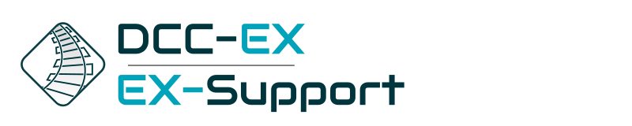

.. include:: /include/include.rst
.. include:: /include/include-l1.rst
..

   
***********
Contact us
***********

|conductor| |tinkerer| |engineer|

The best way to reach us is on our `Discord server <https://discord.gg/PuPnNMp8Qf>`_. Usually there is always a team member online to help with your issue in English, German and French, and if not you'll get a response within a few hours.

.. raw:: html

    
<iframe src="https://ptb.discordapp.com/widget?id=713189617066836079&theme=dark" width="350" height="500" allowtransparency="true" frameborder="0" sandbox="allow-popups allow-popups-to-escape-sandbox allow-same-origin allow-scripts"></iframe>
 

You can also find us on Facebook in the "DCC++ and Arduino Model Railroading" private group here:

https://www.facebook.com/groups/1406785379394934/

and on TrainBoard Here:

https://www.trainboard.com/highball/index.php?forums/dcc.177/
