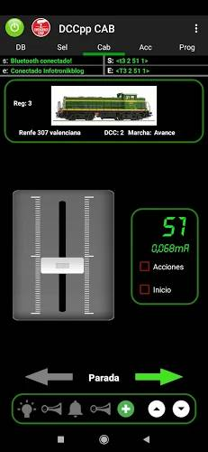

**********
DCCpp CAB
**********

.. image:: ../_static/images/throttles/icon_android.png
   :alt: Android Logo
   :scale: 30%
   :align: left

This is an Android App (with plans for iOS) from Spain. One of the major benefits of DCCpp CAB is that it speaks the <DCC++> Application Programming language (API) natively (see our `Command Reference <../reference/software/command-reference.html>`_). This means it is fast and can take advantage of some features that exist in the DCC++ EX Command Station not implemented in other APIs. Another benefit is that this throttle can use Bluetooth instead of Wifi if you choose! There are several advantages to usingn Bluetooth, the main one being that Uno and Nano users can use a wireless throttle!

You can find it in the Play Store: `DCCpp CAB <https://play.google.com/store/apps/details?id=com.infotronikblog.dcc_cab>`_

.. _dccpp-features:

Features
=========

* Speaks the <DCC++> Command Language natively
* Connect via WiFi or Bluetooth
* Read and Write CVs

Screenshots
============

.. image:: ../_static/images/throttles/dccpp3.jpg
   :alt: Dccpp CAB Screenshot 3
   :scale: 70%

..
   The next line is trying to avoid a duplicate label name since many files may have a requirements section

.. _dccpp--requirements:

Requirements
=============

* A DCC++ EX Commmand Station (Mega based for WiFi or Mega or Uno/Nano based for Bluetooth)
* An Android Cell Phone or Tablet
* A Wifi Shield (or other ESP8622 solution) if you want to connect using WiFi `Wifi Setup <../get-started/wifi-setup.html>`_
* An HC-06 Board if you want to connect using Bluetooth

Operation
==========

.. Note:: A Mega is required for using the WiFi connection, but an Uno or Nano will work with the Bluetooth connection.

Using Wifi
-----------

To use Wifi, make sure you have a WiFi enabled Command Station as described in the `Wifi Setup <../get-started/wifi-setup.html>`_ section.

We have not tested the WiFi implementation yet

***insert tutorial here***

Using Bluetooth
----------------

The Bluetooth connection requires an Android device with Bluetooth capability and a Bluetooth board attached to the Command Station. The setup is similar to how we use a WiFi Sheild or an ESP-01s board. It is just a different method to create a wireless serial connection to the CS from another device.

You will need one of these inexpensive HC-06 boards.

***insert tutorial here***

