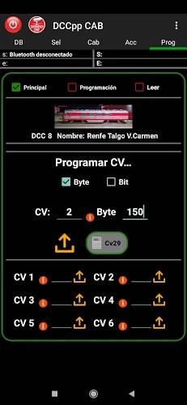

**********
DCCpp CAB
**********

This is an Android App (with plans for iOS) from Spain. One of the major benefits of DCCpp CAB is that it speaks the <DCC++> Application Programming language (API) natively (see our `Command Reference <../../references/software/command-reference.html>`_. This means it is fast and can take advantage of some features that exist in the DCC++ EX Command Station. Another benefit is that this throttle can use Bluetooth instead of Wifi if you choose! There are several advantages to usingn Bluetooth, the main one being that Uno and Nano users can use a wireless throttle!

You can find it in the Play Store: `DCCpp CAB <https://play.google.com/store/apps/details?id=com.infotronikblog.dcc_cab`_

Features
=========

* Speaks the <DCC++> Command Language natively
* Connect via WiFi
* Connect via Bluetooth
* Read and Write CVs

Screenshots
============

.. image:: ../../_static/images/throttles/dccpp2.jpg
   :alt: Dccpp CAB Screenshot 2
   :scale: 70%

Requirements
=============

* A DCC++ EX Commmand Station (Mega OR Uno/Nano based)
* An Android Cell Phone or Tablet
* A Wifi Shield (or other ESP8622 solution) if you want to connect using WiFi `Wifi Setup <../get-started/wifi-setup.html>`_
* An HC-06 Board if you want to connect using Bluetooth

Operation
==========

.. Note:: A Mega is required for using the WiFi connection, but an Uno or Nano will work with the Bluetooth connection.

Using Wifi
-----------

Using Bluetooth
----------------

