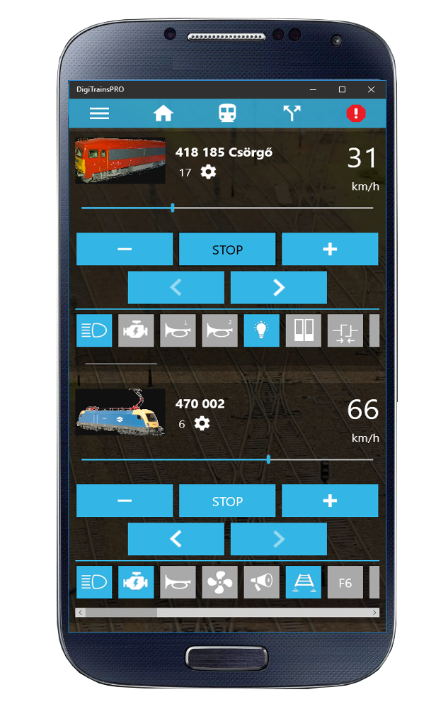
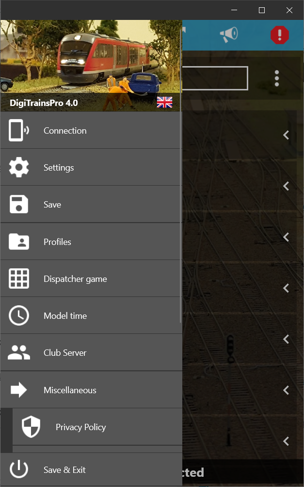

*******************************
DigiTrainsPro
*******************************

.. image:: ../_static/images/throttles/icon_android.png
   :alt: Android Logo
   :scale: 30%

Currently, DigitTrainsPro works with DCC-EX through JMRI. You use JMRI's Web Server for the connection. However, we are working with the author and will soon have an option to connect directly to the DCC-EX Command Station using <DCC++> Commands (estimated April 2021).

`WINDOWS - Get if from the Windows Store <https://www.microsoft.com/en-us/p/digitrainspro/9p3kl60r0c5q?rtc=1&activetab=pivot:overviewtab>`_

`ANDROID - Get it from the Google Play Store <https://play.google.com/store/apps/details?id=digitrainspro.digitrainspro.hu&hl=en_US&gl=US>`_

`iOS - Get it from the App Store <https://apps.apple.com/us/app/digitrainspro/id1481937310>`_

.. _digitrains-features:

Features
==========

* Runs on Android, IOS, Widnows 10 Desktop, Tablet and Mobile.
* Connects to JMRI using their Web Server or *soon* will be able to connect directly to DCC++ EX
* Attractive User Interface
* Plays Station Loudspeaker Sounds
* Includes a Dispatcher game
* Club Server feature (connect multiple CABs through a computer connected to the CS)
* Function control
* CV Programming

.. _digitrains-screenshots:

Screenshots
============

.. _digitrains-requireents:

Requirements
=============

* An Android, IOS, Widnows 10 (Desktop, Tablet and Mobile) device
* Command Station (WiFi if you want to connect directly)
* JMRI (If you want to connect through the JMRI WEB Server)

.. _digitrains-operation:

Operation
==========

***TODO: Write the operatio section***
