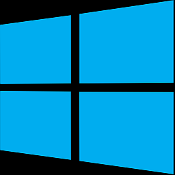

*******************************
digitrainspro
*******************************

.. image:: ../_static/images/throttles/icon_ios.png
   :alt: Android Logo
   :scale: 30%
   :align: left

Currently, DigitTrainsPro works with DCC-EX through JMRI. You use JMRI's Web Server for the connection. However, we are working with the author and will soon have an option to connect directly to the DCC-EX Command Station using <DCC++> Commands (estimated April 2021).

Features
==========

* Runs on Android, IOS, Widnows 10 Desktop, Tablet and Mobile.
* Connects to JMRI using their Web Server or *soon* will be able to connect directly to DCC++ EX
* Attractive User Interface
* Plays Station Loudspeaker Sounds
* Includes a Dispatcher game
* Club Server feature (connect multiple CABs through a computer connected to the CS)
* Function control
* CV Programming
