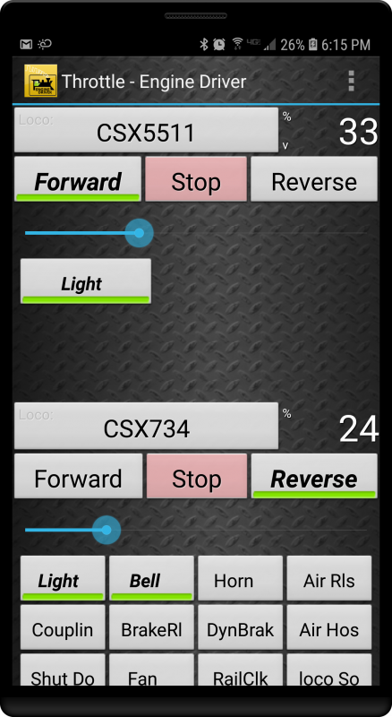
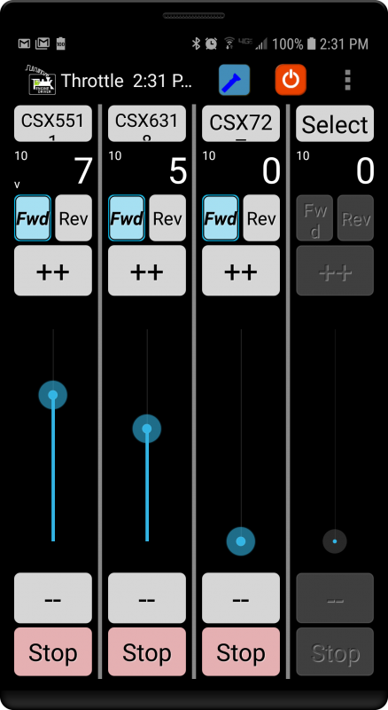
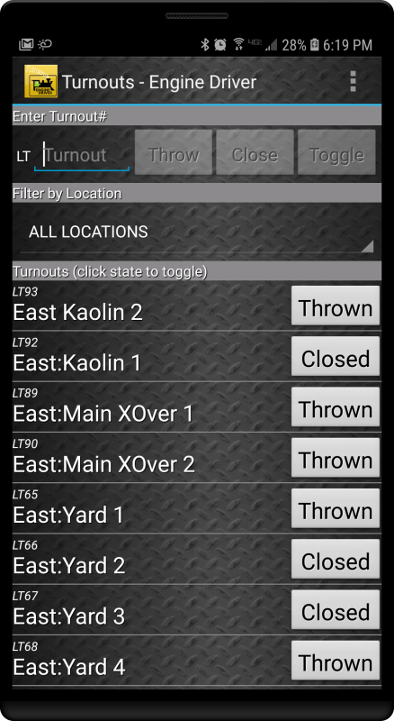
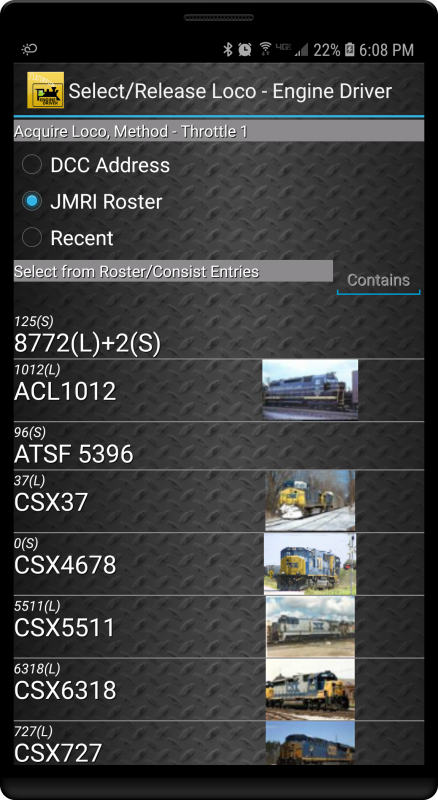

******************
Engine Driver
******************

.. image:: ../_static/images/throttles/engine_driver_logo.png
   :alt: Android Logo
   :scale: 60%
   :align: left

**Engine Driver** is an Android App that uses the WiThrottle Protocol to either connect directly to the DCC++ EX Command Station or connect to the JMRI WiThrottle Server via WiFi. If you connect Engine Driver to JMRI, you connect to the computer running JMRI via WiFi and connect the JMRI computer to the Command Station using a USB cable. If you connect Engine Driver directly to DCC++ EX, you will to add a WiFi option to your DCC++ EX Command Station as explained here: `WiFi Setup <../get-started/wifi-setup>`_

.. _ed-platforms:

Platforms
===========

.. image:: ../_static/images/throttles/icon_android.png
   :alt: Android Logo
   :scale: 30%
   :align: left

Please visit the Engine Driver Website: https://enginedriver.mstevetodd.com/

`Get Cab Engineer from the Google Play Store <https://play.google.com/store/apps/details?id=jmri.enginedriver>`_

   .. raw:: html
      
      <iframe width="336" height="189" src="https://www.youtube.com/embed/N6TWR7fIl0A" frameborder="0" allow="accelerometer; autoplay; clipboard-write; encrypted-media; gyroscope; picture-in-picture" allowfullscreen></iframe>

.. _ed-features:

Features
==========

* Speed and directipn control
* Up to 29 DCC functions
* One to six locomotives or consists 
* Create and edit consists (software-defined)
* You can also control layout power, turnouts, routes, and access JMRI web panels and windows.

.. _ed-screenshots:

Screenshots
============

|
|
|
|
|
|
|
|
|
|

.. _ed-operation:

Operation
===========

***TODO: More details to come***