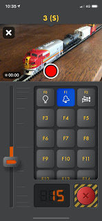

*******************
Locontrol
*******************

.. image:: ../_static/images/throttles/icon_ios.png
   :alt: Dccpp CAB Screenshot 2
   :scale: 20%

This iOS App is simply beautiful, but you would expect this from a team of talented people consisting of an artist/graphic designer, an iOS Developer, and a User Interface (UI) Designer.

Today, you can use Locontrol on an iOS device connected to JMRI throuth its Web Interface. JMRI then connects to DCC++EX with a USB cable or wireless USB bridge.

We are currently working with the Locontrol folks to work directly with DCC++ EX without the need for external software. Come back soon for more information. In the meantime, please visit their website https://www.locontrol.com

j
.. _locontrol-features:

Features
=========

* Connect to JMRI with the WiFi Web Server in DecoderPro
* Locomotive Roster list with Photos
* Uses the phone camera
* Make videos and take pictures of your trains while operating

.. _locontrol-requirements:

Requirements
=============

* An iOS Device