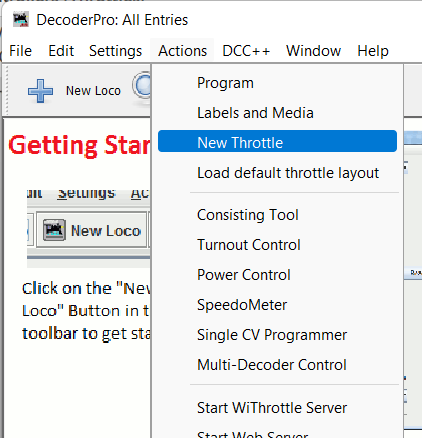
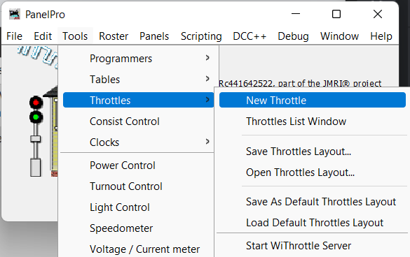
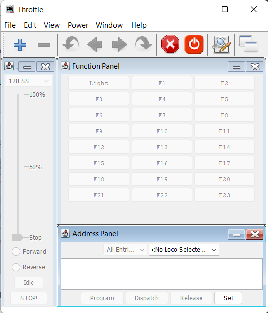
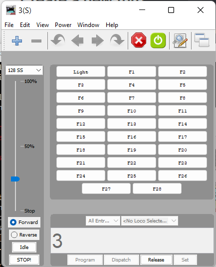

.. include:: /include/include.rst
.. include:: /include/include-l2.rst
.. include:: /include/include-throttles.rst
************************************
JMRI (Java Model Railroad Interface)
************************************

|conductor| |tinkerer| |engineer|

.. sidebar:: 

  .. contents:: On this page
    :depth: 2
    :local:

|JMRI| is quite a powerful suite of software applications, and can be as simple or as complex as you wish to make it.

On this page, we will focus on utilising |JMRi| as a throttle only.

Connecting to your EX-CommandStation
====================================

The first thing you need to do is connect your |EX-CS| to |JMRi|.

If you haven't done so already, follow the instructions outlined in the `JMRi help page <https://www.jmri.org/help/en/html/hardware/dccpp/index.shtml>`_ to get connected.

Create a new throttle
=====================

Once you have your connection to |JMRI| configured, you can launch a new throttle using either the DecoderPro or PanelPro applications.

DecoderPro
----------

In DecoderPro, select "New Throttle" from the "Actions" menu.

PanelPro
--------

In PanelPro, from the "Tools" menu, select "Throttles" -> "New Throttle".

Select and control a loco
=========================

At this point, you should have your |JMRi| throttle window open ready for action:

To select and control a loco from here, you need to:

* Ensure track power is turned on using the :guilabel:`Power` button at the top of the window, or selecting "Power On" from the "Power" menu
* Type the address of your loco in the "Address Panel" then press the :guilabel:`Set` button
* You can now use the throttle slider, forward, reverse, :guilabel:`Idle`, and :guilabel:`STOP!` buttons to control your loco
* Use the buttons in the "Function Panel" to control your various loco functions also

Here we show a loco at address 3 selected, with track power turned on, and running in a forward direction at 25% speed:

EX-CommandStation & JMRI DecoderPro Programming Station
=======================================================

If you would like to utilise the combined power of EX-CommandStation & JMRI DecoderPro Programming Station, please download and review the :ref:`reference/downloads/documents:comprehensive dcc-ex & jmri decoderpro getting started guide pdf`.

Further reading
===============

If you're keen to learn more about |JMRi|, then we highly recommend going to the `JMRI website <https://www.jmri.org/>`_ and reading further on the features and possibilities available.
