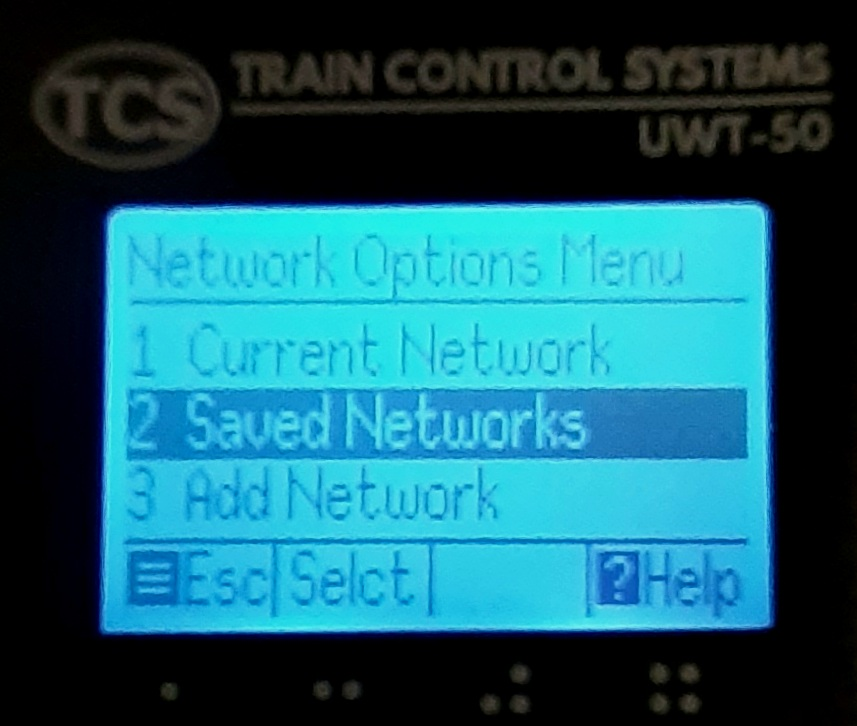

**********************
TCS UWT-50 (Physical)
**********************

Train Control Systems (TCS) makes a nice line of physical hardware based controllers. Since they support the WiThrottle protocol, they work with DCC++EX. Currently, the UWT-50 is the only one we have tested.

.. image:: ../_static/images/throttles/uwt50_a.png
   :alt: UTW-50 Throttle
   :scale: 50%
   :align: left

.. image:: ../_static/images/throttles/uwt50_1.jpg
   :alt: WiTcontroller connection diagram
   :scale: 50%
   :align: left

.. image:: ../_static/images/throttles/uwt50_2.jpg
   :alt: WiTcontroller connection diagram
   :scale: 50%
   :align: left

.. image:: ../_static/images/throttles/uwt50_4.jpg
   :alt: WiTcontroller connection diagram
   :scale: 50%
   :align: left

   https://tcsdcc.com/mini-throttle