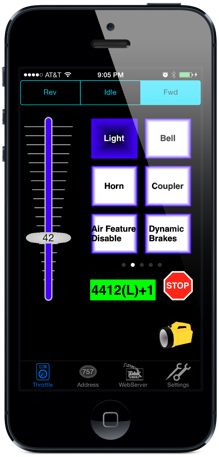

****************
WiThrottle
****************

.. image:: ../_static/images/throttles/icon_ios.png
   :alt: iOS Logo
   :scale: 30%
   :align: left

This is an iOS App (with plans for iOS) from the USA. WiThrottle is probably the most popular iOS throttle since early on JMRI built a WiThrottle Server into its program. You can connect WiThrottle to JMRI and connect JMRI to DCC++EX, or you if you are not going to use JMRI, you can connect directly to the CS if you install a WiFi board.

Please visit their website: https://www.withrottle.com

You can find it in the App Store: `WiThrottle <http://itunes.apple.com/app/id344172578>`_

For more information more information about these protocols, see :doc:`WiThrottle Server, Web Server, DCC++ API Explained <protocols>`

.. _withrottle-features:

Features
=========

* Supports WiThrottle Protocol
* Connect to JMRI
* Connect to DCC++ EX if not using JMRI
* Connect via WiFi
* Read and Write CVs

.. _withrottle-screenshots:

Screenshots
============

|
|
|
|
|
|
|
|
|
|
|
|
|
|
|
|
|
|

..
   The next line is trying to avoid a duplicate label name since many files may have a requirements section

.. _withrottle-requirements:

Requirements
=============

* A DCC++ EX Commmand Station (Mega based for WiFi)
* An iOS Cell Phone or Tablet
* A Wifi Shield (or other ESP8622 solution) if you want to connect using WiFi :doc:`Wifi Setup <../get-started/wifi-setup>`

.. _withrottle-operation:

Operation
==========

.. Note:: A Mega is required for using the WiFi connection

.. _withrottle-wifi:

Using Wifi
------------

To use Wifi, make sure you have a WiFi enabled Command Station as described in the :doc:`Wifi Setup <../get-started/wifi-setup>` section.

We have not tested the WiFi implementation yet

***TODO:Tutorial coming soon***
