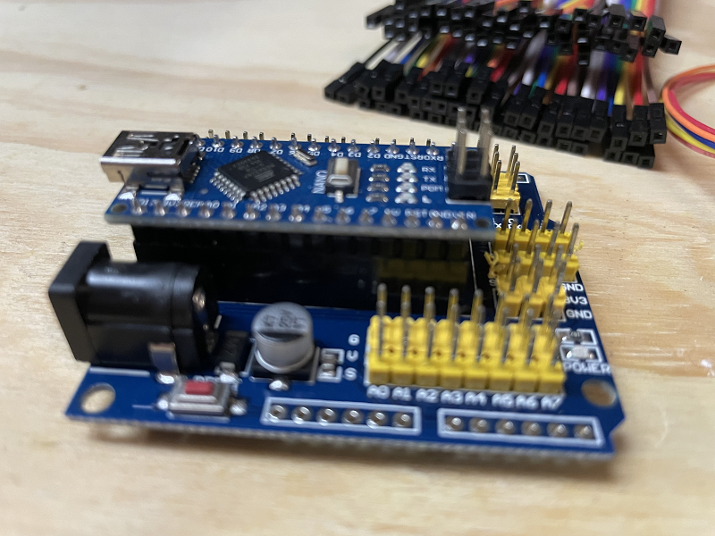
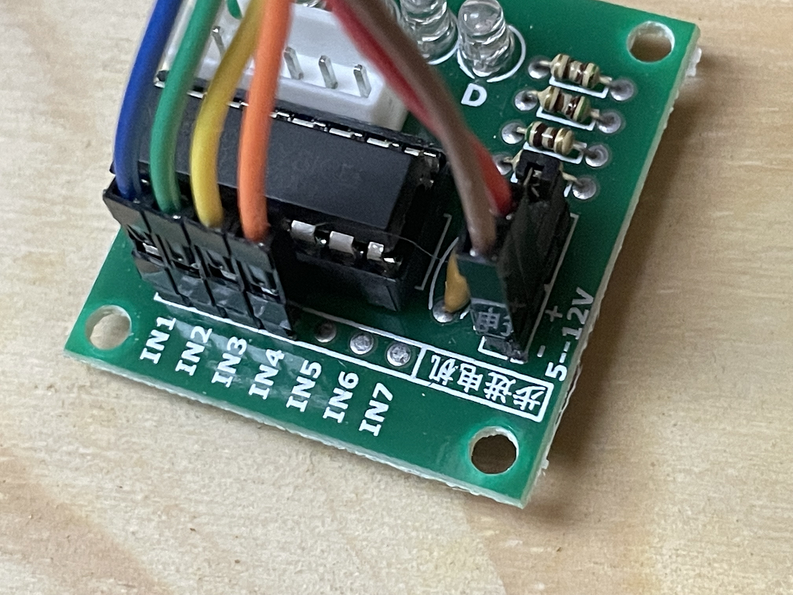

********************
Getting started
********************

Assembly
________

For assembly, we will assume the default ULN2003/28BYJ-48 combo is in use with an Arduino Nano V3, a standard 3 pin Arduino compatible hall effect sensor, and a dual relay board.

We will also assume a prototyping shield is available that provides regulated 5V power sufficient for driving the ULN2003/28BYJ-48 stepper combo, and that there is a power supply with a suitable DC power plug to suit the prototyping shield.

Throughout the assembly process, you can refer to this Fritzing diagram to help validate your connections are correct (open this image in a new tab or window and zoom in to see the detail):

.. image:: ../_static/images/turntable-ex/assembly.png
  :alt: Fritzing Diagram
  :scale: 20%

1. BEFORE you start
^^^^^^^^^^^^^^^^^^^

Gather all your components and visually check them all for any obvious damage, paying particular attention to pins on the Arduino to make sure they are straight.

.. image:: ../_static/images/turntable-ex/components.png
  :alt: Components
  :scale: 50%

.. image:: ../_static/images/turntable-ex/check-pins.png
  :alt: Nano Pins
  :scale: 50%

2. Insert the Nano into the shield
^^^^^^^^^^^^^^^^^^^^^^^^^^^^^^^^^^

Insert the Nano into the prototype shield socket, taking care to ensure the USB socket is located at the same end as the DC power jack, and that all pins are straight and aligned correctly with the female headers.

The various pin numbers may also be printed on the prototyping shield to confirm the correct orientation.

.. image:: ../_static/images/turntable-ex/insert-nano.png
  :alt: Insert Nano
  :scale: 50%

At this point, it's a good idea to take careful note of the various pin markings on your prototype shield as it's critical that these are correct when connecting the various components.

With the shield used in these assembly photos, you will note that each of the Nano GPIO pins has three pins associated with it marked "G" for ground, "V" for 5V, and "S" for signal, with this last pin being the actual Nano GPIO pin.

.. image:: ../_static/images/turntable-ex/proto-shield-pins.png
  :alt: Prototype Shield Pins
  :scale: 50%

1. Connect the stepper controller and motor
^^^^^^^^^^^^^^^^^^^^^^^^^^^^^^^^^^^^^^^^^^^

Firstly, note that the ULN2003 controller will have four pins marked "IN1" through "IN4", as well as a pair of pins with "+" and "-". There is a likely a jumper installed across two pins beside these that is unmarked, leave this in place.

You will need to connect six of the female to female Dupont wires from the ULN2003 pins to the Arduino prototype shield as below:

.. list-table::
    :widths: auto
    :header-rows: 1
    :class: command-table

    * - ULN2003 Pin
      - Arduino Pin
    * - IN1
      - A0 S
    * - IN2
      - A1 S
    * - IN3
      - A2 S
    * - IN4
      - A3 S
    * - \+
      - A0 V
    * - \-
      - A0 G
  

.. image:: ../_static/images/turntable-ex/shield-uln2003-pins.png
  :alt: Shield to ULN2003 pins
  :scale: 50%

Insert the stepper motor connector into the recepticle on the ULN2003 controller. Note that it will only go in one way, so check the orientation and simply plug it in.

.. image:: ../_static/images/turntable-ex/28byj-48-connector1.png
  :alt: 28BYJ-48 Connector
  :scale: 50%

.. image:: ../_static/images/turntable-ex/28byj-48-connector2.png
  :alt: 28BYJ-48 Connector
  :scale: 50%

4. Connect the hall effect sensor
^^^^^^^^^^^^^^^^^^^^^^^^^^^^^^^^^

The hall effect sensor has three pins, and likely only two of these pins are marked, the left with "-" and right with "S". The middle pin is likely to be unmarked, and will be the 5V pin. There are probably many different varieties of sensors and designs out there, but both that I have (from different suppliers) are marked identically.

Use three of the Dupont wires and connect these from the hall effect sensor to the Arduino prototype shield as below:

.. list-table::
    :widths: auto
    :header-rows: 1
    :class: command-table

    * - Hall Effect Pin
      - Arduino Pin
    * - \- (Left)
      - 5 G
    * - Unmarked (middle)
      - 5 V
    * - S (Right)
      - 5 S

.. image:: ../_static/images/turntable-ex/hall-effect-pins.png
  :alt: Hall Effect Pins
  :scale: 50%

.. image:: ../_static/images/turntable-ex/hall-effect-shield.png
  :alt: Hall Effect to Shield
  :scale: 50%

5. Connect the dual relay board
^^^^^^^^^^^^^^^^^^^^^^^^^^^^^^^

Note there should be six pins on the dual relay board marked "VCC", "GND", "IN1", "IN2", "COM", and "GND". The "COM" and "GND" pins should have a jumper installed to connect these together. Leave this in place.

Use four Dupont wires to connect the other four pins as below:

.. list-table::
    :widths: auto
    :header-rows: 1
    :class: command-table

    * - Dual Relay Pin
      - Arduino Pin
    * - VCC
      - 3 V
    * - GND
      - 3 G
    * - IN1
      - 3 S
    * - IN2
      - 4 S

.. image:: ../_static/images/turntable-ex/dual-relay-pins.png
  :alt: Dual Relay Pins
  :scale: 50%

.. image:: ../_static/images/turntable-ex/dual-relay-shield-pins.png
  :alt: Dual Relay to Shield Pins
  :scale: 50%

6. Connect power and test
^^^^^^^^^^^^^^^^^^^^^^^^^

At this point, it should be safe to plug in the power supply to the DC power jack on the prototyping shield.

When the power supply is turned on, the power LEDs on the Arduino Nano and dual relay board should be lit. Note there is likely no power LED on the ULN2003 stepper controller, and testing of this will require loading the Turntable-EX software on to the Nano in step 7 below.

.. image:: ../_static/images/turntable-ex/power-on.png
  :alt: Powered On
  :scale: 50%

To validate the hall effect sensor is connected correctly, put a magnet in close proximity (within a millimetre or so) of the sensor IC, and the onboard LED should light up.

.. image:: ../_static/images/turntable-ex/hall-effect-inactive.png
  :alt: Hall Effect Inactive
  :scale: 50%

.. image:: ../_static/images/turntable-ex/hall-effect-active.png
  :alt: Hall Effect Active
  :scale: 50%

7. Load the Turntable-EX software
^^^^^^^^^^^^^^^^^^^^^^^^^^^^^^^^^

At the time of writing, there is no installer for Turntable-EX like there is for the CommandStation, so you will need to install the Arduino IDE and load the software onto the Arduino manually.

The process here is the same as installing CommandStation-EX via the Arduino IDE which you can find on the :doc:`/get-started/arduino-ide` page.

While following that process, you will need to make some ammendments to cater for Turntable-EX:

* See the :ref:`download/turntable-ex:turntable-ex` download page to obtain the Turntable-EX software.
* References to CommandStation-EX are substituted with Turntable-EX (eg. your folder name needs to be called Turntable-EX).
* You will need to set the board type to "Nano" and set the correct Processor type (typically ATMega328P).

Once the software is loaded successfully on to Turntable-EX, the stepper motor should automatically start rotating in an attempt to find its "home" position, which will be activated when the magnet at one end of the turntable comes in close proximity to the hall effect sensor.

If you don't have the magnet installed at this point, or if it is too far from the sensor, Turntable-EX will rotate two full turns prior to flagging that homing has failed, and will then cease turning.

If your testing of the hall effect sensor in step 6 above succeeded, then the issue is likely to be the distance the magnet is from the sensor, and this will require adjustment.

At this point, you can power off Turntable-EX and remove the USB cable from your PC as it is no longer required for normal operation, as all commands will be issued by the CommandStation.

8. Add the Turntable-EX device driver to CommandStation-EX
^^^^^^^^^^^^^^^^^^^^^^^^^^^^^^^^^^^^^^^^^^^^^^^^^^^^^^^^^^

Before you will be able to test or use Turntable-EX, you need to configure the CommandStation to load the appropriate device driver.

This requires creating or editing the myHal.cpp file in the CommandStation-EX version 4.0.2 or later code and uploading it to your CommandStation.

At this point, it is helpful to have a high level understanding of how device drivers and the HAL works in the CommandStation as explained on the :doc:`/reference/software/hal-config` page.

If that page is more information than you require at this point, then follow the steps below to add the required Turntable-EX device driver and device.

Before continuing, refer to the file "myHal.cpp_example.txt" included with the CommandStation-EX software, and note the following.

**Note**: If the "myHal.cpp_example.txt" is missing the below lines, or if you receive compile errors that the file "IO_TurntableEX" is missing when attempting to upload the CommandStation software later in this process, this indicates you are using a version of CommandStation-EX prior to 4.0.2.

At the top of the file there are a number of lines beginning with "#include":

.. code-block:: cpp

  // Include devices you need.
  #include "IODevice.h"
  #include "IO_HCSR04.h"    // Ultrasonic range sensor
  #include "IO_VL53L0X.h"   // Laser time-of-flight sensor
  #include "IO_DFPlayer.h"  // MP3 sound player
  //#include "IO_TurntableEX.h"   // Turntable-EX turntable controller

Note the last line, this is the device driver required to enable Turntable-EX support.

Scrolling down towards the bottom of that file, you will also see this indented section:

.. code-block:: cpp

  //=======================================================================
  // The following directive defines a Turntable-EX turntable instance.
  //=======================================================================
  // TurntableEX::create(VPIN, Number of VPINs, I2C Address)
    //
  // The parameters are:
  //   VPIN=600
  //   Number of VPINs=1 (Note there is no reason to change this)
  //   I2C address=0x60
  //
  // Note that the I2C address is defined in the Turntable-EX code, and 0x60 is the default.

  //TurntableEX::create(600, 1, 0x60);

If you don't have an existing "myHal.cpp" file, then follow these steps to create a new one: :ref:`reference/software/hal-config:adding a new device`. Note that you don't need to worry about copying or providing device driver files, as these are already included with CommandStation-EX version 4.0.2 and later.

Copy and paste the relevant lines from the "myHal.cpp_example.txt" file as above, which should result in the following content in your new "myHal.cpp" file:

.. code-block:: cpp

  #include "IODevice.h"
  #include "IO_TurntableEX.h"   // Turntable-EX turntable controller

  void halSetup() {
    //=======================================================================
    // The following directive defines a Turntable-EX turntable instance.
    //=======================================================================
    // TurntableEX::create(VPIN, Number of VPINs, I2C Address)
    //
    // The default parameters are:
    //   VPIN=600
    //   Number of VPINs=1 (Note there is no reason to change this)
    //   I2C address=0x60
    //
    // Note that the I2C address is defined in the Turntable-EX code, and 0x60 is the default.
  
    TurntableEX::create(600, 1, 0x60);
  }

In the device setup above, there are three parameters provided, but only two may need to change in your environment if you have other devices that may conflict with these two settings:

- VPIN=600 - This is the default virtual pin (Vpin) ID that is used to send Turntable-EX commands to. Vpin IDs need to be unique, so if this ID is used elsewhere, change as necessary (refer :ref:`reference/software/hal:overview`).
- I2C address=0x60 - This is the default address on the I2C bus that the Turntable-EX is configured to use. This address also needs to be unique, so change this also if it is in use elsewhere, both in "myHal.cpp" and in "config.h" in the Turntable-EX software.

If you already have an existing "myHal.cpp" file, then you simply need to add these entries in the appropriate sections of your existing file, noting that the "#include" needs to be before "void halSetup() {" and the "TurntableEX::create..." needs to be before the final "}".

Follow the rest of the directions for :ref:`reference/software/hal-config:adding a new device` all the way through to the :ref:`reference/software/hal-config:upload the new version of the software` step to upload your newly configured CommandStation.

Note there is no point in checking the driver at this stage as Turntable-EX is not connected, and will show as "OFFLINE".

9. Connect Turntable-EX to your CommandStation
^^^^^^^^^^^^^^^^^^^^^^^^^^^^^^^^^^^^^^^^^^^^^^

To control Turntable-EX from your CommandStation, you will need a connection to the I2C (SDA, SCL) pins.

Ensure you turn the power off to both your CommandStation and Turntable-EX prior to making any of these connections.

On the CommandStation, assuming this is a Mega2560 or Mega2560 + WiFi, the SDA (pin 20) and SCL (pin 21) pins are typically labelled as such, so should be easy to identify.

On an Arduino Nano (and Uno) however, the SDA and SCL pins are shared with analog pins A4 and A5, and therefore aren't explicitly labelled. The SDA pin is A4, and the SCL pin is A5.

Connect these pins to your CommandStation as shown in the table below, noting that it is important to ensure the ground is also connected to ensure the I2C communication is reliable.

.. list-table::
    :widths: auto
    :header-rows: 1
    :class: command-table

    * - CommandStation Pin
      - Arduino Nano Pin
    * - 20 (SDA)
      - A4 S (SDA)
    * - 21 (SCL)
      - A5 S (SCL)
    * - Any spare ground
      - A4 G
  
.. image:: ../_static/images/turntable-ex/nano-i2c.png
  :alt: Nano I2C pins
  :scale: 40%

.. image:: ../_static/images/turntable-ex/commandstation-i2c.png
  :alt: Nano I2C pins
  :scale: 40%

.. image:: ../_static/images/turntable-ex/commandstation-gnd.png
  :alt: Nano I2C pins
  :scale: 40%

Now you're ready!
=================

At this point, you should have a fully assembled Turntable-EX with the software loaded, a default configuration, and the device driver installed and configured in your CommandStation.

In addition, Turntable-EX should be connected to your CommandStation ready to test, tune your turntable positions, and configure EX-RAIL ready for use on your layout.

Click the "next" button to get cracking!
