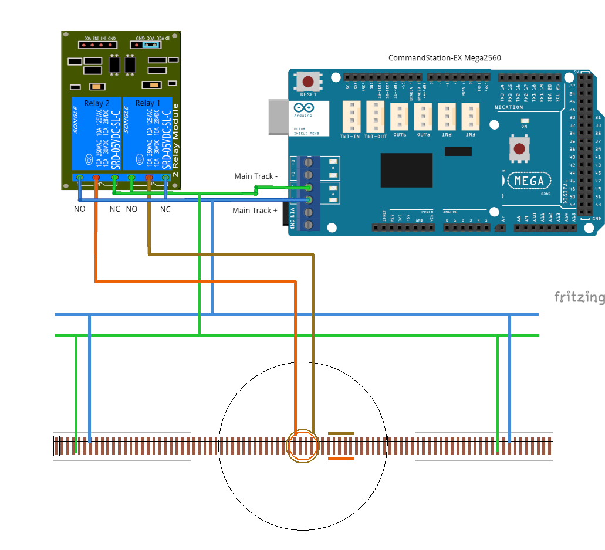

******************************
Layout Connections and Wiring
******************************

.. image:: ../_static/images/conductor-level.png
  :alt: Conductor Level
  :scale: 50%

On this page we hope to outline various different ways to connect your turntable to Turntable-EX and your layout to ensure correct DCC phase alignment with the surrounding tracks.

Given Turntable-EX is in its infancy at the time of writing, there will likely be plenty of other options available or in use that we've not been made aware of as yet. We will capture those here in due course.

Split ring connection
======================

This first example demonstrates the connection commonly used in commercial turntables, whereby the connection from the track to the turntable bridge is provided by a 

Centre connection rings
========================

This next example uses a pair of 

