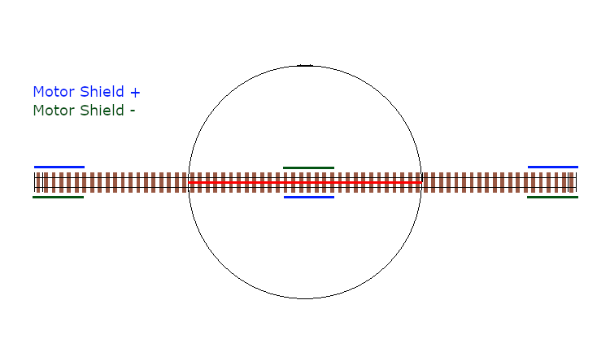

*********
Overview
*********

What is Turntable-EX?
======================

.. note:: 

  Turntable-EX is in public Beta testing, and as such, we encourage regular feedback on the success or otherwise of both the software and documentation. Please reach out via any of our support methods and help us get Turntable-EX as easy to use and reliable as possible.

  For those who wish to help us with Beta testing, you're encouraged to follow the testing processes outlined in the `Regression Testing process <https://github.com/DCC-EX/Support-Planning/blob/master/Testing/Turntable-EX/TTEX_Regression_Testing.md>`_, and then submit your test results using the `Beta Test Results <https://github.com/DCC-EX/Turntable-EX/issues/new/choose>`_ issue template.

Turntable-EX is a fully integrated turntable controller, using an additional Arduino microcontroller to drive a stepper driver to rotate a turntable and align the bridge track with the surrounding layout tracks. An Arduino Nano or Uno are suitable microcontrollers for Turntable-EX.

The aim is to keep things as simple as possible, and to maintain alignment with the categories of our users as defined in our :ref:`get-started/levels:choose your level` guide for CommandStation-EX (Conductor, Tinkerer, and Engineer).

The out-of-the-box example configuration should allow a Conductor level user to get up and running relatively quickly using the ubiquitous ULN2003/28BYJ-48 stepper driver and motor combination that are readily available.

.. sidebar:: Supported stepper drivers and motors

  .. image:: ../_static/images/conductor.png
    :alt: Conductor Level
    :scale: 40%
    :align: left
  
  .. image:: ../_static/images/tinkerer.png
    :alt: Tinkerer Level
    :scale: 40%
    :align: right

  Using other pre-defined, supported stepper drivers and motors should also be achievable at the Conductor level, but may enter into Tinkerer territory depending on the specific hardware.

To make full use of Turntable-EX, you will need a basic understanding of :ref:`EX-RAIL<automation/ex-rail-intro:introduction to ex-rail automation>` automation, but we'll share the details and some examples to help with this.

Essentially, if you have setup your own CommandStation, the expectation is that Turntable-EX will be a natural extension of this, and be equally as easy to setup (at least from the electronics and software perspective).

The Turntable-EX integration includes:

* Support for an Arduino Nano or Uno
* I2C device driver
* EX-RAIL automation support
* Debug/test command (handy for tuning step positions)
* Out-of-the-box support for several common stepper drivers and motors
* Automatic or manual DCC signal phase switching to align bridge track phase with layout phase (if your turntable doesn't do this already)
* An LED and accessory output to control turntable specific automations (eg. flashing warning light)

.. note:: 

  Credit where credit is due!
  
  **AccelStepper.h credit:** This project would not be effective without the excellent work by Mike McCauley on the AccelStepper.h library that enables us to have somewhat prototypical acceleration and deceleration of the turntable. A slightly modified version of this library is included with the Turntable-EX software (sans example sketches), and more details can be found on the official `AccelStepper <http://www.airspayce.com/mikem/arduino/AccelStepper/>`_ web page. Modification comments are included within the library.

  **NmraDcc.h credit:** Also, while not directly used in this software, Alex Shephard's "DCCInterface_TurntableControl" was the inspiration for the initial turntable logic for another DCC driven turntable that translated into the beginnings of Turntable-EX. You can see this code as part of the `NmraDcc Arduino library <https://github.com/mrrwa/NmraDcc>`_.

What you need for Turntable-EX
===============================

* A DCC++ EX CommandStation running version X.X.X or later of CommandStation-EX (this includes the Beta version of the Turntable-EX device driver)
* An Arduino microcontroller (tested on Nano V3, both old and new bootloader, an Uno R3 should also work)
* A supported stepper motor driver and stepper motor (see list below)
* A hall effect (or similar) sensor for homing, which needs to be digital/unipolar such as an A3144 or 44E (or equivalent)
* A suitable power supply - note that your chosen stepper driver/motor will dictate this, see note below
* A prototyping shield is highly recommended, especially when using a Nano, and the pictured version is preferred over the screw terminal version
* Dupont type wires to connect the components, male to female or female to female as required
* A USB cable to connect the Arduino to a PC to load the software
* *Optional:* A dual relay board (or similar) if you wish to use the phase switching capability (see :ref:`turntable-ex/turntable-ex:important! phase (or polarity) switching`)

.. image:: ../_static/images/turntable-ex/nano-v3.png
  :alt: Nano V3
  :scale: 50%

.. image:: ../_static/images/turntable-ex/hall-effect.png
  :alt: Hall Effect sensor
  :scale: 40%

.. image:: ../_static/images/turntable-ex/dual-relay.png
  :alt: Dual Relay
  :scale: 40%

.. image:: ../_static/images/turntable-ex/nano-shield1.png
  :alt: Nano Prototype Shield
  :scale: 40%

.. image:: ../_static/images/turntable-ex/dupont.png
  :alt: Dupont male to female
  :scale: 30%

Power supplies
_______________

Choosing the right power supply for your Arduino and stepper motor is important to get right.

If you are using the default ULN2003/28BYJ-48 it is technically possible to power the driver and stepper directly from the 5V output on an Arduino, however this is not recommended and should be avoided.

Given that this combo requires 5V, you can use a single, regulated 5V DC power supply rated for at least 500mA to power both the Arduino and the ULN2003/28BYJ-48.

Note that if you use the right Arduino Nano prototyping shield, it will likely have a LM317 voltage regulator supplied by the DC power jack. In this instance, you can use a 7 to 9V 500mA+ DC power supply to provide power, and it will be safe to connect the ULN2003 5V to a 5V output on the prototyping shield.

For other steppers such as the NEMA17 that require 12V DC, you will need either two separate power supplies, or a DC-DC converter to provide a lower voltage to the Arduino. Note that the NEMA17 steppers have a considerably higher current rating, so the power supply will need to be rated at 1.5A or higher.

Supported stepper drivers and motors
=========================================

The default configuration of Turntable-EX is for the ubiquitous ULN2003/28BYJ-48 stepper driver and motor combination. These steppers are used in a myriad of applications, are inexpensive, and will be suitable for most smaller scale turntable applications.

.. sidebar:: Unsupported stepper drivers and motors

  .. image:: ../_static/images/tinkerer.png
    :alt: Tinkerer Level
    :scale: 40%
    :align: left

  If you have a need to use a different driver, these should be relatively straight forward to configure in a similar manner to how additional motor drivers are configured for use with CommandStation-EX.

However, it is very easy to use one of several other common stepper drivers if you require more torque, or if you prefer to use a NEMA17 or other stepper motor.

The complete list of supported stepper drivers and motors:

* ULN2003/28BYJ-48 (Default)
* A4988/NEMA17
* DRV8825/NEMA17

How does it work?
==================

.. sidebar:: Full step, half step, and other modes

  Stepper motor drivers typically support more than one mode for driving stepper motors. This simply means that they can be turned less than one complete step, allowing more granular control of positioning, resulting in higher precision, and much smoother operation. For example, the DRV8825 can drive 1/32 of a step, talk about smooooth!

If you're not familiar with stepper motors then you only need a very high level understanding of how they work in order to use Turntable-EX successfully on your layout, as the concept is very simple.

Very simply, a stepper motor is able to be rotated one step at a time, which translates to degrees of movement around a circle. For example, the ubiquitous 28BYJ-48 stepper motor referred to here takes 2048 steps to make a full 360 degree rotation. The higher the number of steps in a single rotation, the easier it will be to get perfect alignment between the turntable and your layout, and this also typically translates to smoother rotation.

.. note:: 

  You don't actually need to know the number of steps required to make a full rotation as this is calculated by Turntable-EX the first time it starts up and performs the calibration sequence. You will see the number displayed in the serial console as outlined in :ref:`turntable-ex/get-started:automatic calibration`.

In Turntable-EX, at startup, the turntable will rotate until such time as the homing sensor is activated, in which case it will set the homed position as step 0 and stop moving. Typically, the homing sensor is a hall effect device mounted in the turntable pit which is activated when a magnet in one end of the turntable bridge comes in to close proximity.

Once the home position is determined, the various positions on your layout are defined as the number of steps from this home position.

The command used to move to these positions simply sends the number of steps to Turntable-EX, which calculates the steps required in order to move the least number of steps to the desired position, meaning it will rotate either clockwise or counter clockwise depending which is the shortest distance.

That's pretty much as simple as it gets. These step positions are defined in myAutomation.h (part of EX-RAIL), which will be described in further detail below, including how to ensure these are advertised to WiThrottle applications.

.. tip:: 

  It's recommended that the home position does not align with a specific layout connection track to ensure that each time Turntable-EX powers on, it automatically triggers the homing activity to occur, ensuring it starts in a consistent location each time for the highest accuracy.

Controlling the turntable
__________________________

To control the turntable, the simplest method is using EX-RAIL automation commands advertised as ROUTEs to the throttle of your choice.

Refer to the :ref:`turntable-ex/test-and-tune:testing, tuning, and control` page for more details on this.

Important! Phase (or polarity) switching
_________________________________________

An important aspect that must be taken into consideration with a rotating turntable is the phase or polarity of the turntable bridge track in relation to the surrounding layout tracks.

.. danger:: 

  If your locomotive drives on to the turntable bridge track, and the DCC phase (or polarity) is not aligned with the surrounding layout tracks, then you will cause a short circuit. The CommandStation should cut power in that scenario, but the desired behaviour is simply to drive onto the turntable with no interruption.

In order to prevent short circuits, the phase (or polarity) of the bridge track will need to be inverted when rotating to ensure it remains in alignment with the surrounding tracks. There are three options to achieve this:

* Use an auto-reverser that automatically reverses the phase when a short circuit is detected (the Digitrax AR1 is a commonly used option here)
* Use a mechanical method to switch the phase based on the physical position of the turntable
* Use Turntable-EX and to automatically (or manually) invert the phase as appropriate

The critical aspect when using Turntable-EX/EX-RAIL or a mechanical method to control the phase is to ensure the entry and exit tracks for each position are wired with the same phase or polarity. An auto reverser will allow out of phase layouts to work as it will always reverse on a short circuit.

Consider the turntable starting in alignment with the entry and exit tracks, with everything wired in alignment so the +/- connections from the motor shield are connected to the same rail all the way along.

If we do not invert or reverse the phase, when it rotates 180 degrees, there will be an obvious issue!

.. image:: ../_static/images/turntable-ex/90degree-no-phase-change.png
  :alt: 90 degrees
  :scale: 45%

Now consider inverting or reversing the phase when performing that 180 degree turn, and the result is just like the starting point, with all tracks in DCC phase alignment.

.. image:: ../_static/images/turntable-ex/90degree-phase-change.png
  :alt: 90 degrees
  :scale: 45%

.. image:: ../_static/images/turntable-ex/180degree-phase-change.png
  :alt: 180 degrees
  :scale: 45%

How does this work with Turntable-EX?
^^^^^^^^^^^^^^^^^^^^^^^^^^^^^^^^^^^^^^

Turntable-EX supports automatic phase switching by default, but can also be controlled manually by both EX-RAIL and diagnostic commands.

With the default automatic phase switching, once the turntable rotates 45 degrees away from the home position, it will automatically invert the DCC phase, with the phase then reverting 180 degrees later once the turntable rotates to 225 degrees from the home position.

In the diagrams below, the "home" end of the turntable bridge is indicated by the bright green sleeper, with the "home" position of 0 degrees being located at the top of the diagram. The surrounding layout tracks are separated by 10 degrees.

The yellow dashed line represents the 45/225 degree trigger points to invert and revert the phase switching, with the light yellow shaded area representing the 180 degrees in which the phase will be inverted.

The surrounding layout tracks have been wired so that each opposing track is wired the same.

To start, with the turntable bridge is aligned with the first layout track, which is 10 degrees from the home position, and all our phases are in alignment.

.. image:: ../_static/images/turntable-ex/auto-phase-switch-start.png
  :alt: Aligned with first track
  :scale: 100%

Next, we've sent a command for the turntable to rotate 180 degrees, which requires our phase to be inverted in order to prevent a short circuit.

As this will trigger the turntable to rotate beyond our 45 degree trigger point, the phase will automatically be inverted.

.. image:: ../_static/images/turntable-ex/auto-phase-switch-trigger.png
  :alt: Rotate beyond 45 degrees
  :scale: 100%

Once the turntable reaches the correction position, all our phases will be in alignment, meaning our locomotive can leave or enter the turntable with no short circuit issues.

.. image:: ../_static/images/turntable-ex/auto-phase-switch-end.png
  :alt: Rotated 180 degrees
  :scale: 100%

If the turntable continues to rotate beyond the 225 degree point, the phase will revert again.

.. image:: ../_static/images/turntable-ex/auto-phase-switch-revert.png
  :alt: Rotated 180 degrees
  :scale: 100%

The above outlines how the default automatic phase switching works with Turntable-EX, and this behaviour is configurable.

If you find that the default 45/225 degree angles aren't right for your layout, then this can be modified in "config.h" which is created in :ref:`get-started/assembly:7. load firmware on your command station`, and the configuration parameter is outlined here: :ref:`turntable-ex/configure:phase_switch_angle`.

If you have a layout that requires more control over when phase switching does and doesn't happen, you can configure manual phase switching, as outlined in :ref:`turntable-ex/test-and-tune:manual phase switching`.

Time to assemble
=================

Now that you have a general overview of Turntable-EX's features and capabilities, click the "next" button to get started on assembly.
