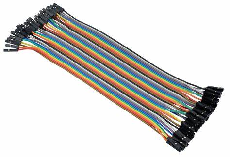

*****************
Turntable-EX
*****************

Turntable-EX is a fully integrated turntable controller, using an Arduino microcontroller to drive a stepper controller and motor to spin the turntable bridge.

The aim is to keep things as simple as possible, and to maintain alignment with the categories of our users as defined in our Getting Started guide for CommandStation-EX (Conductor, Tinkerer, and Engineer).

The out-of-the-box example configuration should allow a Conductor level user to get up and running relatively quickly using the ubiquitous ULN2003/28BYJ-48 stepper controller and motor combination that are readily available.

Using other pre-defined stepper controllers and motors should also be achievable at the Conductor level, but may enter into Tinkerer territory depending on the specific hardware.

To make full use of Turntable-EX, you will need some understanding of EX-RAIL automation, but we'll share the details and some examples to help with this.

The integration includes:

* I2C device driver
* EX-RAIL automation support
* Debug/test command (handy for tuning step positions)
* Out-of-the-box support for several common stepper controllers
* DCC signal phase switching to align bridge track phase with layout phase

What you need for Turntable-EX
==============================

* A DCC++ EX command station running version 4.0.2 or later of CommandStation-EX (this includes the Beta version of the Turntable-EX device driver)
* An Arduino microcontroller (tested on Nano V3, both old and new bootloader, an Uno R3 should also work)
* A supported stepper motor controller and stepper motor
* A hall effect (or similar) sensor for homing
* A dual relay board (or similar) if you wish to use the phase switching capability
* A suitable power supply - note that your chosen stepper controller/motor will dictate this, see note below
* A prototyping shield is highly recommended, especially when using a Nano, and the pictured version is preferred over the screw terminal version
* Dupont type wires to connect the components, male to female or female to female as required
* A USB cable to connect the Arduino to a PC to load the software

.. image:: ../_static/images/turntable-ex/nano-v3.png
  :alt: Nano V3
  :scale: 50%

.. image:: ../_static/images/turntable-ex/uln2003-28byj-48.png
  :alt: ULN2003/28BYJ-48 Stepper combo
  :scale: 50%

.. image:: ../_static/images/turntable-ex/hall-effect.png
  :alt: Hall Effect sensor
  :scale: 40%

.. image:: ../_static/images/turntable-ex/dual-relay.png
  :alt: Dual Relay
  :scale: 40%

.. image:: ../_static/images/turntable-ex/nano-shield1.png
  :alt: Nano Prototype Shield
  :scale: 40%

Power supplies
--------------

Choosing the right power supply for your Arduino and stepper motor is important to get right.

If you are using the default ULN2003/28BYJ-48 it is technically possible to power the controller and stepper directly from the 5V output on an Arduino, however this is not recommended.

Given that this combo requires 5V, you can use a single, regulated 5V DC power supply rated for at least 500mA to power both the Arduino and the ULN2003/28BYJ-48.

Note that if you use the right Arduino Nano prototyping shield, it will likely have a LM317 voltage regulator supplied by the DC power jack. In this instance, you can use a 7 to 9V 500mA+ DC power supply to provide power, and it will be safe to connect the ULN2003 5V to a 5V output on the prototyping shield.

For other steppers such as the NEMA17 that require 12V DC, you will need either two separate power supplies, or a DC-DC converter to provide a lower voltage to the Arduino. Note that the NEMA17 steppers have a considerably higher current rating, so the power supply will need to be rated at 1.5A or higher.

Supported stepper controllers and motors
=========================================

The default configuration of Turntable-EX is for the ubiquitous ULN2003/28BYJ-48 stepper controller and motor combination. These steppers are used in a myriad of applications, are inexpensive, and will be suitable for most smaller scale turntable applications.

However, it is very easy to use one of several other common stepper controllers if you require more torque, or if you prefer to use a NEMA17 or other stepper motor.

The complete list of supported stepper controllers and motors:

* ULN2003/28BYJ-48 (Default)
* A4988/NEMA17
* DRV8825/NEMA17
* TMC2208/NEMA17

If you have a need to use a different controller, some minor code updates will be required unless it is "pin compatible" with one of the existing controllers, in which case you can simply select the appropriate compatible driver.

How does it work?
=================

If you're not familiar with stepper motors then you only need a very high level understanding of how they work in order to use Turntable-EX successfully on your layout, as the concept is very simple.

Very simply, a stepper motor is able to be rotated one step at a time, which translates to degrees of movement around a circle. For example, the ubiquitous 28BYJ-48 stepper motor referred to here takes 2048 steps to make a full 360 degree rotation. The higher the number of steps in a single rotation, the easier it will be to get perfect alignment between the turntable and your layout.

In Turntable-EX, at startup, the turntable will rotate until such time as the homing sensor is activated, in which case it will set the homed position as step 0 and stop moving. Typically, the homing sensor is a hall effect device mounted in the turntable pit which is activated when a magnet in one end of the turntable bridge comes in to close proximity.

Once the home position is determined, the various positions on your layout are defined as the number of steps from this home position.

The command used to move to these positions simply sends the number of steps to Turntable-EX, which calculates the steps required in order to move the least number of steps to the desired position.

That's pretty much as simple as it gets. These step positions are defined in myAutomation.h (part of EX-RAIL), which will be described in further detail below.

Controlling the turntable
-------------------------

To control the turntable, the simplest method is using EX-RAIL automation commands advertised as ROUTEs to the throttle of your choice.

Refer to the Configure and Control page for more details on this.

Important! Phase (or polarity) switching
----------------------------------------

An important aspect that must be taken into consideration with a rotating turntable is the phase or polarity of the turntable bridge track in relation to the surrounding layout tracks.

If your locomotive drives on to the turntable bridge track, and the DCC phase (or polarity) is not aligned with the surrounding layout tracks, then you will cause a short circuit. The CommandStation should cut power in that scenario, but the desired behaviour is simply to drive onto the turntable with no interruption.

In order to prevent short circuits, the DCC signal to the tracks on the bridge need to be reversed when rotated to certain positions. There are three options to achieve this:

* Use an auto-reverser that automatically reverses the phase when a short circuit is detected (the Digitrax AR1 is a commonly used option here)
* Use a mechanical method to switch the phase based on the physical position of the turntable
* Use Turntable-EX and EX-RAIL position definitions to reverse or maintain the phase as appropriate for each position

The critical aspect when using Turntable-EX/EX-RAIL or a mechanical method to control the phase is to ensure the entry and exit tracks for each position are wired with the same phase or polarity. An auto reverser will allow out of phase layouts to work as it will always reverse on a short circuit.

INSERT IMAGES HERE - animated gif perhaps?

I'm Ready!
----------

Click the "next" button to get started assembling Turntable-EX.

.. toctree::
    :hidden:

    get-started
    configure
