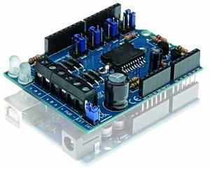

Motor boards
============

CommandStation-EX is compatible with a wide variety of motor boards, also known as "dual H-bridges" and "motor shields". We've sorted them from least difficult to most difficult to use to help you decide what to use.

**TL;DR**: We recommend the Arduino Motor Shield R3 or a supported clone board like the Deek-Robot.

.. image:: ../../_static/images/deek_robot1_sm.jpg
   :alt: Deek Robot Motor Shield

Boards currently supported
--------------------------

* Easy to use boards
   * :ref:`Arduino Motor Shield`
   * :ref:`Deek-Robot Motor Shield`
   * :ref:`DIY More L298NH Motor Shield`
* Intermediate boards
   * :ref:`L298 Motor Driver (dual)`
   * :ref:`BTS7960 IBT_2 Board (single)`
   * :ref:`Pololu MC33926`
* Others listed below

Other boards, while not fully supported and tested, can be used. Look for the following criteria:

* We recommend a dual h-bridge board or two discrete h-bridge boards. They can be different sizes, one bigger for main track and one smaller for programming track operations.
* It must handle enough current for the layout. 2 amps will drive 3-5 HO scale locomotives.
* It must have working and accurate current sensing (many do not)
* It must be able to switch at least 10000 times per second (some do not)
* Look for an Arduino shield form factor to eliminate wiring (not required but preferred)

Arduino Motor Shield
^^^^^^^^^^^^^^^^^^^^

Easy to use, widely available and can support 2A load per channel.

.. image:: ../../_static/images/motorboards/arduino_motorshield2.jpg
   :alt: Arduino Motor Shield R3

Deek-Robot Motor Shield
^^^^^^^^^^^^^^^^^^^^^^^

Electrically identical in most every regard to the Arduino motor shield. Often cheaper. Supports 2A per channel

.. image:: ../../_static/images/motorboards/deek_robot1_sm.jpg
   :alt: Deek Robot Motor Shield

DIY More L298NH Motor Shield
^^^^^^^^^^^^^^^^^^^^^^^^^^^^

Another similar board to the Arduino motor shield. Supports 2A per channel.

.. image:: ../../_static/images/motorboards/diy_more_motor.jpg
   :alt: DIY More Motor Shield

L298 Motor Driver (dual)
^^^^^^^^^^^^^^^^^^^^^^^^

This is an alternative to the Arduino and Deek-Robot shields. It uses the same L298 chip as the Arduino motor shield, only in a different form factor and with better cooling. You'll need to connect jumper wires from the correct pins on the Arduino to this board. IMPORTANT: You will also need to snip two long chip pins and add 2 resistors to enable current sense to have overload protection and be able to acknowledge CV reads and writes. As with any of these boards with current sense issues, you can also add a small current sense board like the MAX471.

.. image:: ../../_static/images/motorboards/l298_board.jpg
   :alt: L298 Motor Driver

BTS7960 IBT_2 Board (single)
^^^^^^^^^^^^^^^^^^^^^^^^^^^^

You will either need 2 of these or one of these and another board to run your programming track. These boards can provide high current. Indeed, we have built boosters using these boards. If the 2 Amps (really 1.5A) of the L298 boards aren't enough for your track, this is one of the best options.

.. image:: ../../_static/images/motorboards/ibt_2_bts7960.jpg
   :alt: IBT_2 Board

Pololu MC33926
^^^^^^^^^^^^^^

Comes soldered or in a kit where you just have to solder the headers and connector. While we have a motor board type for this board, the current sense is not acceptable. We recommend using an external current sense board like the MAX471. Many people still use this board.

.. image:: ../../_static/images/motorboards/pololu.png
   :alt: Pololu MC33926

Keyes/Fundumoto ("Beeper Board")
^^^^^^^^^^^^^^^^^^^^^^^^^^^^^^^^

You have to lift two traces and solder 2 resistors and use 2 jumpers to the current sense pins. This board is immediately recognizable because it has a cylindrical beeper or buzzer on the board.

.. image:: ../../_static/images/motorboards/keyes_fundumoto.jpg
   :alt: Keyes/Fundumoto Motor Shield

Velleman KA03 (kit) VMA03 (soldered)
^^^^^^^^^^^^^^^^^^^^^^^^^^^^^^^^^^^^

Must cut traces and solder resistors to get current sensing on the soldered board. Much easier to simply not solder the pins on the kit version. Pin assignments must be added to a new motorboard entry in the config.h file.

NOT compatible for use with CommandStation-EX
-------------------------------------------------------------

* VNH2SP30 - Sparkfun Monster Moto and other boards from China based on this chip. It can't switch fast enough to generate a reliable DCC signal
* IFX9202ED - Infineon Dual H-Bridge. Can't switch fast enough.
